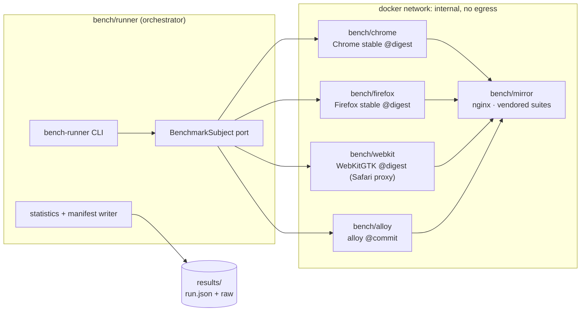

# Benchmark Harness — Technical Reference

Reference record for the harness specified in `PRD-009` and decided in `ADR-0016` (containerization, lanes) and
`ADR-0017` (tiers, profiles, claims). This document is the implementation contract: topology, directory layout, CLI,
schemas and gates. Nothing here is implemented yet — every path below is a target, not a description.

---

## 1. Topology



The runner is the only container with a writable volume. Subject containers are read-only rootfs, non-root, on an
`internal` network that reaches the mirror and nothing else. The Basemark lane is the single exception: it needs real
egress, runs manually, and is marked `external: true` in its manifest.

---

## 2. Directory layout

```text
bench/
├── README.md                  # how to run one measurement, and the lane rules
├── runner/                    # Rust crate `bench-runner` (workspace member)
│   ├── src/domain/            # SubjectIdentity, FeatureSet, RawMetrics, Tier, Budget, RunManifest
│   ├── src/application/       # ports.rs (BenchmarkSubject), sweep orchestration, statistics
│   ├── src/infrastructure/    # docker/compose driver, playwright bridge, alloy devtools client
│   └── tests/                 # bench-conformance suite + MockSubject
├── docker/
│   ├── mirror.Dockerfile      # nginx + vendored suites
│   ├── chrome.Dockerfile
│   ├── firefox.Dockerfile
│   ├── webkit.Dockerfile
│   ├── alloy.Dockerfile       # builds the workspace binary under test
│   └── compose.yaml           # one project per run; tier limits injected as env
├── suites/                    # pinned upstream checkouts (git submodules, by SHA)
│   ├── speedometer/           # + upstream LICENSE, kept verbatim
│   ├── jetstream/
│   └── motionmark/
├── profiles/
│   ├── standard.json          # deterministic journey: steps, cadence, seed
│   ├── advanced.json
│   └── corpus/                # frozen local page corpus served by the mirror
├── tiers/                     # T0..T3 cgroup definitions
├── probe/                     # feature-probe page + key definitions
└── results/                   # manifests + raw output (git-ignored; archived per release)
```

`bench/runner` is an explicit workspace member. It depends on no `core/*` crate except through the public `alloy` binary
interface, so the `no-engine` and `arch-lint` gates are unaffected.

---

## 3. Images

Every image pins its base by digest and its payload by digest or commit SHA. Sketch of the invariant shape:

```dockerfile
# bench/docker/chrome.Dockerfile — illustrative; authored during implementation
FROM mcr.microsoft.com/playwright:v0.0.0-noble@sha256:<pinned>
USER pwuser
ENV BENCH_SUBJECT=chrome
ENTRYPOINT ["/bench/subject-entrypoint"]
```

Run-time flags applied by the runner to every subject container:

| Flag                                           | Why                                                   |
| ---------------------------------------------- | ----------------------------------------------------- |
| `--cpuset-cpus`, `--memory`, `--pids-limit`    | Tier enforcement (`PRD-009` §5), verified from inside |
| `--network bench_internal` (no default bridge) | No external variance; mirror only                     |
| `--read-only` + `tmpfs /tmp`                   | Run-to-run identical filesystem state                 |
| `--security-opt no-new-privileges`, non-root   | Untrusted suite content executes here                 |
| `--device /dev/dri` (lab lane only)            | Real GPU for tiers T1–T3; absent in CI lane           |
| `--shm-size` explicit                          | Chromium crashes on the 64 MiB default                |

---

## 4. Feature probe keys

The probe page reports which keys a subject supports; a suite declares which keys it requires (`PRD-009` §2.2). The
difference decides `ok` vs `unsupported`.

| Key             | Meaning                                    | Alloy lands it at       |
| --------------- | ------------------------------------------ | ----------------------- |
| `dom_l1`        | Element tree, attributes, traversal        | `F3`                    |
| `html_parse`    | HTML5 tokenizer + tree construction        | `F5`                    |
| `css_flexbox`   | Cascade + normal flow + Flexbox            | `F9`                    |
| `canvas2d`      | 2D canvas context                          | not scheduled           |
| `svg`           | SVG rendering                              | not scheduled           |
| `raf`           | `requestAnimationFrame` at display cadence | `F12`                   |
| `css_animation` | CSS transitions/animations                 | not scheduled           |
| `es2020`        | ES2020 language + built-ins                | `F10` (`boa`)           |
| `wasm_mvp`      | WebAssembly MVP                            | not scheduled           |
| `web_workers`   | Dedicated workers                          | not scheduled           |
| `fetch`         | `fetch` + HTTP/1.1                         | `F8` + `F10`            |
| `history_api`   | `pushState` / navigation                   | `F10`                   |
| `webgl1`        | WebGL 1.0                                  | non-goal (`PRD-001:44`) |

"Not scheduled" is the honest state today: those keys have no phase in `ROADMAP-IMPLEMENTACAO-V1.md`, which is exactly
what the coverage scoreboard is meant to surface.

---

## 5. Run manifest (`run.json`, schema v1)

```json
{
	"schema_version": 1,
	"run_id": "01JBENCH0000000000000000",
	"started_at": "2026-09-02T00:00:00Z",
	"lane": "lab",
	"tier": "T2",
	"status": "ok",
	"host": {
		"cpu_model": "…",
		"cores_physical": 8,
		"smt": false,
		"governor": "performance",
		"ram_bytes": 17179869184,
		"kernel": "…",
		"gpu": "…",
		"gpu_driver": "…",
		"refresh_hz": 60
	},
	"container": {
		"engine": "docker 00.0.0",
		"image_digest": "sha256:…",
		"cpuset": "2-9",
		"memory_bytes": 17179869184,
		"verified_from_inside": true
	},
	"subject": {
		"id": "chrome",
		"engine_family": "blink",
		"version": "…",
		"build_digest": "sha256:…",
		"is_proxy_for": null,
		"user_agent": "…"
	},
	"suite": {
		"name": "speedometer",
		"version": "3.x",
		"commit": "…",
		"subset": null,
		"served_from": "http://mirror/speedometer/"
	},
	"execution": { "warmups": 2, "iterations": 10, "seed": 1 },
	"features": { "required": ["es2020"], "supported": ["es2020"], "missing": [] },
	"metrics": [
		{
			"name": "score",
			"unit": "runs/min",
			"median": 0.0,
			"iqr": 0.0,
			"ci95": [0.0, 0.0],
			"samples": [0.0]
		}
	],
	"notes": []
}
```

Rules the schema enforces:

- `status` is `ok` | `unsupported` | `error`. **`metrics` is empty unless `status == "ok"`** — there is no zero score
  for a suite that did not run (`PRD-009` I-03).
- `subject.is_proxy_for` is `"safari"` for WebKitGTK and `null` otherwise; renderers must print the proxy label.
- `lane`, `tier` and `subject.build_digest` are required for any comparative rendering; the generator rejects a table
  whose rows disagree on lane or tier (`PRD-009` I-07).

Profile runs use the same envelope with `suite.name` of `profile:standard` / `profile:advanced` and one metric entry per
budget of `ADR-0017`.

---

## 6. CLI

```bash
just bench suite speedometer chrome T2      # one suite, one subject, one tier
just bench sweep jetstream --tiers T0..T3   # tier sweep for one suite
just bench profile advanced alloy T1        # user-journey profile run
just bench malleability alloy T1            # Alloy Malleability Suite (PRD-009 §7)
just bench report --release v0.9            # regenerate tables from manifests only
just bench calibrate chrome T2              # noise-floor calibration (C-26)
```

`bench report` reads manifests and nothing else; rendered tables are never edited by hand.

---

## 7. CI integration

| Workflow            | Trigger              | Lane | Content                                                            | Gating |
| ------------------- | -------------------- | ---- | ------------------------------------------------------------------ | ------ |
| `bench-smoke.yml`   | pull request         | CI   | Harness builds; 1 iteration of JetStream on Chromium; schema check | Yes    |
| `bench-nightly.yml` | schedule, `main`     | CI   | Speedometer + JetStream, Alloy + Chrome, T1; regression test       | Yes    |
| `bench-lab.yml`     | manual / release tag | Lab  | Full matrix, tier sweep, profiles, malleability suite              | No     |

Per-PR full benchmarks are deliberately absent: they are slow, and on shared runners their noise would produce failures
uncorrelated with the diff. The PR gate checks that the harness still works; the nightly gate checks for regression.

---

## 8. Open items

Tracked in `PRD-009` §10 (V-01 … V-06) — pinned suite versions and licences, MotionMark stability under software
rendering, Basemark terms, Playwright image digests, lab-host GPU passthrough, and the `boa_engine` JetStream subset.
