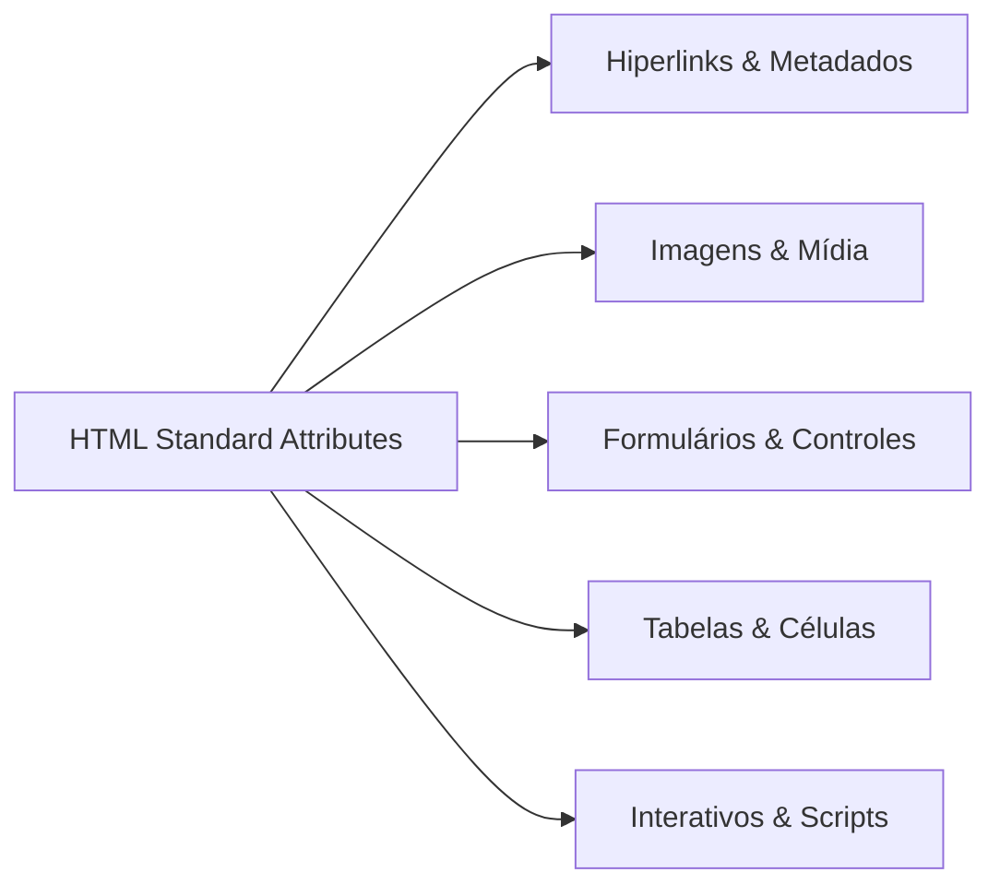

# Inventário Completo de Elementos e Atributos HTML (WHATWG & MDN) para o Engine Alloy

> **Documento de Referência Arquitetural & Auditoria de Compatibilidade** Gerado com base no padrão normativo oficial
> WHATWG HTML Living Standard, W3C HTML5 Recommendation e MDN Web Docs Data (`@mdn/data/html`).

## 1. Resumo Executivo & Métricas do HTML

- **Total de Elementos/Tags HTML Padrão Modernos (WHATWG / MDN):** 114
- **Total de Elementos Legados/Obsoletos Reconhecidos pelo Parser:** 26 (regras de tolerância web compat)
- **Total Geral de Elementos Catalogados:** 140
- **Elementos Atualmente Suportados no Alloy (`core/html` v0.5):** 36 (25.7% do total; 31.6% dos modernos)
- **Elementos Pendentes para HTML Completo:** 104
- **Total de Atributos Globais Padrão:** 32 (incluindo extensões modernas como `popover`, `inert`, `writingsuggestions`)
- **Total de Atributos ARIA (Estados e Propriedades):** 48
- **Total de Manipuladores de Eventos Globais (`on*`):** 74
- **Total de Atributos Específicos Catalogados:** 152
- **Propriedades e Métodos DOM IDL Essenciais de Nó/Elemento:** 42

### Distribuição por Domínio Arquitetural

| Domínio Arquitetural                                                  | Total | No Alloy | Pendentes | Cobertura | Status          |
| :-------------------------------------------------------------------- | :---: | :------: | :-------: | :-------: | :-------------- |
| 01. Raiz e Metadados do Documento (Root & Document Metadata)          |   7   |    6     |     1     |    86%    | 🟡 Em progresso |
| 02. Seções e Estrutura Semântica (Content Sectioning)                 |  15   |    12    |     3     |    80%    | 🟡 Em progresso |
| 03. Agrupamento de Texto e Blocos (Grouping & Text Content)           |  16   |    9     |     7     |    56%    | 🟡 Em progresso |
| 04. Semântica Inline & Nível de Texto (Inline Text Semantics)         |  30   |    6     |    24     |    20%    | 🟡 Em progresso |
| 05. Mídia e Conteúdo Embutido (Embedded & Replaced Content)           |  11   |    1     |    10     |    9%     | 🟡 Em progresso |
| 06. Tabelas e Dados Tabulares (Tabular Data & Tables)                 |  10   |    0     |    10     |    0%     | ⚪ Pendente     |
| 07. Formulários e Controles de Usuário (Forms & Interactive Controls) |  14   |    0     |    14     |    0%     | ⚪ Pendente     |
| 08. Elementos Interativos e Diálogos (Interactive & Dialogs)          |   3   |    0     |     3     |    0%     | ⚪ Pendente     |
| 09. Web Components, Templates & Slots                                 |   2   |    0     |     2     |    0%     | ⚪ Pendente     |
| 10. Scripting & Fallback                                              |   4   |    2     |     2     |    50%    | 🟡 Em progresso |
| 11. Demarcação de Edições (Edits)                                     |   2   |    0     |     2     |    0%     | ⚪ Pendente     |
| 12. Namespaces Estrangeiros (Foreign Elements: SVG & MathML)          |   2   |    0     |     2     |    0%     | ⚪ Pendente     |
| 13. Elementos Obsoletos e Quirks (Obsolete / Compatibility)           |  26   |    0     |    26     |    0%     | ⚪ Pendente     |
| 14. Atributos Globais (Global Attributes)                             |  32   |    4     |    28     |    13%    | 🟡 Em progresso |
| 15. Manipuladores de Eventos Globais (Event Handlers)                 |  74   |    0     |    74     |    0%     | ⚪ Pendente     |
| 16. Propriedades de Acessibilidade (ARIA Roles & States)              |  48   |    0     |    48     |    0%     | ⚪ Pendente     |
| 17. Propriedades e Métodos Refletidos no DOM (DOM IDL Core)           |  42   |    12    |    30     |    29%    | 🟡 Em progresso |

---

## 2. Roteiro Estratégico de Implementação em Tiers para o Alloy

Para atingir um motor HTML completo sem comprometer os princípios arquiteturais do Alloy (_Skeleton and Muscle_, Clean
Code e Object Calisthenics em `core/html` e `core/dom`):

1. **Tier 1 (Base Estática & Documento Mínimo — v0.5 Atual):**
    - Cobertura das 36 tags estruturais fundamentais (`html`, `head`, `body`, `div`, `span`, `p`, `h1`-`h6`, `a`, `img`,
      `pre`, `code`, `blockquote`, `ul`, `ol`, `li`, `main`, `section`, `nav`, `article`, `header`, `footer`, `style`,
      `script`, etc.).
    - Tokenizer WHATWG streaming §13.2.5 (`core/html/src/infrastructure/tokenizer.rs`).
    - Resolução de tags void (`domain/tag.rs`) e regras básicas de omissão de tags (`
`, `<li>`).
    - Atributos globais essenciais (`id`, `class`, `style`, `title`).
2. **Tier 2 (Dados Tabulares & Formatação de Tabela — v0.6):**
    - Implementação das tags de tabela: `table`, `thead`, `tbody`, `tfoot`, `tr`, `td`, `th`, `caption`, `col`,
      `colgroup`.
    - Inserção de modos do parser WHATWG: `in_table`, `in_table_body`, `in_row`, `in_cell`, e mecanismo de _foster
      parenting_ de nós órfãos.
    - User-Agent Stylesheet: `display: table`, `display: table-row`, `display: table-cell`.
    - Layout em `core/css`: cálculo de larguras de colunas e colapso de bordas.
3. **Tier 3 (Formulários & Controles Nativos de Entrada — v0.6):**
    - Implementação das tags de controle: `form`, `input`, `button`, `select`, `option`, `optgroup`, `textarea`,
      `label`, `fieldset`, `legend`.
    - Parsing de `<textarea>` como **RCDATA** (entidades de caracteres são decodificadas, mas markup filho não é
      tokenizado).
    - Binding DOM e validação de restrições (`required`, `pattern`, `min`, `max`, `type`).
    - Rasterização de controles em `core/graphics` e interação de foco (`tabindex`, pseudo-classes `:focus`, `:checked`,
      `:disabled`).
4. **Tier 4 (Multimídia Avançada, Imagens Responsivas e Diálogos — v0.7):**
    - Tags: `<picture>`, `<source>`, `<video>`, `<audio>`, `<track>`, `
`, `
`, `<dialog>`.
    - Algoritmo de seleção de imagem responsiva (`srcset` e `sizes` com DPR/viewport).
    - Elemento `<dialog>` e atributo `popover` com renderização em _Top Layer_ acima da árvore normal de stacking
      contexts.
5. **Tier 5 (Web Components, Templates e Namespaces Estrangeiros — v0.7/v0.8):**
    - Tags: `<template>` (conteúdo armazenado em um nó inerte `DocumentFragment`), `<slot>`.
    - Tags de namespace estrangeiro: `<svg>` e `<math>`. Ajuste do parser para correção de case de tags/atributos SVG
      (ex: `viewBox`, `preserveAspectRatio`).
6. **Tier 6 (Compatibilidade Web, Quirks Mode e Adoption Agency — v0.8+):** - Algoritmo completo de agência de adoção
   (_Adoption Agency Algorithm_ — AAA) no parser para tags de formatação não-aninhadas (ex: `<b><i>text</b></i>`).
    - Mapeamento e tolerância a tags obsoletas (`font`, `center`, `marquee`, `nobr`, etc.) no UA stylesheet.

---

## 3. Catálogo Exaustivo de Elementos (Tags) por Domínio

### 01. Raiz e Metadados do Documento (7 tags)

| Elemento (Tag)                                                           |    Alloy    | Classificação no Parser |   Modelo de Conteúdo   | UA Stylesheet Padrão | Atributos Específicos Principais                                          | Módulo / Especificação   |
| :----------------------------------------------------------------------- | :---------: | :---------------------: | :--------------------: | :------------------- | :------------------------------------------------------------------------ | :----------------------- |
| [`<`html`>`](https://developer.mozilla.org/docs/Web/HTML/Element/html)   |   ✅ Sim    |         Normal          |   Raiz do documento    | `display: block;`    | `manifest`                                                                | WHATWG Document Root     |
| [`<`head`>`](https://developer.mozilla.org/docs/Web/HTML/Element/head)   |   ✅ Sim    |         Normal          | Metadados do documento | `display: none;`     | —                                                                         | WHATWG Document Metadata |
| [`<`title`>`](https://developer.mozilla.org/docs/Web/HTML/Element/title) |   ✅ Sim    |       **RCDATA**        | Metadados (texto puro) | `display: none;`     | —                                                                         | WHATWG Document Metadata |
| [`<`base`>`](https://developer.mozilla.org/docs/Web/HTML/Element/base)   | ⏳ Pendente |        **Void**         |       Metadados        | `display: none;`     | `href`, `target`                                                          | WHATWG Document Metadata |
| [`<`link`>`](https://developer.mozilla.org/docs/Web/HTML/Element/link)   |   ✅ Sim    |        **Void**         |       Metadados        | `display: none;`     | `href`, `rel`, `as`, `type`, `media`, `crossorigin`, `integrity`, `sizes` | WHATWG Document Metadata |
| [`<`meta`>`](https://developer.mozilla.org/docs/Web/HTML/Element/meta)   |   ✅ Sim    |        **Void**         |       Metadados        | `display: none;`     | `charset`, `name`, `http-equiv`, `content`, `media`                       | WHATWG Document Metadata |
| [`<`style`>`](https://developer.mozilla.org/docs/Web/HTML/Element/style) |   ✅ Sim    |      **Raw Text**       |       Metadados        | `display: none;`     | `media`, `blocking`, `title`                                              | WHATWG Document Metadata |

### 02. Seções e Estrutura Semântica (15 tags)

| Elemento (Tag)                                                                   |    Alloy    | Classificação no Parser |   Modelo de Conteúdo   | UA Stylesheet Padrão                                                      | Atributos Específicos Principais                       | Módulo / Especificação |
| :------------------------------------------------------------------------------- | :---------: | :---------------------: | :--------------------: | :------------------------------------------------------------------------ | :----------------------------------------------------- | :--------------------- |
| [`<`body`>`](https://developer.mozilla.org/docs/Web/HTML/Element/body)           |   ✅ Sim    |         Normal          | Sectioning root / Flow | `display: block; margin: 8px;`                                            | `onafterprint`, `onbeforeunload`, `onload`, `onresize` | WHATWG Sections        |
| [`<`article`>`](https://developer.mozilla.org/docs/Web/HTML/Element/article)     |   ✅ Sim    |     Normal (Block)      |   Sectioning / Flow    | `display: block;`                                                         | —                                                      | WHATWG Sections        |
| [`<`section`>`](https://developer.mozilla.org/docs/Web/HTML/Element/section)     |   ✅ Sim    |     Normal (Block)      |   Sectioning / Flow    | `display: block;`                                                         | —                                                      | WHATWG Sections        |
| [`<`nav`>`](https://developer.mozilla.org/docs/Web/HTML/Element/nav)             |   ✅ Sim    |     Normal (Block)      |   Sectioning / Flow    | `display: block;`                                                         | —                                                      | WHATWG Sections        |
| [`<`aside`>`](https://developer.mozilla.org/docs/Web/HTML/Element/aside)         | ⏳ Pendente |     Normal (Block)      |   Sectioning / Flow    | `display: block;`                                                         | —                                                      | WHATWG Sections        |
| [`<`h1`>`](https://developer.mozilla.org/docs/Web/HTML/Element/Heading_Elements) |   ✅ Sim    |     Normal (Block)      |     Heading / Flow     | `display: block; font-size: 2em; margin: 0.67em 0; font-weight: bold;`    | —                                                      | WHATWG Sections        |
| [`<`h2`>`](https://developer.mozilla.org/docs/Web/HTML/Element/Heading_Elements) |   ✅ Sim    |     Normal (Block)      |     Heading / Flow     | `display: block; font-size: 1.5em; margin: 0.83em 0; font-weight: bold;`  | —                                                      | WHATWG Sections        |
| [`<`h3`>`](https://developer.mozilla.org/docs/Web/HTML/Element/Heading_Elements) |   ✅ Sim    |     Normal (Block)      |     Heading / Flow     | `display: block; font-size: 1.17em; margin: 1em 0; font-weight: bold;`    | —                                                      | WHATWG Sections        |
| [`<`h4`>`](https://developer.mozilla.org/docs/Web/HTML/Element/Heading_Elements) |   ✅ Sim    |     Normal (Block)      |     Heading / Flow     | `display: block; font-size: 1em; margin: 1.33em 0; font-weight: bold;`    | —                                                      | WHATWG Sections        |
| [`<`h5`>`](https://developer.mozilla.org/docs/Web/HTML/Element/Heading_Elements) |   ✅ Sim    |     Normal (Block)      |     Heading / Flow     | `display: block; font-size: 0.83em; margin: 1.67em 0; font-weight: bold;` | —                                                      | WHATWG Sections        |
| [`<`h6`>`](https://developer.mozilla.org/docs/Web/HTML/Element/Heading_Elements) |   ✅ Sim    |     Normal (Block)      |     Heading / Flow     | `display: block; font-size: 0.67em; margin: 2.33em 0; font-weight: bold;` | —                                                      | WHATWG Sections        |
| [`<`hgroup`>`](https://developer.mozilla.org/docs/Web/HTML/Element/hgroup)       | ⏳ Pendente |     Normal (Block)      |     Heading / Flow     | `display: block;`                                                         | —                                                      | WHATWG Sections        |
| [`<`header`>`](https://developer.mozilla.org/docs/Web/HTML/Element/header)       |   ✅ Sim    |     Normal (Block)      |      Flow content      | `display: block;`                                                         | —                                                      | WHATWG Sections        |
| [`<`footer`>`](https://developer.mozilla.org/docs/Web/HTML/Element/footer)       |   ✅ Sim    |     Normal (Block)      |      Flow content      | `display: block;`                                                         | —                                                      | WHATWG Sections        |
| [`<`address`>`](https://developer.mozilla.org/docs/Web/HTML/Element/address)     | ⏳ Pendente |     Normal (Block)      |      Flow content      | `display: block; font-style: italic;`                                     | —                                                      | WHATWG Sections        |

### 03. Agrupamento de Texto e Blocos (16 tags)

| Elemento (Tag)                                                                     |    Alloy    | Classificação no Parser |  Modelo de Conteúdo  | UA Stylesheet Padrão                                                           | Atributos Específicos Principais | Módulo / Especificação |
| :--------------------------------------------------------------------------------- | :---------: | :---------------------: | :------------------: | :----------------------------------------------------------------------------- | :------------------------------- | :--------------------- |
| [`<`p`>`](https://developer.mozilla.org/docs/Web/HTML/Element/p)                   |   ✅ Sim    |   Normal (Fecha auto)   |     Flow content     | `display: block; margin: 1em 0;`                                               | —                                | WHATWG Grouping        |
| [`<`hr`>`](https://developer.mozilla.org/docs/Web/HTML/Element/hr)                 |   ✅ Sim    |        **Void**         |     Flow content     | `display: block; border-style: inset; border-width: 1px; margin: 0.5em auto;`  | —                                | WHATWG Grouping        |
| [`<`pre`>`](https://developer.mozilla.org/docs/Web/HTML/Element/pre)               |   ✅ Sim    |     Normal (Block)      |     Flow content     | `display: block; font-family: monospace; white-space: pre; margin: 1em 0;`     | —                                | WHATWG Grouping        |
| [`<`blockquote`>`](https://developer.mozilla.org/docs/Web/HTML/Element/blockquote) |   ✅ Sim    |     Normal (Block)      |     Flow content     | `display: block; margin: 1em 40px;`                                            | `cite`                           | WHATWG Grouping        |
| [`<`ol`>`](https://developer.mozilla.org/docs/Web/HTML/Element/ol)                 |   ✅ Sim    |     Normal (Block)      |     Flow content     | `display: block; list-style-type: decimal; margin: 1em 0; padding-left: 40px;` | `reversed`, `start`, `type`      | WHATWG Grouping        |
| [`<`ul`>`](https://developer.mozilla.org/docs/Web/HTML/Element/ul)                 |   ✅ Sim    |     Normal (Block)      |     Flow content     | `display: block; list-style-type: disc; margin: 1em 0; padding-left: 40px;`    | —                                | WHATWG Grouping        |
| [`<`menu`>`](https://developer.mozilla.org/docs/Web/HTML/Element/menu)             | ⏳ Pendente |     Normal (Block)      |     Flow content     | `display: block; list-style-type: disc; margin: 1em 0; padding-left: 40px;`    | —                                | WHATWG Grouping        |
| [`<`li`>`](https://developer.mozilla.org/docs/Web/HTML/Element/li)                 |   ✅ Sim    |   Normal (Fecha auto)   | Flow / Item de lista | `display: list-item;`                                                          | `value`                          | WHATWG Grouping        |
| [`<`dl`>`](https://developer.mozilla.org/docs/Web/HTML/Element/dl)                 | ⏳ Pendente |     Normal (Block)      |     Flow content     | `display: block; margin: 1em 0;`                                               | —                                | WHATWG Grouping        |
| [`<`dt`>`](https://developer.mozilla.org/docs/Web/HTML/Element/dt)                 | ⏳ Pendente |     Normal (Block)      |     Flow content     | `display: block; font-weight: bold;`                                           | —                                | WHATWG Grouping        |
| [`<`dd`>`](https://developer.mozilla.org/docs/Web/HTML/Element/dd)                 | ⏳ Pendente |     Normal (Block)      |     Flow content     | `display: block; margin-left: 40px;`                                           | —                                | WHATWG Grouping        |
| [`<`figure`>`](https://developer.mozilla.org/docs/Web/HTML/Element/figure)         | ⏳ Pendente |     Normal (Block)      |     Flow content     | `display: block; margin: 1em 40px;`                                            | —                                | WHATWG Grouping        |
| [`<`figcaption`>`](https://developer.mozilla.org/docs/Web/HTML/Element/figcaption) | ⏳ Pendente |     Normal (Block)      |     Flow content     | `display: block;`                                                              | —                                | WHATWG Grouping        |
| [`<`div`>`](https://developer.mozilla.org/docs/Web/HTML/Element/div)               |   ✅ Sim    |     Normal (Block)      |     Flow content     | `display: block;`                                                              | —                                | WHATWG Grouping        |
| [`<`main`>`](https://developer.mozilla.org/docs/Web/HTML/Element/main)             |   ✅ Sim    |     Normal (Block)      |     Flow content     | `display: block;`                                                              | —                                | WHATWG Grouping        |
| [`<`search`>`](https://developer.mozilla.org/docs/Web/HTML/Element/search)         | ⏳ Pendente |     Normal (Block)      |     Flow content     | `display: block;`                                                              | —                                | WHATWG Grouping        |

### 04. Semântica Inline & Nível de Texto (30 tags)

| Elemento (Tag)                                                             |    Alloy    | Classificação no Parser | Modelo de Conteúdo | UA Stylesheet Padrão                                                | Atributos Específicos Principais                                          | Módulo / Especificação |
| :------------------------------------------------------------------------- | :---------: | :---------------------: | :----------------: | :------------------------------------------------------------------ | :------------------------------------------------------------------------ | :--------------------- |
| [`<`a`>`](https://developer.mozilla.org/docs/Web/HTML/Element/a)           |   ✅ Sim    |         Normal          |  Phrasing / Flow   | `color: -webkit-link; text-decoration: underline; cursor: pointer;` | `href`, `target`, `download`, `rel`, `hreflang`, `type`, `referrerpolicy` | WHATWG Text-level      |
| [`<`em`>`](https://developer.mozilla.org/docs/Web/HTML/Element/em)         |   ✅ Sim    |         Normal          |  Phrasing content  | `font-style: italic;`                                               | —                                                                         | WHATWG Text-level      |
| [`<`strong`>`](https://developer.mozilla.org/docs/Web/HTML/Element/strong) |   ✅ Sim    |         Normal          |  Phrasing content  | `font-weight: bold;`                                                | —                                                                         | WHATWG Text-level      |
| [`<`small`>`](https://developer.mozilla.org/docs/Web/HTML/Element/small)   | ⏳ Pendente |         Normal          |  Phrasing content  | `font-size: smaller;`                                               | —                                                                         | WHATWG Text-level      |
| [`<`s`>`](https://developer.mozilla.org/docs/Web/HTML/Element/s)           | ⏳ Pendente |         Normal          |  Phrasing content  | `text-decoration: line-through;`                                    | —                                                                         | WHATWG Text-level      |
| [`<`cite`>`](https://developer.mozilla.org/docs/Web/HTML/Element/cite)     | ⏳ Pendente |         Normal          |  Phrasing content  | `font-style: italic;`                                               | —                                                                         | WHATWG Text-level      |
| [`<`q`>`](https://developer.mozilla.org/docs/Web/HTML/Element/q)           | ⏳ Pendente |         Normal          |  Phrasing content  | `quotes: auto;` (gera aspas inline)                                 | `cite`                                                                    | WHATWG Text-level      |
| [`<`dfn`>`](https://developer.mozilla.org/docs/Web/HTML/Element/dfn)       | ⏳ Pendente |         Normal          |  Phrasing content  | `font-style: italic;`                                               | —                                                                         | WHATWG Text-level      |
| [`<`abbr`>`](https://developer.mozilla.org/docs/Web/HTML/Element/abbr)     | ⏳ Pendente |         Normal          |  Phrasing content  | `text-decoration: underline dotted;`                                | `title`                                                                   | WHATWG Text-level      |
| [`<`ruby`>`](https://developer.mozilla.org/docs/Web/HTML/Element/ruby)     | ⏳ Pendente |         Normal          |  Phrasing content  | `display: ruby;`                                                    | —                                                                         | WHATWG Text-level      |
| [`<`rt`>`](https://developer.mozilla.org/docs/Web/HTML/Element/rt)         | ⏳ Pendente |         Normal          |  Phrasing content  | `display: ruby-text; font-size: 50%;`                               | —                                                                         | WHATWG Text-level      |
| [`<`rp`>`](https://developer.mozilla.org/docs/Web/HTML/Element/rp)         | ⏳ Pendente |         Normal          |  Phrasing content  | `display: none;` (quando ruby é suportado)                          | —                                                                         | WHATWG Text-level      |
| [`<`data`>`](https://developer.mozilla.org/docs/Web/HTML/Element/data)     | ⏳ Pendente |         Normal          |  Phrasing content  | —                                                                   | `value`                                                                   | WHATWG Text-level      |
| [`<`time`>`](https://developer.mozilla.org/docs/Web/HTML/Element/time)     | ⏳ Pendente |         Normal          |  Phrasing content  | —                                                                   | `datetime`                                                                | WHATWG Text-level      |
| [`<`code`>`](https://developer.mozilla.org/docs/Web/HTML/Element/code)     |   ✅ Sim    |         Normal          |  Phrasing content  | `font-family: monospace;`                                           | —                                                                         | WHATWG Text-level      |
| [`<`var`>`](https://developer.mozilla.org/docs/Web/HTML/Element/var)       | ⏳ Pendente |         Normal          |  Phrasing content  | `font-style: italic;`                                               | —                                                                         | WHATWG Text-level      |
| [`<`samp`>`](https://developer.mozilla.org/docs/Web/HTML/Element/samp)     | ⏳ Pendente |         Normal          |  Phrasing content  | `font-family: monospace;`                                           | —                                                                         | WHATWG Text-level      |
| [`<`kbd`>`](https://developer.mozilla.org/docs/Web/HTML/Element/kbd)       | ⏳ Pendente |         Normal          |  Phrasing content  | `font-family: monospace;`                                           | —                                                                         | WHATWG Text-level      |
| [`<`sub`>`](https://developer.mozilla.org/docs/Web/HTML/Element/sub)       | ⏳ Pendente |         Normal          |  Phrasing content  | `vertical-align: sub; font-size: smaller;`                          | —                                                                         | WHATWG Text-level      |
| [`<`sup`>`](https://developer.mozilla.org/docs/Web/HTML/Element/sup)       | ⏳ Pendente |         Normal          |  Phrasing content  | `vertical-align: super; font-size: smaller;`                        | —                                                                         | WHATWG Text-level      |
| [`<`i`>`](https://developer.mozilla.org/docs/Web/HTML/Element/i)           | ⏳ Pendente |         Normal          |  Phrasing content  | `font-style: italic;`                                               | —                                                                         | WHATWG Text-level      |
| [`<`b`>`](https://developer.mozilla.org/docs/Web/HTML/Element/b)           | ⏳ Pendente |         Normal          |  Phrasing content  | `font-weight: bold;`                                                | —                                                                         | WHATWG Text-level      |
| [`<`u`>`](https://developer.mozilla.org/docs/Web/HTML/Element/u)           | ⏳ Pendente |         Normal          |  Phrasing content  | `text-decoration: underline;`                                       | —                                                                         | WHATWG Text-level      |
| [`<`mark`>`](https://developer.mozilla.org/docs/Web/HTML/Element/mark)     | ⏳ Pendente |         Normal          |  Phrasing content  | `background-color: yellow; color: black;`                           | —                                                                         | WHATWG Text-level      |
| [`<`bdi`>`](https://developer.mozilla.org/docs/Web/HTML/Element/bdi)       | ⏳ Pendente |         Normal          |  Phrasing content  | `unicode-bidi: isolate;`                                            | —                                                                         | WHATWG Text-level      |
| [`<`bdo`>`](https://developer.mozilla.org/docs/Web/HTML/Element/bdo)       | ⏳ Pendente |         Normal          |  Phrasing content  | `unicode-bidi: bidi-override;`                                      | `dir` (obrigatório)                                                       | WHATWG Text-level      |
| [`<`span`>`](https://developer.mozilla.org/docs/Web/HTML/Element/span)     |   ✅ Sim    |         Normal          |  Phrasing content  | —                                                                   | —                                                                         | WHATWG Text-level      |
| [`<`br`>`](https://developer.mozilla.org/docs/Web/HTML/Element/br)         |   ✅ Sim    |        **Void**         |  Phrasing content  | Força quebra de linha inline                                        | —                                                                         | WHATWG Text-level      |
| [`<`wbr`>`](https://developer.mozilla.org/docs/Web/HTML/Element/wbr)       | ⏳ Pendente |        **Void**         |  Phrasing content  | Oportunidade de quebra de linha                                     | —                                                                         | WHATWG Text-level      |

### 05. Mídia e Conteúdo Embutido (11 tags)

| Elemento (Tag)                                                               |    Alloy    | Classificação no Parser | Modelo de Conteúdo  | UA Stylesheet Padrão                              | Atributos Específicos Principais                                                                      | Módulo / Especificação |
| :--------------------------------------------------------------------------- | :---------: | :---------------------: | :-----------------: | :------------------------------------------------ | :---------------------------------------------------------------------------------------------------- | :--------------------- |
| [`<`img`>`](https://developer.mozilla.org/docs/Web/HTML/Element/img)         |   ✅ Sim    |        **Void**         | Replaced / Phrasing | `display: inline-block;`                          | `src`, `alt`, `width`, `height`, `srcset`, `sizes`, `loading`, `decoding`, `crossorigin`              | WHATWG Embedded        |
| [`<`iframe`>`](https://developer.mozilla.org/docs/Web/HTML/Element/iframe)   | ⏳ Pendente |         Normal          | Replaced / Phrasing | `border: 2px inset; width: 300px; height: 150px;` | `src`, `srcdoc`, `name`, `sandbox`, `allow`, `allowfullscreen`, `loading`, `width`, `height`          | WHATWG Embedded        |
| [`<`embed`>`](https://developer.mozilla.org/docs/Web/HTML/Element/embed)     | ⏳ Pendente |        **Void**         | Replaced / Phrasing | `width: 300px; height: 150px;`                    | `src`, `type`, `width`, `height`                                                                      | WHATWG Embedded        |
| [`<`object`>`](https://developer.mozilla.org/docs/Web/HTML/Element/object)   | ⏳ Pendente |         Normal          | Replaced / Phrasing | `width: 300px; height: 150px;`                    | `data`, `type`, `name`, `form`, `width`, `height`                                                     | WHATWG Embedded        |
| [`<`video`>`](https://developer.mozilla.org/docs/Web/HTML/Element/video)     | ⏳ Pendente |         Normal          | Replaced / Phrasing | `width: 300px; height: 150px;`                    | `src`, `poster`, `controls`, `autoplay`, `loop`, `muted`, `preload`, `playsinline`, `width`, `height` | WHATWG Embedded        |
| [`<`audio`>`](https://developer.mozilla.org/docs/Web/HTML/Element/audio)     | ⏳ Pendente |         Normal          | Replaced / Phrasing | `display: none;` (ou inline se `controls`)        | `src`, `controls`, `autoplay`, `loop`, `muted`, `preload`                                             | WHATWG Embedded        |
| [`<`source`>`](https://developer.mozilla.org/docs/Web/HTML/Element/source)   | ⏳ Pendente |        **Void**         | Metadados de mídia  | `display: none;`                                  | `src`, `srcset`, `sizes`, `type`, `media`, `width`, `height`                                          | WHATWG Embedded        |
| [`<`track`>`](https://developer.mozilla.org/docs/Web/HTML/Element/track)     | ⏳ Pendente |        **Void**         | Metadados de texto  | `display: none;`                                  | `kind`, `src`, `srclang`, `label`, `default`                                                          | WHATWG Embedded        |
| [`<`picture`>`](https://developer.mozilla.org/docs/Web/HTML/Element/picture) | ⏳ Pendente |         Normal          |   Phrasing / Flow   | `display: inline;`                                | —                                                                                                     | WHATWG Embedded        |
| [`<`map`>`](https://developer.mozilla.org/docs/Web/HTML/Element/map)         | ⏳ Pendente |         Normal          |   Phrasing / Flow   | `display: inline;`                                | `name`                                                                                                | WHATWG Embedded        |
| [`<`area`>`](https://developer.mozilla.org/docs/Web/HTML/Element/area)       | ⏳ Pendente |        **Void**         |  Phrasing content   | `display: none;`                                  | `alt`, `coords`, `shape`, `href`, `target`, `download`, `rel`                                         | WHATWG Embedded        |

### 06. Tabelas e Dados Tabulares (10 tags)

| Elemento (Tag)                                                                 |    Alloy    | Classificação no Parser | Modelo de Conteúdo  | UA Stylesheet Padrão                                              | Atributos Específicos Principais                 | Módulo / Especificação |
| :----------------------------------------------------------------------------- | :---------: | :---------------------: | :-----------------: | :---------------------------------------------------------------- | :----------------------------------------------- | :--------------------- |
| [`<`table`>`](https://developer.mozilla.org/docs/Web/HTML/Element/table)       | ⏳ Pendente |    Normal (In Table)    |    Flow content     | `display: table; border-collapse: separate; border-spacing: 2px;` | —                                                | WHATWG Tables          |
| [`<`caption`>`](https://developer.mozilla.org/docs/Web/HTML/Element/caption)   | ⏳ Pendente |   Normal (In Caption)   |  Título de tabela   | `display: table-caption; text-align: center;`                     | —                                                | WHATWG Tables          |
| [`<`colgroup`>`](https://developer.mozilla.org/docs/Web/HTML/Element/colgroup) | ⏳ Pendente |  Normal (In Colgroup)   |  Colunas de tabela  | `display: table-column-group;`                                    | `span`                                           | WHATWG Tables          |
| [`<`col`>`](https://developer.mozilla.org/docs/Web/HTML/Element/col)           | ⏳ Pendente |        **Void**         |  Coluna individual  | `display: table-column;`                                          | `span`                                           | WHATWG Tables          |
| [`<`tbody`>`](https://developer.mozilla.org/docs/Web/HTML/Element/tbody)       | ⏳ Pendente | Normal (In Table Body)  |  Linhas de tabela   | `display: table-row-group; vertical-align: middle;`               | —                                                | WHATWG Tables          |
| [`<`thead`>`](https://developer.mozilla.org/docs/Web/HTML/Element/thead)       | ⏳ Pendente | Normal (In Table Body)  | Cabeçalho de tabela | `display: table-header-group; vertical-align: middle;`            | —                                                | WHATWG Tables          |
| [`<`tfoot`>`](https://developer.mozilla.org/docs/Web/HTML/Element/tfoot)       | ⏳ Pendente | Normal (In Table Body)  |  Rodapé de tabela   | `display: table-footer-group; vertical-align: middle;`            | —                                                | WHATWG Tables          |
| [`<`tr`>`](https://developer.mozilla.org/docs/Web/HTML/Element/tr)             | ⏳ Pendente |     Normal (In Row)     |   Linha de tabela   | `display: table-row; vertical-align: inherit;`                    | —                                                | WHATWG Tables          |
| [`<`td`>`](https://developer.mozilla.org/docs/Web/HTML/Element/td)             | ⏳ Pendente |    Normal (In Cell)     |   Célula de dados   | `display: table-cell; vertical-align: inherit; padding: 1px;`     | `colspan`, `rowspan`, `headers`                  | WHATWG Tables          |
| [`<`th`>`](https://developer.mozilla.org/docs/Web/HTML/Element/th)             | ⏳ Pendente |    Normal (In Cell)     | Célula de cabeçalho | `display: table-cell; font-weight: bold; text-align: center;`     | `colspan`, `rowspan`, `headers`, `scope`, `abbr` | WHATWG Tables          |

### 07. Formulários e Controles de Usuário (14 tags)

| Elemento (Tag)                                                                 |    Alloy    | Classificação no Parser |   Modelo de Conteúdo   | UA Stylesheet Padrão                                                                 | Atributos Específicos Principais                                                                                               | Módulo / Especificação |
| :----------------------------------------------------------------------------- | :---------: | :---------------------: | :--------------------: | :----------------------------------------------------------------------------------- | :----------------------------------------------------------------------------------------------------------------------------- | :--------------------- |
| [`<`form`>`](https://developer.mozilla.org/docs/Web/HTML/Element/form)         | ⏳ Pendente |    Normal (In Body)     |      Flow content      | `display: block; margin-top: 0em;`                                                   | `action`, `method`, `enctype`, `target`, `novalidate`, `accept-charset`, `autocomplete`, `name`                                | WHATWG Forms           |
| [`<`label`>`](https://developer.mozilla.org/docs/Web/HTML/Element/label)       | ⏳ Pendente |         Normal          | Phrasing / Interactive | `cursor: default;`                                                                   | `for`                                                                                                                          | WHATWG Forms           |
| [`<`input`>`](https://developer.mozilla.org/docs/Web/HTML/Element/input)       | ⏳ Pendente |        **Void**         | Replaced / Interactive | `display: inline-block; cursor: text;`                                               | `type`, `name`, `value`, `placeholder`, `checked`, `disabled`, `readonly`, `required`, `pattern`, `min`, `max`, `step`, `size` | WHATWG Forms           |
| [`<`button`>`](https://developer.mozilla.org/docs/Web/HTML/Element/button)     | ⏳ Pendente |         Normal          | Phrasing / Interactive | `display: inline-block; text-align: center; cursor: pointer;`                        | `type`, `name`, `value`, `disabled`, `form`, `formaction`, `formenctype`, `formmethod`, `formnovalidate`, `popovertarget`      | WHATWG Forms           |
| [`<`select`>`](https://developer.mozilla.org/docs/Web/HTML/Element/select)     | ⏳ Pendente |   Normal (In Select)    | Phrasing / Interactive | `display: inline-block; cursor: default;`                                            | `name`, `disabled`, `form`, `multiple`, `required`, `size`, `autocomplete`                                                     | WHATWG Forms           |
| [`<`datalist`>`](https://developer.mozilla.org/docs/Web/HTML/Element/datalist) | ⏳ Pendente |         Normal          |    Phrasing content    | `display: none;`                                                                     | —                                                                                                                              | WHATWG Forms           |
| [`<`optgroup`>`](https://developer.mozilla.org/docs/Web/HTML/Element/optgroup) | ⏳ Pendente |         Normal          |    Grupo de opções     | `display: block; font-weight: bolder;`                                               | `label`, `disabled`                                                                                                            | WHATWG Forms           |
| [`<`option`>`](https://developer.mozilla.org/docs/Web/HTML/Element/option)     | ⏳ Pendente |   Normal (Fecha auto)   |     Opção de lista     | `display: block;`                                                                    | `value`, `selected`, `disabled`, `label`                                                                                       | WHATWG Forms           |
| [`<`textarea`>`](https://developer.mozilla.org/docs/Web/HTML/Element/textarea) | ⏳ Pendente |       **RCDATA**        | Replaced / Interactive | `display: inline-block; font-family: monospace; white-space: pre-wrap;`              | `name`, `rows`, `cols`, `placeholder`, `disabled`, `readonly`, `required`, `maxlength`, `minlength`, `wrap`                    | WHATWG Forms           |
| [`<`output`>`](https://developer.mozilla.org/docs/Web/HTML/Element/output)     | ⏳ Pendente |         Normal          |    Phrasing content    | `display: inline;`                                                                   | `for`, `form`, `name`                                                                                                          | WHATWG Forms           |
| [`<`progress`>`](https://developer.mozilla.org/docs/Web/HTML/Element/progress) | ⏳ Pendente |         Normal          |  Replaced / Phrasing   | `display: inline-block; vertical-align: -0.2em;`                                     | `value`, `max`, `form`                                                                                                         | WHATWG Forms           |
| [`<`meter`>`](https://developer.mozilla.org/docs/Web/HTML/Element/meter)       | ⏳ Pendente |         Normal          |  Replaced / Phrasing   | `display: inline-block; vertical-align: -0.2em;`                                     | `value`, `min`, `max`, `low`, `high`, `optimum`, `form`                                                                        | WHATWG Forms           |
| [`<`fieldset`>`](https://developer.mozilla.org/docs/Web/HTML/Element/fieldset) | ⏳ Pendente |     Normal (Block)      |      Flow content      | `display: block; margin: 0 2px; padding: 0.35em 0.75em 0.625em; border: 2px groove;` | `disabled`, `form`, `name`                                                                                                     | WHATWG Forms           |
| [`<`legend`>`](https://developer.mozilla.org/docs/Web/HTML/Element/legend)     | ⏳ Pendente |         Normal          |   Título de fieldset   | `display: block; padding: 0 2px;`                                                    | —                                                                                                                              | WHATWG Forms           |

### 08. Elementos Interativos e Diálogos (3 tags)

| Elemento (Tag)                                                               |    Alloy    | Classificação no Parser |    Modelo de Conteúdo     | UA Stylesheet Padrão                                                                 | Atributos Específicos Principais | Módulo / Especificação |
| :--------------------------------------------------------------------------- | :---------: | :---------------------: | :-----------------------: | :----------------------------------------------------------------------------------- | :------------------------------- | :--------------------- |
| [`<`details`>`](https://developer.mozilla.org/docs/Web/HTML/Element/details) | ⏳ Pendente |     Normal (Block)      |    Interactive / Flow     | `display: block;` (filhos colapsados se sem `open`)                                  | `open`, `name`                   | WHATWG Interactive     |
| [`<`summary`>`](https://developer.mozilla.org/docs/Web/HTML/Element/summary) | ⏳ Pendente |         Normal          | Primeiro filho de details | `display: list-item; list-style-type: disclosure-closed; cursor: pointer;`           | —                                | WHATWG Interactive     |
| [`<`dialog`>`](https://developer.mozilla.org/docs/Web/HTML/Element/dialog)   | ⏳ Pendente |     Normal (Block)      |       Flow content        | `display: none; position: absolute; left: 0; right: 0; margin: auto; border: solid;` | `open`                           | WHATWG Interactive     |

### 09. Web Components, Templates & Slots (2 tags)

| Elemento (Tag)                                                                 |    Alloy    | Classificação no Parser | Modelo de Conteúdo | UA Stylesheet Padrão | Atributos Específicos Principais | Módulo / Especificação |
| :----------------------------------------------------------------------------- | :---------: | :---------------------: | :----------------: | :------------------- | :------------------------------- | :--------------------- |
| [`<`template`>`](https://developer.mozilla.org/docs/Web/HTML/Element/template) | ⏳ Pendente |    Normal (Template)    |  Conteúdo inerte   | `display: none;`     | `shadowrootmode`                 | WHATWG Web Components  |
| [`<`slot`>`](https://developer.mozilla.org/docs/Web/HTML/Element/slot)         | ⏳ Pendente |         Normal          |  Flow / Phrasing   | `display: contents;` | `name`                           | WHATWG Web Components  |

### 10. Scripting & Fallback (3 tags)

| Elemento (Tag)                                                                 |    Alloy    | Classificação no Parser |  Modelo de Conteúdo   | UA Stylesheet Padrão                   | Atributos Específicos Principais                                                                                       | Módulo / Especificação |
| :----------------------------------------------------------------------------- | :---------: | :---------------------: | :-------------------: | :------------------------------------- | :--------------------------------------------------------------------------------------------------------------------- | :--------------------- |
| [`<`script`>`](https://developer.mozilla.org/docs/Web/HTML/Element/script)     |   ✅ Sim    |      **Raw Text**       | Metadados / Scripting | `display: none;`                       | `src`, `type`, `async`, `defer`, `nomodule`, `crossorigin`, `integrity`, `referrerpolicy`, `fetchpriority`, `blocking` | WHATWG Scripting       |
| [`<`noscript`>`](https://developer.mozilla.org/docs/Web/HTML/Element/noscript) |   ✅ Sim    |  Normal (In Head/Body)  |   Metadados / Flow    | `display: none;` (quando script ativo) | —                                                                                                                      | WHATWG Scripting       |
| [`<`canvas`>`](https://developer.mozilla.org/docs/Web/HTML/Element/canvas)     | ⏳ Pendente |         Normal          |  Replaced / Phrasing  | `width: 300px; height: 150px;`         | `width`, `height`                                                                                                      | WHATWG Scripting       |

### 11. Demarcação de Edições (2 tags)

| Elemento (Tag)                                                       |    Alloy    | Classificação no Parser | Modelo de Conteúdo | UA Stylesheet Padrão             | Atributos Específicos Principais | Módulo / Especificação |
| :------------------------------------------------------------------- | :---------: | :---------------------: | :----------------: | :------------------------------- | :------------------------------- | :--------------------- |
| [`<`ins`>`](https://developer.mozilla.org/docs/Web/HTML/Element/ins) | ⏳ Pendente |         Normal          |  Phrasing / Flow   | `text-decoration: underline;`    | `cite`, `datetime`               | WHATWG Edits           |
| [`<`del`>`](https://developer.mozilla.org/docs/Web/HTML/Element/del) | ⏳ Pendente |         Normal          |  Phrasing / Flow   | `text-decoration: line-through;` | `cite`, `datetime`               | WHATWG Edits           |

### 12. Namespaces Estrangeiros (Foreign Elements: SVG & MathML) (2 tags raiz)

| Elemento (Tag)                                                           |    Alloy    | Classificação no Parser | Modelo de Conteúdo  | UA Stylesheet Padrão                       | Atributos Específicos Principais                             | Módulo / Especificação   |
| :----------------------------------------------------------------------- | :---------: | :---------------------: | :-----------------: | :----------------------------------------- | :----------------------------------------------------------- | :----------------------- |
| [`<`svg`>`](https://developer.mozilla.org/docs/Web/SVG/Element/svg)      | ⏳ Pendente |    **Foreign (SVG)**    | Embedded / Phrasing | `display: inline-block; overflow: hidden;` | `viewBox`, `xmlns`, `width`, `height`, `preserveAspectRatio` | W3C SVG 2 / WHATWG       |
| [`<`math`>`](https://developer.mozilla.org/docs/Web/MathML/Element/math) | ⏳ Pendente |  **Foreign (MathML)**   | Embedded / Phrasing | `display: inline;`                         | `display`, `xmlns`                                           | W3C MathML Core / WHATWG |

### 13. Elementos Obsoletos e Quirks de Compatibilidade (26 tags)

Tags legadas que não devem ser usadas em novos documentos, mas cujas regras de parsing e fallback estão normatizadas
pelo WHATWG para evitar quebras na Web histórica:

| Elemento (Tag) |    Alloy    | Classificação no Parser | Comportamento Requerido pelo WHATWG                    | Tratamento no Alloy                       |
| :------------- | :---------: | :---------------------: | :----------------------------------------------------- | :---------------------------------------- |
| `<acronym>`    | ⚪ Obsoleto |         Normal          | Mapeia semântica para `<abbr>`                         | Parse inline padrão                       |
| `<applet>`     | ⚪ Obsoleto |         Normal          | Substituto obsoleto de Java applets                    | Replaced fallback ou ignorar              |
| `<basefont>`   | ⚪ Obsoleto |        **Void**         | Definidor global antigo de fonte                       | Ignorado sem efeitos de estilo            |
| `<bgsound>`    | ⚪ Obsoleto |        **Void**         | Áudio em segundo plano do IE                           | Ignorado na pipeline gráfica              |
| `<big>`        | ⚪ Obsoleto |         Normal          | Equivale a `font-size: larger;`                        | Mapeado no UA stylesheet                  |
| `<blink>`      | ⚪ Obsoleto |         Normal          | Texto piscante (Netscape)                              | Renderizado sem piscar                    |
| `
`     | ⚪ Obsoleto |     Normal (Block)      | Equivale a `text-align: -webkit-center; margin: auto;` | Mapeado no UA stylesheet                  |
| `<dir>`        | ⚪ Obsoleto |     Normal (Block)      | Diretório de lista (equivale a `<ul>`)                 | Mapeado como `<ul>`                       |
| ``       | ⚪ Obsoleto |         Normal          | Suporte a atributos `color`, `face`, `size`            | Mapeado para regras inline CSS no cascade |
| `<frame>`      | ⚪ Obsoleto |        **Void**         | Quadro individual de frameset                          | Tratado no parsing de frames              |
| `<frameset>`   | ⚪ Obsoleto |         Normal          | Substituía o `<body>` em layouts antigos               | Modo de inserção `in_frameset`            |
| `<isindex>`    | ⚪ Obsoleto |         Normal          | Controle primitivo de pesquisa                         | Transformado em `<form>` + `<input>`      |
| `<keygen>`     | ⚪ Obsoleto |        **Void**         | Gerador de par de chaves do Netscape                   | Elemento inoperante                       |
| `<listing>`    | ⚪ Obsoleto |     Normal (Block)      | Variante de `<pre>` com fonte fixa                     | Mapeado como `<pre>`                      |
| `<marquee>`    | ⚪ Obsoleto |     Normal (Block)      | Texto rolante animado do IE                            | Renderizado como bloco estático           |
| `<menuitem>`   | ⚪ Obsoleto |         Normal          | Item de menu contextual                                | Ignorado no DOM padrão                    |
| `<multicol>`   | ⚪ Obsoleto |     Normal (Block)      | Colunas antigas do Netscape                            | Renderizado como bloco normal             |
| `<nextid>`     | ⚪ Obsoleto |        **Void**         | Metadado arcaico de identificadores                    | Ignorado no `<head>`                      |
| `<nobr>`       | ⚪ Obsoleto |         Normal          | Impede quebra de linha (`white-space: nowrap;`)        | Mapeado no UA stylesheet                  |
| `<noembed>`    | ⚪ Obsoleto |      **Raw Text**       | Fallback para navegadores sem `<embed>`                | Ignorado se plugins suportados            |
| `<noframes>`   | ⚪ Obsoleto |      **Raw Text**       | Fallback para navegadores sem `<frameset>`             | Ignorado se frameset suportado            |
| `<param>`      | ⚪ Obsoleto |        **Void**         | Parâmetros para `<object>`                             | Lidos como chave/valor                    |
| `<plaintext>`  | ⚪ Obsoleto |      **Plaintext**      | Todo o texto subsequente é lido cru até EOF            | Transição irreversível no tokenizer       |
| `<spacer>`     | ⚪ Obsoleto |         Normal          | Espaçador de layout antigo                             | Renderizado como inline vazio             |
| `<strike>`     | ⚪ Obsoleto |         Normal          | Equivale a `<s>` (`text-decoration: line-through`)     | Mapeado no UA stylesheet                  |
| `<tt>`         | ⚪ Obsoleto |         Normal          | Tele-type (`font-family: monospace;`)                  | Mapeado no UA stylesheet                  |
| `<xmp>`        | ⚪ Obsoleto |      **Raw Text**       | Variante de `<pre>` que não processa tags              | Lido como texto cru                       |

---

## 4. Catálogo Exaustivo de Atributos Globais (32 atributos)

Atributos definidos pelo padrão WHATWG válidos em todos os elementos HTML:

| Atributo                |    Alloy    |                               Tipo de Valor                               | Função Arquitetural na Engine                                                 | Referência MDN                                                                             |
| :---------------------- | :---------: | :-----------------------------------------------------------------------: | :---------------------------------------------------------------------------- | :----------------------------------------------------------------------------------------- |
| `accesskey`             | ⏳ Pendente |                                  String                                   | Registra atalho de teclado global do navegador                                | [MDN](https://developer.mozilla.org/docs/Web/HTML/Global_attributes/accesskey)             |
| `autocapitalize`        | ⏳ Pendente |          Enumerado (`none`, `sentences`, `words`, `characters`)           | Configura comportamento do sistema de entrada e teclado virtual               | [MDN](https://developer.mozilla.org/docs/Web/HTML/Global_attributes/autocapitalize)        |
| `autocorrect`           | ⏳ Pendente |                          Booleano (`on`, `off`)                           | Habilita ou desabilita correção ortográfica na entrada                        | [MDN](https://developer.mozilla.org/docs/Web/HTML/Global_attributes/autocorrect)           |
| `autofocus`             | ⏳ Pendente |                                 Booleano                                  | Move o foco para o elemento imediatamente após renderização inicial           | [MDN](https://developer.mozilla.org/docs/Web/HTML/Global_attributes/autofocus)             |
| `class`                 |   ✅ Sim    |                    String (lista separada por espaços)                    | Resolução de seletores de classe CSS (`.nome`) e `classList`                  | [MDN](https://developer.mozilla.org/docs/Web/HTML/Global_attributes/class)                 |
| `contenteditable`       | ⏳ Pendente |               Enumerado (`true`, `false`, `plaintext-only`)               | Habilita edição interativa do conteúdo pelo usuário                           | [MDN](https://developer.mozilla.org/docs/Web/HTML/Global_attributes/contenteditable)       |
| `data-*`                | ⏳ Pendente |                             String arbitrária                             | Armazena metadados privados expostos via `element.dataset`                    | [MDN](https://developer.mozilla.org/docs/Web/HTML/Global_attributes/data-*)                |
| `dir`                   | ⏳ Pendente |                     Enumerado (`ltr`, `rtl`, `auto`)                      | Define a direção de texto para o algoritmo BiDi no layout inline              | [MDN](https://developer.mozilla.org/docs/Web/HTML/Global_attributes/dir)                   |
| `draggable`             | ⏳ Pendente |                        Booleano (`true`, `false`)                         | Habilita a infraestrutura de arrastar e soltar (Drag and Drop)                | [MDN](https://developer.mozilla.org/docs/Web/HTML/Global_attributes/draggable)             |
| `enterkeyhint`          | ⏳ Pendente |        Enumerado (`enter`, `done`, `go`, `next`, `search`, `send`)        | Dica de ícone/ação no teclado virtual de dispositivos móveis                  | [MDN](https://developer.mozilla.org/docs/Web/HTML/Global_attributes/enterkeyhint)          |
| `exportparts`           | ⏳ Pendente |                                  String                                   | Exporta shadow parts através de múltiplos níveis de Shadow DOM                | [MDN](https://developer.mozilla.org/docs/Web/HTML/Global_attributes/exportparts)           |
| `hidden`                | ⏳ Pendente |                         Booleano ou `until-found`                         | Impede a renderização (`display: none !important`) ou esconde até busca       | [MDN](https://developer.mozilla.org/docs/Web/HTML/Global_attributes/hidden)                |
| `id`                    |   ✅ Sim    |                       String (identificador único)                        | Indexador primário no `DomTree`, alvo de fragment URLs e seletores `#id`      | [MDN](https://developer.mozilla.org/docs/Web/HTML/Global_attributes/id)                    |
| `inert`                 | ⏳ Pendente |                                 Booleano                                  | Ignora eventos de ponteiro/teclado e remove nó da árvore de acessibilidade    | [MDN](https://developer.mozilla.org/docs/Web/HTML/Global_attributes/inert)                 |
| `inputmode`             | ⏳ Pendente | Enumerado (`text`, `decimal`, `numeric`, `tel`, `search`, `email`, `url`) | Seleciona o teclado virtual adequado durante a edição                         | [MDN](https://developer.mozilla.org/docs/Web/HTML/Global_attributes/inputmode)             |
| `is`                    | ⏳ Pendente |                                  String                                   | Instancia um Custom Element personalizado estendendo tag nativa               | [MDN](https://developer.mozilla.org/docs/Web/HTML/Global_attributes/is)                    |
| `itemid`                | ⏳ Pendente |                                    URL                                    | Identificador global de item Microdata                                        | [MDN](https://developer.mozilla.org/docs/Web/HTML/Global_attributes/itemid)                |
| `itemprop`              | ⏳ Pendente |                                  String                                   | Nome da propriedade em item Microdata                                         | [MDN](https://developer.mozilla.org/docs/Web/HTML/Global_attributes/itemprop)              |
| `itemref`               | ⏳ Pendente |                               Lista de IDs                                | Conecta propriedades Microdata adicionais fora do nó pai                      | [MDN](https://developer.mozilla.org/docs/Web/HTML/Global_attributes/itemref)               |
| `itemscope`             | ⏳ Pendente |                                 Booleano                                  | Cria um novo escopo de item Microdata                                         | [MDN](https://developer.mozilla.org/docs/Web/HTML/Global_attributes/itemscope)             |
| `itemtype`              | ⏳ Pendente |                                    URL                                    | Vocabulário do item Microdata (ex: `https://schema.org/Person`)               | [MDN](https://developer.mozilla.org/docs/Web/HTML/Global_attributes/itemtype)              |
| `lang`                  | ⏳ Pendente |                       String (BCP 47 language tag)                        | Seletores de idioma `:lang()` e hifenização no layout de texto                | [MDN](https://developer.mozilla.org/docs/Web/HTML/Global_attributes/lang)                  |
| `nonce`                 | ⏳ Pendente |                           String criptográfica                            | Validação de execução de scripts/estilos inline sob Content Security Policy   | [MDN](https://developer.mozilla.org/docs/Web/HTML/Global_attributes/nonce)                 |
| `part`                  | ⏳ Pendente |                    String (lista separada por espaços)                    | Expõe elemento para estilização externa via pseudo-elemento `::part()`        | [MDN](https://developer.mozilla.org/docs/Web/HTML/Global_attributes/part)                  |
| `popover`               | ⏳ Pendente |                       Enumerado (`auto`, `manual`)                        | Promove o elemento para a camada Top Layer com fechamento automático          | [MDN](https://developer.mozilla.org/docs/Web/HTML/Global_attributes/popover)               |
| `role`                  | ⏳ Pendente |                          String (WAI-ARIA role)                           | Define o papel semântico para a árvore de acessibilidade                      | [MDN](https://developer.mozilla.org/docs/Web/Accessibility/ARIA/Roles)                     |
| `slot`                  | ⏳ Pendente |                                  String                                   | Distribui o nó para um elemento `<slot>` no Shadow DOM                        | [MDN](https://developer.mozilla.org/docs/Web/HTML/Global_attributes/slot)                  |
| `spellcheck`            | ⏳ Pendente |                        Booleano (`true`, `false`)                         | Aciona o verificador ortográfico do sistema nos nós editáveis                 | [MDN](https://developer.mozilla.org/docs/Web/HTML/Global_attributes/spellcheck)            |
| `style`                 |   ✅ Sim    |                      String (declarações CSS inline)                      | Declarativo inline aplicado diretamente no estágio de cascade com peso máximo | [MDN](https://developer.mozilla.org/docs/Web/HTML/Global_attributes/style)                 |
| `tabindex`              | ⏳ Pendente |                                  Inteiro                                  | Controla ordem sequencial de tabulação e foco por teclado                     | [MDN](https://developer.mozilla.org/docs/Web/HTML/Global_attributes/tabindex)              |
| `title`                 |   ✅ Sim    |                                  String                                   | Texto consultivo exibido como tooltip na camada de UI                         | [MDN](https://developer.mozilla.org/docs/Web/HTML/Global_attributes/title)                 |
| `translate`             | ⏳ Pendente |                          Enumerado (`yes`, `no`)                          | Instrui motores de tradução automática                                        | [MDN](https://developer.mozilla.org/docs/Web/HTML/Global_attributes/translate)             |
| `virtualkeyboardpolicy` | ⏳ Pendente |                       Enumerado (`auto`, `manual`)                        | Controla exibição programática do teclado virtual                             | [MDN](https://developer.mozilla.org/docs/Web/HTML/Global_attributes/virtualkeyboardpolicy) |
| `writingsuggestions`    | ⏳ Pendente |                        Enumerado (`true`, `false`)                        | Habilita assistência de escrita preditiva                                     | [MDN](https://developer.mozilla.org/docs/Web/HTML/Global_attributes/writingsuggestions)    |

---

## 5. Catálogo de Manipuladores de Eventos Globais (`on*`) (74 atributos)

No motor de scripts do Alloy (`core/runtime`), estes atributos declarativos registram listeners no event loop:

| Evento                                                                                                                                  | Categoria             | Disparo Primário                                                       |
| :-------------------------------------------------------------------------------------------------------------------------------------- | :-------------------- | :--------------------------------------------------------------------- |
| `onabort`                                                                                                                               | Recursos / Mídia      | Cancelamento do carregamento de um recurso                             |
| `onafterprint`, `onbeforeprint`                                                                                                         | Impressão             | Ciclo de paginação de impressão do documento                           |
| `onanimationcancel`, `onanimationend`, `onanimationiteration`, `onanimationstart`                                                       | CSS Animations        | Ciclo de vida das animações CSS                                        |
| `onauxclick`                                                                                                                            | Ponteiro              | Clique com botão não-principal (ex: botão do meio)                     |
| `onbeforeinput`, `oninput`                                                                                                              | Entrada de Texto      | Antes e após inserção de caractere em campos de texto                  |
| `onbeforematch`                                                                                                                         | Busca                 | Disparado antes de revelar conteúdo oculto com `hidden="until-found"`  |
| `onbeforetoggle`, `ontoggle`                                                                                                            | Interação             | Transição de estado de abertura/fechamento em `
` ou `popover` |
| `onbeforeunload`, `onunload`                                                                                                            | Navegação             | Antes e durante o descarregamento da página                            |
| `onblur`, `onfocus`, `onfocusin`, `onfocusout`                                                                                          | Foco                  | Ganho e perda de foco do teclado ou clique                             |
| `oncancel`, `onclose`                                                                                                                   | Diálogos              | Cancelamento ou fechamento de um `<dialog>`                            |
| `oncanplay`, `oncanplaythrough`                                                                                                         | Mídia                 | Prontidão de buffer para reprodução                                    |
| `onchange`                                                                                                                              | Formulários           | Alteração confirmada de valor em `<input>`, `<select>`, `<textarea>`   |
| `onclick`, `ondblclick`                                                                                                                 | Ponteiro              | Clique simples e duplo do mouse/toque                                  |
| `oncontextlost`, `oncontextrestored`                                                                                                    | Canvas                | Perda e restauração do contexto gráfico de GPU                         |
| `oncontextmenu`                                                                                                                         | Ponteiro              | Abertura do menu de contexto (botão direito)                           |
| `oncopy`, `oncut`, `onpaste`                                                                                                            | Área de Transferência | Ações de copiar, cortar e colar                                        |
| `ondrag`, `ondragend`, `ondragenter`, `ondragleave`, `ondragover`, `ondragstart`, `ondrop`                                              | Drag & Drop           | Ciclo completo de arrastar e soltar                                    |
| `ondurationchange`, `onended`                                                                                                           | Mídia                 | Duração conhecida e término da reprodução                              |
| `onerror`, `onload`                                                                                                                     | Recursos              | Falha e sucesso no carregamento de recurso (`img`, `script`, `link`)   |
| `onformdata`                                                                                                                            | Formulários           | Construção do conjunto de dados para submissão                         |
| `onkeydown`, `onkeypress`, `onkeyup`                                                                                                    | Teclado               | Pressionamento e liberação de teclas físicas                           |
| `onloadeddata`, `onloadedmetadata`, `onloadstart`                                                                                       | Mídia                 | Carregamento progressivo de metadados de vídeo/áudio                   |
| `onmousedown`, `onmouseenter`, `onmouseleave`, `onmousemove`, `onmouseout`, `onmouseover`, `onmouseup`                                  | Mouse                 | Movimentação e estados dos botões do mouse                             |
| `onpause`, `onplay`, `onplaying`, `onprogress`                                                                                          | Mídia                 | Controle de playback e progresso de download                           |
| `onpointercancel`, `onpointerdown`, `onpointerenter`, `onpointerleave`, `onpointermove`, `onpointerout`, `onpointerover`, `onpointerup` | Ponteiro Unificado    | Eventos unificados de toque, mouse e caneta stylus                     |
| `onratechange`, `onseeked`, `onseeking`, `onstalled`, `onsuspend`, `ontimeupdate`, `onvolumechange`, `onwaiting`                        | Mídia                 | Controle de taxa, busca e volume                                       |
| `onreset`, `onsubmit`                                                                                                                   | Formulários           | Reset e submissão de `<form>`                                          |
| `onresize`                                                                                                                              | Janela / Viewport     | Redimensionamento da janela do viewport                                |
| `onscroll`, `onscrollend`                                                                                                               | Rolagem               | Deslocamento de scroll no viewport ou container com overflow           |
| `onsecuritypolicyviolation`                                                                                                             | Segurança             | Violação detectada de Content Security Policy (CSP)                    |
| `onselect`                                                                                                                              | Seleção de Texto      | Seleção de texto dentro de inputs ou textarea                          |
| `onslotchange`                                                                                                                          | Web Components        | Alteração de nós filhos atribuídos a um `<slot>`                       |
| `ontransitioncancel`, `ontransitionend`, `ontransitionrun`, `ontransitionstart`                                                         | CSS Transitions       | Ciclo de vida das transições CSS                                       |
| `onwheel`                                                                                                                               | Roda do Mouse         | Rolagem física através da roda do mouse ou trackpad                    |

---

## 6. Catálogo de Acessibilidade WAI-ARIA (`role` e `aria-*`) (48 atributos)

| Atributo ARIA                                                       | Tipo                                                       | Finalidade Arquitetural                                                     |
| :------------------------------------------------------------------ | :--------------------------------------------------------- | :-------------------------------------------------------------------------- |
| `role`                                                              | Token                                                      | Sobrescreve o papel do elemento na árvore de acessibilidade                 |
| `aria-activedescendant`                                             | ID                                                         | ID do elemento filho ativo dentro de um container com foco                  |
| `aria-atomic`                                                       | Booleano                                                   | Indica se toda a região viva deve ser lida de uma vez nas mudanças          |
| `aria-autocomplete`                                                 | Token (`none`, `inline`, `list`, `both`)                   | Indica o tipo de previsão textual em campos de entrada                      |
| `aria-braillelabel`, `aria-brailleroledescription`                  | String                                                     | Rótulo e descrição específica para dispositivos táteis Braille              |
| `aria-busy`                                                         | Booleano                                                   | Sinaliza que o elemento está sendo modificado e leitores devem esperar      |
| `aria-checked`                                                      | Tristate (`true`, `false`, `mixed`)                        | Estado de marcação em checkboxes e radio buttons                            |
| `aria-colcount`, `aria-colindex`, `aria-colspan`                    | Inteiro                                                    | Dimensões de colunas em tabelas e grids virtuais                            |
| `aria-controls`                                                     | Lista de IDs                                               | Identifica elementos cujo conteúdo é controlado pelo nó atual               |
| `aria-current`                                                      | Token (`page`, `step`, `location`, `date`, `time`, `true`) | Indica o item atual dentro de uma série ou navegação                        |
| `aria-describedby`                                                  | Lista de IDs                                               | Vincula nós que fornecem descrição estendida ao elemento                    |
| `aria-description`                                                  | String                                                     | Descrição textual direta sem necessidade de nó secundário                   |
| `aria-details`                                                      | ID                                                         | Aponta para um nó que contém detalhes detalhados                            |
| `aria-disabled`                                                     | Booleano                                                   | Indica elemento semanticamente desativado                                   |
| `aria-errormessage`                                                 | ID                                                         | Aponta para o elemento que descreve o erro de validação atual               |
| `aria-expanded`                                                     | Booleano                                                   | Estado colapsado/expandido de painéis e menus suspensos                     |
| `aria-flowto`                                                       | Lista de IDs                                               | Sobrescreve a ordem de leitura recomendada do leitor de tela                |
| `aria-haspopup`                                                     | Token (`menu`, `listbox`, `tree`, `grid`, `dialog`)        | Alerta a existência de popup associado ao elemento                          |
| `aria-hidden`                                                       | Booleano                                                   | Oculta elemento da árvore de acessibilidade sem alterar renderização visual |
| `aria-invalid`                                                      | Token (`grammar`, `false`, `spelling`, `true`)             | Sinaliza valor com erro de validação                                        |
| `aria-keyshortcuts`                                                 | String                                                     | Teclas de atalho para acionar o componente                                  |
| `aria-label`                                                        | String                                                     | Rótulo acessível textual direto para o elemento                             |
| `aria-labelledby`                                                   | Lista de IDs                                               | IDs dos elementos que servem como rótulo textual deste nó                   |
| `aria-level`                                                        | Inteiro                                                    | Nível hierárquico em cabeçalhos ou árvores de nós                           |
| `aria-live`                                                         | Token (`off`, `polite`, `assertive`)                       | Prioridade com que anúncios de mudanças dinâmicas são feitos                |
| `aria-modal`                                                        | Booleano                                                   | Isola o foco da acessibilidade dentro da janela modal                       |
| `aria-multiline`                                                    | Booleano                                                   | Campo de entrada permite quebra de linhas                                   |
| `aria-multiselectable`                                              | Booleano                                                   | Permite seleção de múltiplos itens simultâneos                              |
| `aria-orientation`                                                  | Token (`horizontal`, `vertical`)                           | Orientação espacial de sliders, toolbars e separadores                      |
| `aria-owns`                                                         | Lista de IDs                                               | Define paternidade na árvore de acessibilidade diferente da árvore DOM      |
| `aria-placeholder`                                                  | String                                                     | Texto explicativo provisório quando campo está vazio                        |
| `aria-posinset`, `aria-setsize`                                     | Inteiro                                                    | Posição e tamanho total do conjunto em listas virtuais                      |
| `aria-pressed`                                                      | Tristate (`true`, `false`, `mixed`)                        | Estado de alternância de botões toggle                                      |
| `aria-readonly`                                                     | Booleano                                                   | Conteúdo não pode ser editado pelo usuário                                  |
| `aria-relevant`                                                     | Lista de tokens (`additions`, `removals`, `text`, `all`)   | Quais tipos de alterações na live region geram avisos                       |
| `aria-required`                                                     | Booleano                                                   | Campo obrigatório para validação                                            |
| `aria-roledescription`                                              | String                                                     | Termo humanizado substituto para o papel do elemento                        |
| `aria-rowcount`, `aria-rowindex`, `aria-rowspan`                    | Inteiro                                                    | Dimensões e índices de linhas em tabelas virtuais                           |
| `aria-selected`                                                     | Booleano                                                   | Estado de seleção de abas, opções ou linhas                                 |
| `aria-sort`                                                         | Token (`ascending`, `descending`, `none`, `other`)         | Estado de ordenação de coluna em tabela                                     |
| `aria-valuemax`, `aria-valuemin`, `aria-valuenow`, `aria-valuetext` | Número / String                                            | Valores numéricos mínimo, máximo, atual e descrição textual para sliders    |

---

## 7. Catálogo de Atributos Específicos por Elemento (152 atributos)

Agrupamento dos atributos especializados mais relevantes para a implementação dos elementos:

### 7.1 Hiperlinks, Metadados & Recursos

- **`<a>`**: `href`, `target`, `download`, `rel`, `hreflang`, `type`, `referrerpolicy`, `ping`.
- **`<base>`**: `href`, `target`.
- **`<link>`**: `href`, `rel`, `as`, `type`, `media`, `crossorigin`, `integrity`, `referrerpolicy`, `fetchpriority`,
  `sizes`, `title`, `disabled`, `blocking`.
- **`<meta>`**: `charset`, `name`, `http-equiv`, `content`, `media`.

### 7.2 Mídia & Elementos Substituídos

- **``**: `src`, `alt`, `width`, `height`, `srcset`, `sizes`, `loading`, `decoding`, `crossorigin`,
  `referrerpolicy`, `ismap`, `usemap`, `fetchpriority`.
- **`<video>`**: `src`, `poster`, `controls`, `autoplay`, `loop`, `muted`, `preload`, `playsinline`, `width`, `height`,
  `disablepictureinpicture`, `autopictureinpicture`.
- **`<audio>`**: `src`, `controls`, `autoplay`, `loop`, `muted`, `preload`, `crossorigin`.
- **`<source>`**: `src`, `srcset`, `sizes`, `type`, `media`, `width`, `height`.
- **`<track>`**: `kind`, `src`, `srclang`, `label`, `default`.
- **`<iframe>`**: `src`, `srcdoc`, `name`, `sandbox`, `allow`, `allowfullscreen`, `loading`, `width`, `height`,
  `referrerpolicy`.
- **`<embed>`**: `src`, `type`, `width`, `height`.
- **`<object>`**: `data`, `type`, `name`, `form`, `width`, `height`.
- **`<map>`**: `name`.
- **`<area>`**: `alt`, `coords`, `shape`, `href`, `target`, `download`, `rel`, `referrerpolicy`.

### 7.3 Formulários & Entradas Interativas

- **`<form>`**: `action`, `method`, `enctype`, `target`, `novalidate`, `accept-charset`, `autocomplete`, `name`, `rel`.
- **`<input>`**: `type`, `name`, `value`, `placeholder`, `checked`, `disabled`, `readonly`, `required`, `pattern`,
  `min`, `max`, `step`, `maxlength`, `minlength`, `size`, `multiple`, `accept`, `autocomplete`, `autofocus`, `form`,
  `formaction`, `formenctype`, `formmethod`, `formnovalidate`, `formtarget`, `list`, `src`, `alt`, `width`, `height`,
  `capture`, `popovertarget`, `popovertargetaction`.
- **`<button>`**: `type`, `name`, `value`, `disabled`, `form`, `formaction`, `formenctype`, `formmethod`,
  `formnovalidate`, `formtarget`, `popovertarget`, `popovertargetaction`.
- **`<select>`**: `name`, `disabled`, `form`, `multiple`, `required`, `size`, `autofocus`, `autocomplete`.
- **`<optgroup>`**: `label`, `disabled`.
- **`<option>`**: `value`, `selected`, `disabled`, `label`.
- **`<textarea>`**: `name`, `rows`, `cols`, `placeholder`, `disabled`, `readonly`, `required`, `maxlength`, `minlength`,
  `wrap`, `autocomplete`, `autofocus`, `form`.
- **`<label>`**: `for`.
- **`<output>`**: `for`, `form`, `name`.
- **`<fieldset>`**: `disabled`, `form`, `name`.
- **`<progress>`**: `value`, `max`, `form`.
- **`<meter>`**: `value`, `min`, `max`, `low`, `high`, `optimum`, `form`.

### 7.4 Tabelas

- **`<td>`**: `colspan`, `rowspan`, `headers`.
- **`<th>`**: `colspan`, `rowspan`, `headers`, `scope`, `abbr`.
- **`<col>`, `<colgroup>`**: `span`.

### 7.5 Scripts, Estilos e Interatividade

- **`<script>`**: `src`, `type`, `async`, `defer`, `nomodule`, `crossorigin`, `integrity`, `referrerpolicy`,
  `fetchpriority`, `blocking`.
- **`<style>`**: `media`, `blocking`, `title`.
- **`
`**: `open`, `name`.
- **`<dialog>`**: `open`.
- **`<ol>`**: `reversed`, `start`, `type`.
- **`<li>`**: `value`.
- **`<blockquote>`, `<q>`**: `cite`.
- **`<del>`, `<ins>`**: `cite`, `datetime`.
- **`<time>`**: `datetime`.
- **`<data>`**: `value`.
- **`<canvas>`**: `width`, `height`.
- **`<slot>`**: `name`.

---

## 8. Propriedades e Métodos Refletidos no DOM (DOM IDL Core) (42 itens)

Interfaces centrais do padrão DOM do W3C/WHATWG que compõem o modelo de objetos de nós e elementos:

| Propriedade / Método                    | Interface Base         | Tipo de Retorno            | Função na Arquitetura do Alloy                              | Status no Alloy |
| :-------------------------------------- | :--------------------- | :------------------------- | :---------------------------------------------------------- | :-------------: |
| `nodeType`                              | `Node`                 | `u16`                      | Retorna o tipo de nó (Element, Text, Comment, Document)     |     ✅ Sim      |
| `nodeName`                              | `Node`                 | `String`                   | Nome do nó (ex: `DIV`, `#text`, `#document`)                |     ✅ Sim      |
| `parentNode`                            | `Node`                 | `Option<NodeId>`           | Nó pai imediato na arena do `DomTree`                       |     ✅ Sim      |
| `parentElement`                         | `Node`                 | `Option<NodeId>`           | Elemento pai imediato                                       |     ✅ Sim      |
| `childNodes`                            | `Node`                 | `NodeList`                 | Lista de todos os nós filhos                                |     ✅ Sim      |
| `firstChild`, `lastChild`               | `Node`                 | `Option<NodeId>`           | Primeiro e último nós filhos                                |     ✅ Sim      |
| `previousSibling`, `nextSibling`        | `Node`                 | `Option<NodeId>`           | Irmão anterior e próximo na árvore                          |     ✅ Sim      |
| `textContent`                           | `Node`                 | `String`                   | Texto concatenado de todos os descendentes                  |     ✅ Sim      |
| `appendChild(node)`                     | `Node`                 | `Result<NodeId, DomError>` | Adiciona filho ao final com validação de invariantes        |     ✅ Sim      |
| `removeChild(node)`                     | `Node`                 | `Result<NodeId, DomError>` | Remove filho mantendo coerência da arena                    |     ✅ Sim      |
| `insertBefore(node, ref)`               | `Node`                 | `Result<NodeId, DomError>` | Insere nó antes de referência                               |     ✅ Sim      |
| `replaceChild(node, ref)`               | `Node`                 | `Result<NodeId, DomError>` | Substitui filho mantendo integridade                        |     ✅ Sim      |
| `cloneNode(deep)`                       | `Node`                 | `NodeId`                   | Clona nó (e subárvore se deep for verdadeiro)               |   ⏳ Pendente   |
| `contains(other)`                       | `Node`                 | `bool`                     | Verifica se nó é descendente                                |     ✅ Sim      |
| `tagName`                               | `Element`              | `TagName`                  | Tag normalizada do elemento                                 |     ✅ Sim      |
| `id`                                    | `Element`              | `String`                   | Propriedade IDL refletida do atributo `id`                  |     ✅ Sim      |
| `className`                             | `Element`              | `String`                   | Reflete string de classes                                   |     ✅ Sim      |
| `classList`                             | `Element`              | `DOMTokenList`             | Interface de tokens (`add`, `remove`, `toggle`, `contains`) |   ⏳ Pendente   |
| `attributes`                            | `Element`              | `AttributeMap`             | Coleção First-Class de atributos do elemento                |     ✅ Sim      |
| `getAttribute(name)`                    | `Element`              | `Option<&str>`             | Busca atributo case-insensitive                             |     ✅ Sim      |
| `setAttribute(name, val)`               | `Element`              | `Result<(), DomError>`     | Adiciona ou altera atributo                                 |     ✅ Sim      |
| `removeAttribute(name)`                 | `Element`              | `Option<AttributeValue>`   | Remove atributo                                             |     ✅ Sim      |
| `hasAttribute(name)`                    | `Element`              | `bool`                     | Verifica existência de atributo                             |     ✅ Sim      |
| `innerHTML`                             | `Element`              | `String`                   | Serializa ou reconstrói filhos a partir de HTML             |   ⏳ Pendente   |
| `outerHTML`                             | `Element`              | `String`                   | Serializa o elemento e filhos para HTML                     |   ⏳ Pendente   |
| `children`                              | `Element`              | `Children`                 | Coleção apenas dos filhos que são elementos                 |     ✅ Sim      |
| `firstElementChild`, `lastElementChild` | `Element`              | `Option<NodeId>`           | Primeiro e último nós filhos que são elementos              |   ⏳ Pendente   |
| `childElementCount`                     | `Element`              | `usize`                    | Quantidade de nós filhos que são elementos                  |   ⏳ Pendente   |
| `querySelector(sel)`                    | `Element` / `Document` | `Option<NodeId>`           | Busca primeiro nó coincidente com seletor CSS               |   ⏳ Pendente   |
| `querySelectorAll(sel)`                 | `Element` / `Document` | `Vec<NodeId>`              | Busca todos os nós coincidentes com seletor CSS             |   ⏳ Pendente   |
| `matches(sel)`                          | `Element`              | `bool`                     | Testa se o elemento bate com seletor CSS                    |   ⏳ Pendente   |
| `closest(sel)`                          | `Element`              | `Option<NodeId>`           | Sobe a cadeia de ancestrais buscando seletor CSS            |   ⏳ Pendente   |
| `dataset`                               | `HTMLElement`          | `DOMStringMap`             | Acesso mapeado a atributos `data-*`                         |   ⏳ Pendente   |
| `style`                                 | `HTMLElement`          | `CSSStyleDeclaration`      | Objeto de manipulação de CSS inline                         |   ⏳ Pendente   |
| `hidden`                                | `HTMLElement`          | `bool`                     | Reflete atributo booleano hidden                            |   ⏳ Pendente   |
| `tabIndex`                              | `HTMLElement`          | `i32`                      | Reflete atributo tabindex                                   |   ⏳ Pendente   |
| `focus()`, `blur()`                     | `HTMLElement`          | `()`                       | Altera estado de foco no pipeline                           |   ⏳ Pendente   |
| `click()`                               | `HTMLElement`          | `()`                       | Simula clique sintético no elemento                         |   ⏳ Pendente   |
| `addEventListener(type, listener)`      | `EventTarget`          | `()`                       | Registra observador de evento no barramento de eventos      |   ⏳ Pendente   |
| `removeEventListener(type, listener)`   | `EventTarget`          | `()`                       | Remove observador de evento                                 |   ⏳ Pendente   |
| `dispatchEvent(event)`                  | `EventTarget`          | `bool`                     | Propaga evento na fase de captura e borbulhamento           |   ⏳ Pendente   |
