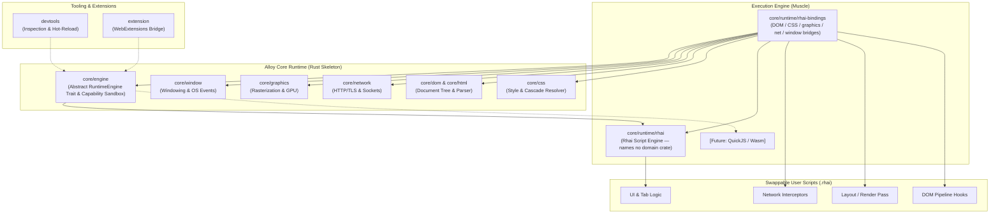
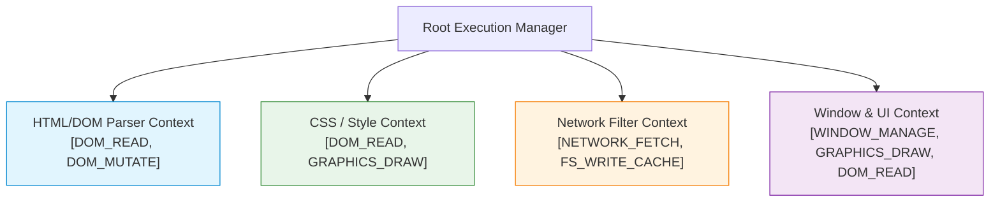

# 🏗️ Alloy Architecture Overview

Alloy is structured around the **Skeleton and Muscle** architectural pattern, modularized across independent Rust Cargo
crates and swappable runtime scripting engines.

---

## 1. High-Level Architecture Diagram

---

## 2. The Skeleton and Muscle Pattern

### 2.1 The Skeleton (Rust Core)

- **Role**: Memory safety, concurrent execution, system I/O, heavy computational bounds.
- **Invariants**:
    - Owns all canonical data structures (`DomTree`, `StyleSheet`, `HttpRequest`, `BitmapBuffer`).
    - Enforces thread safety, lifetime boundaries, and strict capability checks.
    - Exposes deterministic traits for script engines without leaking engine-specific types into core domain crates.

### 2.2 The Muscle (Runtime Scripting)

- **Role**: Behavioral policy, pipeline ordering, event handling, user custom logic.
- **Invariants**:
    - Operates on domain data passed across the capability sandbox boundary.
    - Stateless execution scopes: scripts can be reloaded on the fly.
    - Trapped execution: Script panics and runtime errors are isolated and never crash the Rust host process.

---

## 3. Cargo Workspace Crate Map

Dependencies below are the **target** graph, not today's `Cargo.toml` — except where a crate is implemented. Implemented
so far: `engine`, `rhai-runtime`, `rhai-bindings`, `dom` (v0.1 + v0.2), `graphics` (v0.3 F4a).

**Rule (v0.3 report decision 2.1, generalised in the v0.5 plan §1.4):** no domain crate depends on `engine`. Every
script bridge lives in `core/runtime/rhai-bindings`, which is the one crate that may name both a `rhai` type and a
domain crate. `core/runtime/rhai` itself names no domain crate.

| Crate Path                   | Package Name    | Primary Responsibility                                     | Dependencies                                                                                 |
| ---------------------------- | --------------- | ---------------------------------------------------------- | -------------------------------------------------------------------------------------------- |
| `core/engine`                | `engine`        | Engine traits, Contexts, Capability Bitflags, EngineValue  | None (Pure abstraction)                                                                      |
| `core/runtime/rhai`          | `rhai-runtime`  | Concrete Rhai engine implementation for browser muscle     | `engine`, `rhai`                                                                             |
| `core/runtime/rhai-bindings` | `rhai-bindings` | Rhai ⇄ domain-crate bridges (DOM; CSS/graphics/net/window) | `rhai-runtime`, `engine`, `rhai`, `dom` (+ `css`/`graphics`/`network`/`window` as they land) |
| `core/js`                    | `js`            | Web content ECMAScript runtime & DOM script execution      | `dom`                                                                                        |
| `core/dom`                   | `dom`           | DOM Node hierarchy, Element nodes, mutations               | None (Pure domain)                                                                           |
| `core/html`                  | `html`          | HTML5 tokenization and tree construction                   | `dom`                                                                                        |
| `core/css`                   | `css`           | CSS syntax parser, rule sets, cascade + layout ports       | `dom`, `graphics` (for `Au`/`Px`/`Color`/`Rect` only)                                        |
| `core/graphics`              | `graphics`      | 2D display lists, software rasterizer, later Vulkan/OpenGL | None (Pure domain)                                                                           |
| `core/window`                | `window`        | Window creation, event loop dispatch, surface binding      | None (`FrameView` borrows pixels — no `graphics` edge)                                       |
| `core/network`               | `network`       | Sockets, DNS resolution, HTTP/1.1, TLS, cache              | None (Pure domain)                                                                           |
| `devtools`                   | `devtools`      | Remote debugging protocol, AST inspector, hot-reloader     | `engine`                                                                                     |
| `extension`                  | `extension`     | WebExtensions and native script extension runtime          | `engine`, `dom`                                                                              |

---

## 4. Graphics Rendering Subsystem

Alloy implements a **3-Tier Rendering Cascade**:

1. **Tier 1 (Primary)**: Vulkan backend (`vulkano`) for direct hardware acceleration, explicit command buffers, and
   swapchain presentation.
2. **Tier 2 (Fallback)**: OpenGL / OpenGL ES backend (`glow` + `glutin`) for legacy drivers and virtualized GPU systems.
3. **Tier 3 (Headless/CI)**: Software CPU rasterizer outputting to an in-memory pixel buffer for headless testing.

Subsystems emit declarative `DisplayList` command buffers (`DrawRect`, `DrawText`, `DrawImage`, `PushClip`, `DrawPath`),
keeping layout logic fully decoupled from GPU driver details.

---

## 5. Capability Sandbox Security Hierarchy

---

## 6. Clean Architecture & Structural DDD

Each crate in `core/*` implements an inward Clean Architecture dependency topology:

- **`domain/`**: Innermost kernel containing Entities, Immutable Value Objects (Newtypes), Domain Invariants, and Typed
  Errors. Zero dependencies, zero I/O.
- **`application/`**: Aggregate pipeline orchestrators, domain services, and abstract ports (traits).
- **`infrastructure/`**: Outermost concrete adapters (e.g. Vulkano/Glow renderers, OS windowing, Rhai runtime bindings)
  implementing application ports.

### Mechanism vs. Policy Division

- **Rust Core (Mechanism / Structural DDD)**: Enforces structural tree invariants, memory safety, capability gates, and
  strong value type validations.
- **Runtime Muscle (Policy / Behavioral DDD)**: Expresses workflows, event responses, routing rules, and user-facing
  customization scripts.

### Rust-Adapted Object Calisthenics

- **Zero Naked Primitives**: Domain models use strong Newtypes (`NodeId`, `TagName`, `Px`, `ColorRgba`) to prevent
  primitive obsession.
- **First-Class Collections**: `Vec` and `HashMap` are wrapped into domain collection types enforcing integrity
  (`Children`, `RuleSet`, `HeaderMap`).
- **Guard Clauses & Early Returns**: Functions eliminate `else` branches in favor of `?`, pattern matching, and early
  returns.

---

## 7. Development & SPDD Workflow Integration

Alloy utilizes the **SPDD (Structured Prompt-Driven Development)** framework:

1. **Requirements** in `docs/requirements/` define product expectations.
2. **ADRs** in `docs/adr/` enforce architectural constraints and design invariants.
3. **SPDD Analysis** (`/spdd-analysis`) generates enriched context documents in `spdd/analysis/`.
4. **REASONS Canvas** (`/spdd-reasons-canvas`) creates executable implementation prompts in `spdd/prompt/`.
5. **Code Generation & Verification** (`/spdd-generate` & `/spdd-sync`) produces and syncs high-confidence Rust code.
