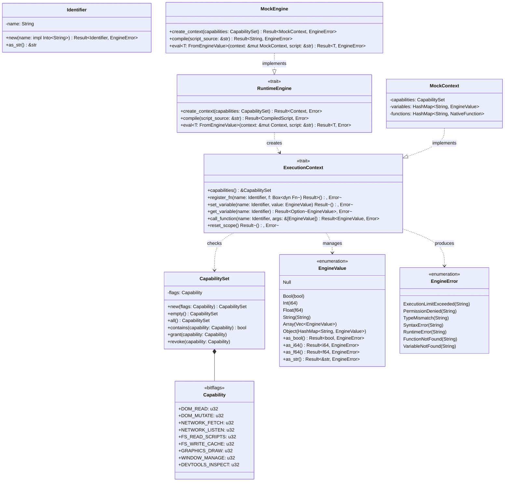

# Abstract Runtime Engine & Script Execution Interface (core/engine)

## Requirements

Implement pure abstract runtime engine interfaces (`RuntimeEngine`, `ExecutionContext`) and canonical dynamic
values/errors (`EngineValue`, `CapabilitySet`, `EngineError`), decoupling Rust domain crates from concrete scripting
interpreters while supporting full testability via a mock engine to satisfy PRD-002 and close criteria C-01 and C-05.

## Entities

## Approach

1. **Layered Architecture & Domain Separation**:
    - Reside strictly within `core/engine` following ADR-0010 Clean Architecture.
    - `src/domain/`: Defines invariant-protecting newtypes, domain value enums, bitflags, and typed domain errors with
      zero dependencies.
    - `src/application/`: Defines abstract ports (`RuntimeEngine`, `ExecutionContext`), function caller types, and
      bidirectional conversion traits (`FromEngineValue`, `IntoEngineValue`).
    - `src/infrastructure/`: Defines `MockEngine` and `MockContext` for hermetic testing and verification of engine
      interchangeability (C-05).
    - `src/lib.rs`: Public facade exporting the ubiquitous language of the scripting boundary.

2. **Technology & Dependencies**:
    - Add `bitflags = { workspace = true }` to `core/engine/Cargo.toml`.
    - Maintain `#![forbid(unsafe_code)]` at the crate root.
    - Zero dependencies on any concrete interpreter (`rhai`, `boa`, etc.) in accordance with ADR-0002.

3. **Object Calisthenics & Invariants**:
    - Newtype `Identifier` ensures function and variable names are non-empty and well-formed without raw string
      obsession.
    - Deterministic error returns via `EngineError` instead of panics.
    - Immutable data types by default, mutating strictly via explicit validated receiver methods.

## Structure

### Inheritance & Implementations

1. `MockEngine` implements `RuntimeEngine`.
2. `MockContext` implements `ExecutionContext`.
3. Standard primitive types (`bool`, `i64`, `f64`, `String`, `&str`) implement `IntoEngineValue` and `FromEngineValue`.
4. `EngineError` implements `std::error::Error` and `std::fmt::Display`.

### Dependencies

1. `core/engine/domain` depends on `bitflags` only.
2. `core/engine/application` depends on `core/engine/domain`.
3. `core/engine/infrastructure` depends on `application` and `domain`.
4. External crates (`alloy`, `dom`, `window`) will depend on `core/engine` ports, never on concrete engine internals.

### Layered Module Layout

- `src/domain/mod.rs`
- `src/domain/error.rs`
- `src/domain/identifier.rs`
- `src/domain/capability.rs`
- `src/domain/value.rs`
- `src/application/mod.rs`
- `src/application/ports.rs`
- `src/application/conversion.rs`
- `src/infrastructure/mod.rs`
- `src/infrastructure/mock.rs`
- `src/lib.rs`

## Operations

### 1. Update Manifest - `core/engine/Cargo.toml`

1. Responsibility: Enable `bitflags` dependency from workspace.
2. Edits: Add `bitflags = { workspace = true }` under `[dependencies]`.

### 2. Implement Domain Error - `src/domain/error.rs`

1. Responsibility: Strongly typed error enum for script execution, permissions, and type mapping.
2. Attributes / Variants:
    - `ExecutionLimitExceeded(String)`
    - `PermissionDenied(String)`
    - `TypeMismatch { expected: &'static str, found: &'static str }`
    - `SyntaxError(String)`
    - `RuntimeError(String)`
    - `FunctionNotFound(String)`
    - `VariableNotFound(String)`
    - `InvalidIdentifier(String)`
3. Methods:
    - Implement `std::fmt::Display` and `std::error::Error`.

### 3. Implement Value Object - `src/domain/identifier.rs`

1. Responsibility: Invariant-protecting identifier newtype for function and variable names.
2. Invariants: Non-empty, trimmed string.
3. Methods:
    - `new(name: impl Into<String>) -> Result<Identifier, EngineError>`
    - `as_str(&self) -> &str`

### 4. Implement Capabilities - `src/domain/capability.rs`

1. Responsibility: Bitflags and capability set representing runtime permissions (PRD-003).
2. Bitflags:
    - `DOM_READ`, `DOM_MUTATE`, `NETWORK_FETCH`, `NETWORK_LISTEN`, `FS_READ_SCRIPTS`, `FS_WRITE_CACHE`, `GRAPHICS_DRAW`,
      `WINDOW_MANAGE`, `DEVTOOLS_INSPECT`.
3. Struct `CapabilitySet`:
    - Methods: `new(flags: Capability)`, `empty()`, `all()`, `contains(&self, cap: Capability) -> bool`,
      `grant(&mut self, cap: Capability)`, `revoke(&mut self, cap: Capability)`.

### 5. Implement Canonical Value - `src/domain/value.rs`

1. Responsibility: Dynamic runtime value representation.
2. Variants:
    - `Null`, `Bool(bool)`, `Int(i64)`, `Float(f64)`, `String(String)`, `Array(Vec<EngineValue>)`,
      `Object(HashMap<String, EngineValue>)`.
3. Methods:
    - `as_bool(&self) -> Result<bool, EngineError>`
    - `as_i64(&self) -> Result<i64, EngineError>`
    - `as_f64(&self) -> Result<f64, EngineError>`
    - `as_str(&self) -> Result<&str, EngineError>`

### 6. Implement Value Conversions - `src/application/conversion.rs`

1. Responsibility: Bidirectional safe conversions between native Rust types and `EngineValue`.
2. Traits:
    - `pub trait IntoEngineValue: Send + Sync { fn into_engine_value(self) -> EngineValue; }`
    - `pub trait FromEngineValue: Sized + Send + Sync {`
      `fn from_engine_value(value: &EngineValue) -> Result<Self, EngineError>; }`
3. Implementations:
    - Implement for `()`, `bool`, `i32`, `i64`, `u32`, `u64`, `f32`, `f64`, `String`, `&str`.

### 7. Implement Abstract Ports - `src/application/ports.rs`

1. Responsibility: Pure traits defining contract for script engines and isolates.
2. Type definitions:
    - `pub type NativeFn = Arc<dyn Fn(&mut dyn ExecutionContext, &[EngineValue])`
      `-> Result<EngineValue, EngineError> + Send + Sync>;`
3. Traits:
    - `pub trait ExecutionContext: Send + Sync`:
        - `fn capabilities(&self) -> &CapabilitySet;`
        - `fn register_fn(&mut self, name: Identifier, f: NativeFn) -> Result<(), EngineError>;`
        - `fn set_variable(&mut self, name: Identifier, value: EngineValue) -> Result<(), EngineError>;`
        - `fn get_variable(&self, name: &Identifier) -> Result<Option<&EngineValue>, EngineError>;`
        - `fn call_function(&mut self, name: &Identifier, args: &[EngineValue]) -> Result<EngineValue, EngineError>;`
        - `fn reset_scope(&mut self) -> Result<(), EngineError>;`
    - `pub trait RuntimeEngine: Send + Sync`:
        - `type Context: ExecutionContext;`
        - `type CompiledScript: Send + Sync;`
        - `type Error: std::error::Error + Send + Sync + 'static;`
        - `fn create_context(&self, capabilities: CapabilitySet) -> Result<Self::Context, Self::Error>;`
        - `fn compile(&self, script_source: &str) -> Result<Self::CompiledScript, Self::Error>;`
        - `fn eval<T: FromEngineValue>(&self, context: &mut Self::Context, script: &str) -> Result<T, Self::Error>;`

### 8. Implement Mock Infrastructure - `src/infrastructure/mock.rs`

1. Responsibility: Lightweight, fast mock engine and isolate verifying trait contracts (C-01, C-05).
2. Structs:
    - `MockContext`: Contains `capabilities: CapabilitySet`, `variables: HashMap<String, EngineValue>`,
      `functions: HashMap<String, NativeFn>`.
    - `MockEngine`: Implements `RuntimeEngine<Context = MockContext, CompiledScript = String, Error = EngineError>`.
3. Mock execution behavior:
    - Simple expression evaluator supporting variable lookups and function calls.

### 9. Configure Facade - `src/lib.rs`

1. Responsibility: Export clean public API and re-exports of ubiquitous language types.
2. Invariants: `#![forbid(unsafe_code)]`.

### 10. Automated Tests - Unit & Mock Interchangeability

1. Verification of C-01: `RuntimeEngine` and `ExecutionContext` contracts validated.
2. Verification of C-05: Test proving domain structs can execute through `MockEngine` without coupling.
3. Verification of Sandbox Security: Capability verification rejecting calls when required flag is absent.

## Norms

1. **Object Calisthenics (ADR-0010)**:
    - Zero naked primitive strings for identifiers — use `Identifier`.
    - No `else` keyword — use `match`, `if let`, and early returns.
    - One level of indentation per function.
2. **Error Handling**:
    - `EngineError` is exhaustive and strongly typed.
    - Zero `unwrap()` or `expect()` in library code.
3. **Safety**:
    - `#![forbid(unsafe_code)]` enforced at crate root.
4. **Format & Style**:
    - Prettier tabs and width 120 for markdown, `cargo fmt` for Rust.

## Safeguards

1. **Dependency Constraints**:
    - `core/engine` must never add dependencies on `rhai`, `boa_engine`, or any specific scripting interpreter.
2. **Performance Constraints (N-01)**:
    - Value conversion for primitive integers, booleans, and floats must be stack-based without heap allocations.
3. **Sandbox Constraints (PRD-003)**:
    - Every `ExecutionContext` must retain its immutable `CapabilitySet`.
4. **Quality Gates**:
    - Zero clippy warnings with `-D warnings`.
    - 100% test pass rate across all 3 OS platforms.
