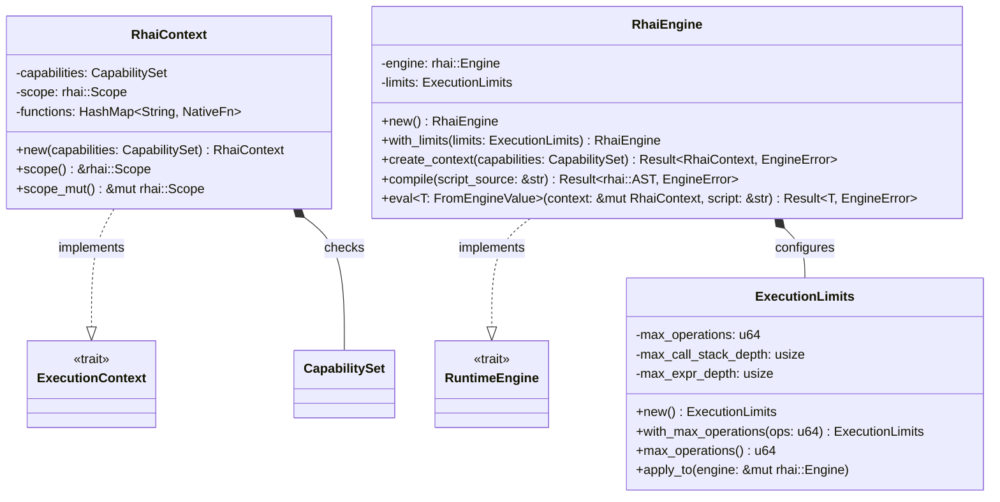

# Concrete Rhai Runtime Backend (core/runtime/rhai)

## Requirements

Implement the concrete Rhai scripting backend (`RhaiEngine`, `RhaiContext`, `ExecutionLimits`) implementing the abstract
`RuntimeEngine` and `ExecutionContext` ports defined in `core/engine`, with strict execution limit enforcement to
prevent infinite loops and complete criteria C-02 and C-04, integrated with the `alloy --script` CLI.

## Entities

## Approach

1. **Architecture & Clean Layering**:
    - Reside in `core/runtime/rhai`.
    - `src/domain/`: `limits.rs` (`ExecutionLimits`), `marshaling.rs` (bidirectional mapping between `EngineValue` and
      `rhai::Dynamic`).
    - `src/application/`: `engine.rs` (`RhaiEngine`), `context.rs` (`RhaiContext`).
    - `src/lib.rs`: Public facade re-exporting `RhaiEngine`, `RhaiContext`, `ExecutionLimits`.

2. **Technology & Dependencies**:
    - Add `rhai = { version = "1.26.0", features = ["sync"] }` to `[workspace.dependencies]` and
      `core/runtime/rhai/Cargo.toml`.
    - Thread safety: `rhai` with feature `sync` uses `Arc` for AST and engine internals, enabling thread-safe
      evaluation.
    - Zero unsafe code: Enforce `#![forbid(unsafe_code)]` at crate root.

3. **Execution Limit & Fault Trapping (C-04)**:
    - Configure `engine.on_progress` or `engine.set_max_operations(limits.max_operations())`.
    - Intercept Rhai's `EvalAltResult::ErrorTooManyOperations` and map to `EngineError::ExecutionLimitExceeded`.
    - Intercept parse/syntax errors and map to `EngineError::SyntaxError`.

4. **CLI Integration**:
    - Add `engine` and `rhai-runtime` dependencies to `alloy/Cargo.toml`.
    - Implement script evaluation branch in `alloy/src/main.rs`: read file, create context, eval, and print return
      value.

## Structure

### Inheritance & Implementations

1. `RhaiEngine` implements `engine::RuntimeEngine`.
2. `RhaiContext` implements `engine::ExecutionContext`.

### Dependencies

1. `core/runtime/rhai` depends on `core/engine` and `rhai`.
2. `alloy` binary depends on `core/engine` and `core/runtime/rhai`.

### Layered Module Layout

- `src/domain/mod.rs`
- `src/domain/limits.rs`
- `src/domain/marshaling.rs`
- `src/application/mod.rs`
- `src/application/context.rs`
- `src/application/engine.rs`
- `src/lib.rs`

## Operations

### 1. Update Workspace & Crate Manifests

1. Add `rhai = { version = "1.26.0", features = ["sync"] }` to root `Cargo.toml` under `[workspace.dependencies]`.
2. Add `rhai = { workspace = true }` to `core/runtime/rhai/Cargo.toml`.

### 2. Implement Execution Limits - `src/domain/limits.rs`

1. Responsibility: Encapsulate limits on operations, recursion, and allocations.
2. Attributes: `max_operations: u64`, `max_call_stack_depth: usize`, `max_expr_depth: usize`.
3. Methods:
    - `new() -> Self` (defaults: 100_000 ops, 64 call stack depth, 64 expr depth)
    - `with_max_operations(mut self, ops: u64) -> Self`
    - `apply_to(&self, engine: &mut rhai::Engine)`

### 3. Implement Value Marshaling - `src/domain/marshaling.rs`

1. Responsibility: Safe bidirectional conversion between `EngineValue` and `rhai::Dynamic`.
2. Functions:
    - `engine_value_to_dynamic(val: &EngineValue) -> rhai::Dynamic`
    - `dynamic_to_engine_value(dyn_val: &rhai::Dynamic) -> Result<EngineValue, EngineError>`

### 4. Implement Context - `src/application/context.rs`

1. Responsibility: Isolate scope and capability check layer.
2. Attributes: `capabilities: CapabilitySet`, `scope: rhai::Scope<'static>`, `functions: HashMap<String, NativeFn>`.
3. Implement `ExecutionContext`:
    - `capabilities()`: returns `&self.capabilities`.
    - `register_fn()`: registers native closure into context.
    - `set_variable()`: stores variable in `rhai::Scope`.
    - `get_variable()`: retrieves and converts variable from `rhai::Scope`.
    - `call_function()`: calls native or script function.
    - `reset_scope()`: clears scope variables.

### 5. Implement Engine - `src/application/engine.rs`

1. Responsibility: Concrete engine managing compilation, context creation, and script eval.
2. Implement `RuntimeEngine<Context = RhaiContext, CompiledScript = rhai::AST, Error = EngineError>`:
    - `create_context()`: instantiates `RhaiContext`.
    - `compile()`: calls `engine.compile(script)` and maps syntax errors.
    - `eval()`: executes script with context and marshals return value to `T`.

### 6. Public Facade - `src/lib.rs`

1. Re-export `RhaiEngine`, `RhaiContext`, `ExecutionLimits`.
2. Enforce `#![forbid(unsafe_code)]`.

### 7. CLI Wiring - `alloy/src/main.rs`

1. Add `engine` and `rhai-runtime` dependencies to `alloy/Cargo.toml`.
2. In `alloy/src/main.rs`, handle `--script <path>`:
    - Read file content from disk.
    - Initialize `RhaiEngine::new()`.
    - Create context with `CapabilitySet::all()`.
    - Evaluate script and print the resulting `EngineValue`.

### 8. Automated Tests - Conformance & Safety

1. Verification of C-02: `RhaiEngine` passes all trait compliance tests.
2. Verification of C-04: Script `while true {}` terminates with `EngineError::ExecutionLimitExceeded`.
3. Verification of Syntax Error: Malformed script returns `EngineError::SyntaxError`.
4. Verification of Native Function: Native function called from Rhai script.

## Norms

1. **Object Calisthenics**: No `else`, early returns, newtype validation.
2. **Error Translation**: Transparent mapping from `rhai::EvalAltResult` to `EngineError`.
3. **Safety**: `#![forbid(unsafe_code)]` at crate root.

## Safeguards

1. Infinite loop execution limit must abort deterministically without hanging CI or test runner.
2. No panic on invalid script input or syntax error.
3. 100% test pass rate in CI across Linux, macOS, Windows.
