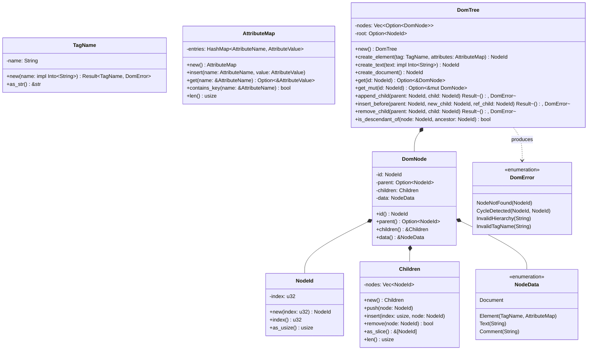

# DOM Tree Arena Hierarchy & Mutations (core/dom)

## Requirements

Implement the DOM tree subsystem in `core/dom` using the arena pattern, enforcing acyclicity invariants, single-parent
linkage, and clean mutation APIs, with scripting bridge integration to close criterion C-03.

## Entities

## Approach

1. **Arena Architecture & Ownership**:
    - Reside in `core/dom`.
    - The tree is an aggregate root (`DomTree`) owning all nodes in a flat vector (`Vec<Option<DomNode>>`).
    - `NodeId(u32)` acts as an unforgeable lightweight index handle.
    - Eliminates heap allocation per node and circular reference leaks.

2. **Structural Invariants & Cycle Detection**:
    - `append_child` and `insert_before` traverse upward from the intended parent to verify that the child is not an
      ancestor of the parent.
    - If a cycle would form, operation rejects with `DomError::CycleDetected`.
    - If the child already has a parent, it is automatically detached from the old parent before attaching to the new
      one.

3. **Object Calisthenics (ADR-0010)**:
    - Strong newtypes: `NodeId`, `TagName`, `AttributeName`, `AttributeValue`.
    - First-class collections: `Children`, `AttributeMap`.
    - No `else` statements — early returns and pattern matching.
    - `#![forbid(unsafe_code)]` at crate root.

4. **Script Runtime Integration (C-03 / I1)**:
    - Provide `infrastructure::bridge` to register DOM helper methods onto `engine::ExecutionContext`.

## Structure

### Dependencies

1. `core/dom` depends on `core/engine`.

### Layered Module Layout

- `src/domain/mod.rs`
- `src/domain/error.rs`
- `src/domain/node_id.rs`
- `src/domain/tag_name.rs`
- `src/domain/attribute.rs`
- `src/domain/children.rs`
- `src/domain/node_data.rs`
- `src/domain/node.rs`
- `src/domain/tree.rs`
- `src/application/mod.rs`
- `src/application/service.rs`
- `src/infrastructure/mod.rs`
- `src/infrastructure/bridge.rs`
- `src/lib.rs`

## Operations

### 1. Update Manifest - `core/dom/Cargo.toml`

1. Add `engine = { workspace = true }` under `[dependencies]`.

### 2. Implement Domain Error - `src/domain/error.rs`

1. Define `DomError` with `NodeNotFound`, `CycleDetected`, `InvalidHierarchy`, `InvalidTagName`.
2. Implement `Display` and `std::error::Error`.

### 3. Implement Value Objects - `src/domain/node_id.rs` & `src/domain/tag_name.rs`

1. `NodeId`: `new(u32)`, `index(&self) -> u32`, `as_usize(&self) -> usize`.
2. `TagName`: `new(impl Into<String>) -> Result<TagName, DomError>`. Enforces non-empty and lowercases.

### 4. Implement Collections - `src/domain/attribute.rs` & `src/domain/children.rs`

1. `AttributeName`, `AttributeValue`, `AttributeMap`: wrappers with insertion and lookup methods.
2. `Children`: `push`, `insert`, `remove`, `as_slice`, `contains`, `len`, `is_empty`.

### 5. Implement Node & Data - `src/domain/node_data.rs` & `src/domain/node.rs`

1. `NodeData`: enum variants `Document`, `Element`, `Text`, `Comment`.
2. `DomNode`: encapsulates `id`, `parent`, `children`, `data`. Accessors for immutable and mutable data.

### 6. Implement Aggregate Arena - `src/domain/tree.rs`

1. `DomTree`: node allocation, `append_child`, `insert_before`, `remove_child`, `is_descendant_of`,
   `depth_first_traversal`.

### 7. Implement Service - `src/application/service.rs`

1. `DomService`: methods to serialize tree/subtree to HTML representation for debugging.

### 8. Implement Script Bridge - `src/infrastructure/bridge.rs`

1. Register DOM manipulation functions (`dom_create_element`, `dom_append_child`, `dom_get_text`, `dom_set_text`) into
   `engine::ExecutionContext`.

### 9. Public Facade - `src/lib.rs`

1. Re-export public ubiquitous language and enforce `#![forbid(unsafe_code)]`.

### 10. Automated Tests - Tree Invariants & Scripting

1. Test tree acyclicity rejection.
2. Test parent reparenting on move.
3. Test depth-first pre-order traversal.
4. Test script manipulation of `DomNode` (C-03).

## Norms

1. Object Calisthenics: Newtypes for primitives, first-class collections, no `else`.
2. Zero unsafe code: `#![forbid(unsafe_code)]`.

## Safeguards

1. Cycle detection prevents invalid tree hierarchies.
2. All tree mutation operations return structured `Result<(), DomError>`.
3. 100% test pass rate in CI.
