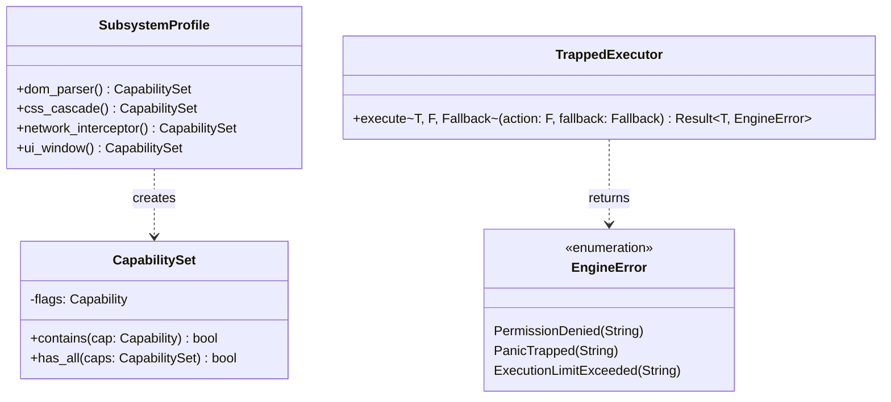

# Hierarchical Capability Sandboxing & Fault Trapping (core/engine)

## Requirements

Implement the hierarchical capability sandboxing subsystem and fault isolation executor in `core/engine`, enforcing
security checks on native bindings, scope isolation across subsystem execution contexts, and panic trapping with
fallback recovery, closing criteria C-06, C-07, C-08, and C-09.

## Entities

## Approach

1. **Subsystem Profiles**:
    - Reside in `core/engine/src/domain/capability.rs`.
    - Provide standard profiles according to PRD-003 §3.2.

2. **Guarded Native Bindings (C-06, C-07)**:
    - Provide `guarded_native_fn(required: Capability, f: ...)` combinator.
    - Automatically validates `ctx.capabilities().contains(required)`.
    - Returns `EngineError::PermissionDenied` if unauthorized.

3. **Scope Hermeticity (C-08)**:
    - Verify through automated multi-context tests that each `ExecutionContext` maintains an isolated state and scope.

4. **Panic Trapping & Fallback (C-09)**:
    - Provide `TrappedExecutor::execute(action, fallback)`.
    - Wraps closure in `std::panic::catch_unwind(std::panic::AssertUnwindSafe(...))`.
    - If a panic or error occurs, logs the error and executes the fallback handler.

## Structure

### Layered Module Layout

- `src/domain/capability.rs` (adds `SubsystemProfile`)
- `src/domain/error.rs` (adds `PanicTrapped`)
- `src/application/sandbox.rs` (`guarded_native_fn`, `TrappedExecutor`)
- `src/application/mod.rs`
- `src/lib.rs`

## Operations

### 1. Update Domain Error - `src/domain/error.rs`

1. Add `PanicTrapped(String)` variant to `EngineError`.

### 2. Implement Subsystem Profiles - `src/domain/capability.rs`

1. Implement `SubsystemProfile` struct with `dom_parser()`, `css_cascade()`, `network_interceptor()`, and `ui_window()`.

### 3. Implement Sandbox Application Logic - `src/application/sandbox.rs`

1. Implement `guarded_native_fn`.
2. Implement `TrappedExecutor`.

### 4. Update Application & Lib Facade - `src/application/mod.rs` & `src/lib.rs`

1. Re-export `SubsystemProfile`, `guarded_native_fn`, and `TrappedExecutor`.

### 5. Automated Tests - Sandboxing & Fault Isolation

1. Create `core/engine/tests/sandbox_isolation.rs`:
    - Test C-06: Guarded function checks capability.
    - Test C-07: Calling without capability returns `PermissionDenied`.
    - Test C-08: Two contexts have separate, isolated scopes without leakage.
    - Test C-09: Panicking closure is trapped and triggers fallback.

## Norms

1. Object Calisthenics: No `else`, early returns, newtypes.
2. Safety: `#![forbid(unsafe_code)]`.
3. Catch Unwind: Must preserve unwind safety using `AssertUnwindSafe`.

## Safeguards

1. A panicking script must never terminate the Rust test or host process.
2. Capability permissions must be immutable during script execution.
