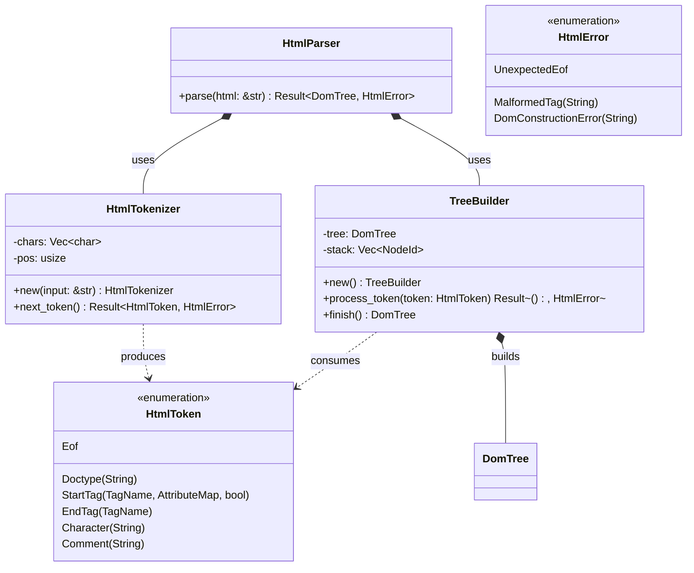

# HTML5 Tokenizer & Tree Construction (core/html)

## Requirements

Implement the HTML5 tokenizer, entity decoder, and tree builder in `core/html`, transforming raw HTML input streams into
a well-formed `DomTree` adhering to the subset required for v0.3 headless rendering.

## Entities

## Approach

1. **Tokenization Strategy**:
    - Reside in `core/html`.
    - Lexer scans through the input character slice, identifying tag brackets (`<`, `>`), tag names, attributes, quotes,
      comments (`<!--`), and raw text.
    - Text chunks are buffered and coalesced into single `Character` tokens.
    - HTML entities (`&amp;`, `&lt;`, `&gt;`, `&quot;`, `&#39;`) are decoded on the fly.

2. **Tree Building Strategy**:
    - `TreeBuilder` initializes a new `DomTree` with a root Document node.
    - Start tags create element nodes attached to the current top of the insertion stack (`stack.last()`).
    - If not void (e.g. not `img`, `br`, `hr`), the new node ID is pushed onto `stack`.
    - End tags pop nodes from `stack` up to the matching tag name.
    - Character tokens create text nodes attached to the current insertion node.

3. **Error Handling & Resiliency**:
    - Unclosed tags are gracefully auto-closed at EOF.
    - Missing parent elements auto-wrap under document or body.
    - Zero panic policy: All parse errors return structured `Result<DomTree, HtmlError>`.

## Structure

### Dependencies

1. `core/html` depends on `core/dom` and `core/engine`.

### Layered Module Layout

- `src/domain/mod.rs`
- `src/domain/token.rs`
- `src/domain/entities.rs`
- `src/domain/tokenizer.rs`
- `src/domain/tree_builder.rs`
- `src/application/mod.rs`
- `src/application/parser.rs`
- `src/lib.rs`

## Operations

### 1. Update Manifest - `core/html/Cargo.toml`

1. Add `dom = { workspace = true }` and `engine = { workspace = true }` under `[dependencies]`.

### 2. Implement Tokens & Errors - `src/domain/token.rs`

1. Define `HtmlToken` enum with `Doctype`, `StartTag`, `EndTag`, `Character`, `Comment`, `Eof`.
2. Define `HtmlError` enum with `UnexpectedEof`, `MalformedTag`, `DomConstructionError`.

### 3. Implement Entity Decoder - `src/domain/entities.rs`

1. Implement `decode_html_entities(raw: &str) -> String`.

### 4. Implement Tokenizer - `src/domain/tokenizer.rs`

1. Implement `HtmlTokenizer` scanning characters into `HtmlToken`s.

### 5. Implement Tree Builder - `src/domain/tree_builder.rs`

1. Implement `TreeBuilder` with `open_elements: Vec<NodeId>` and void element detection.

### 6. Implement Application Facade - `src/application/parser.rs`

1. Implement `HtmlParser::parse(html: &str) -> Result<DomTree, HtmlError>`.
2. Provide standalone helper `parse_html(html: &str) -> Result<DomTree, HtmlError>`.

### 7. Public Facade - `src/lib.rs`

1. Re-export `HtmlParser`, `parse_html`, `HtmlToken`, `HtmlError`.
2. Enforce `#![forbid(unsafe_code)]`.

### 8. Automated Tests - Tokenizer & Tree Construction

1. Test tokenizing tags, attributes, comments, and entities.
2. Test parsing complete HTML document with nested hierarchy.
3. Test void elements (``, ` `).
4. Test unclosed tag auto-recovery.

## Norms

1. Object Calisthenics: Newtypes, no `else`, one dot per line.
2. Safety: `#![forbid(unsafe_code)]`.

## Safeguards

1. Tokenizer never enters an infinite loop on malformed syntax.
2. 100% test pass rate in CI.
