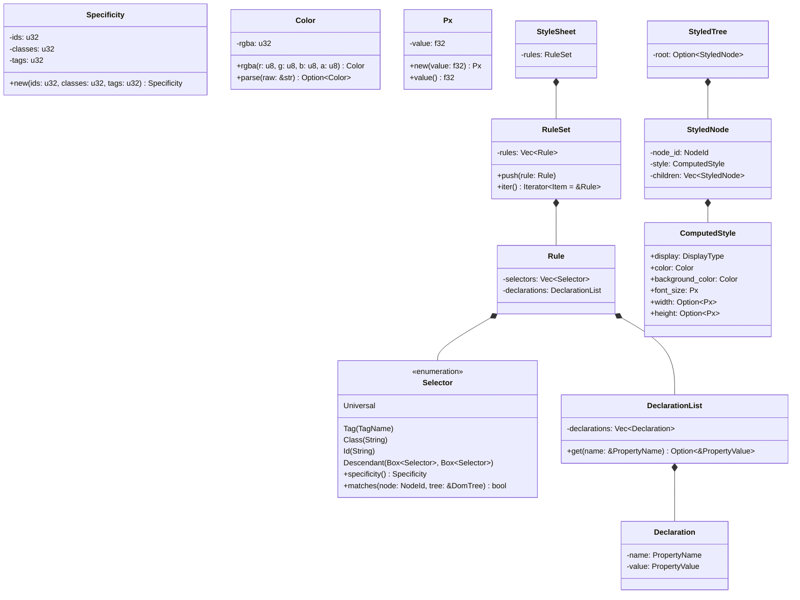

# CSS Parser, Specificity & Style Cascade (core/css)

## Requirements

Implement the CSS parser, selector matcher (tag, class, ID, descendant), specificity resolver, rule-set manager, and
style cascade engine in `core/css`, producing the `StyledTree` aggregate from a `DomTree` and `StyleSheet`.

## Entities

## Approach

1. **Architecture & Clean Layering**:
    - Reside in `core/css`.
    - `domain/`: Value objects (`Px`, `Color`), collections (`DeclarationList`, `RuleSet`), entities (`Selector`,
      `Rule`, `StyleSheet`, `ComputedStyle`), and aggregate roots (`StyledTree`).
    - `application/`: Parser service (`CssParser`) and cascade service (`StyleCascade`).
    - `lib.rs`: Public facade.

2. **Parsing Strategy**:
    - Tokenize CSS into selectors, `{`, property-value pairs, `}`, `;`.
    - Parse selector chains: handle commas (multiple selectors per rule) and spaces (descendant selectors).
    - Parse values: colors (hex, named, rgb), lengths (`px`), keywords (`block`, `inline`, `none`, `flex`).

3. **Cascade & Inheritance**:
    - For every element in the `DomTree`, find matching rules.
    - Sort matched declarations by specificity `(ids, classes, tags)` and source order.
    - Apply non-inherited initial defaults.
    - For text or child nodes, inherit inheritable properties (`color`, `font-size`) from parent.
    - Construct `StyledTree` matching the visible DOM structure.

## Structure

### Dependencies

1. `core/css` depends on `core/dom` and `core/engine`.

### Layered Module Layout

- `src/domain/mod.rs`
- `src/domain/error.rs`
- `src/domain/property.rs`
- `src/domain/specificity.rs`
- `src/domain/selector.rs`
- `src/domain/declaration.rs`
- `src/domain/rule.rs`
- `src/domain/stylesheet.rs`
- `src/domain/computed.rs`
- `src/domain/styled_node.rs`
- `src/application/mod.rs`
- `src/application/parser.rs`
- `src/application/cascade.rs`
- `src/lib.rs`

## Operations

### 1. Update Manifest - `core/css/Cargo.toml`

1. Add `dom = { workspace = true }` and `engine = { workspace = true }`.

### 2. Implement Primitives & Errors - `domain/property.rs` & `domain/error.rs`

1. `Color`, `Px`, `DisplayType`, `PropertyName`, `PropertyValue`.
2. `CssError`.

### 3. Implement Selectors & Specificity - `domain/specificity.rs` & `domain/selector.rs`

1. `Specificity(u32, u32, u32)` implementing `Ord`.
2. `Selector` with `matches(node, tree)`.

### 4. Implement Declarations & Rules - `domain/declaration.rs`, `domain/rule.rs`, `domain/stylesheet.rs`

1. First-class collections: `DeclarationList`, `RuleSet`.
2. Structs: `Declaration`, `Rule`, `StyleSheet`.

### 5. Implement Computed Style & Styled Tree - `domain/computed.rs` & `domain/styled_node.rs`

1. `ComputedStyle` with defaults and builder.
2. `StyledNode` and `StyledTree`.

### 6. Implement Parser - `application/parser.rs`

1. `CssParser::parse_stylesheet(css: &str) -> Result<StyleSheet, CssError>`.
2. Helper `parse_css(css: &str) -> Result<StyleSheet, CssError>`.

### 7. Implement Cascade Service - `application/cascade.rs`

1. `StyleCascade::build_styled_tree(tree: &DomTree, stylesheet: &StyleSheet) -> StyledTree`.

### 8. Public Facade - `src/lib.rs`

1. Re-export public ubiquitous language with `#![forbid(unsafe_code)]`.

### 9. Automated Tests - Parser, Specificity & Cascade

1. Test selector parsing and specificity calculation order.
2. Test rule matching (tag, class, ID, descendant).
3. Test cascade priority (ID overrides class, class overrides tag).
4. Test inheritance and `StyledTree` construction from `DomTree`.

## Norms

1. Object Calisthenics: Newtypes (`Px`, `Color`), first-class collections (`RuleSet`), no `else`.
2. Safety: `#![forbid(unsafe_code)]`.

## Safeguards

1. Malformed CSS rules are ignored without failing the whole stylesheet.
2. Specificity comparison is strictly ordered.
3. 100% test pass rate in CI.
