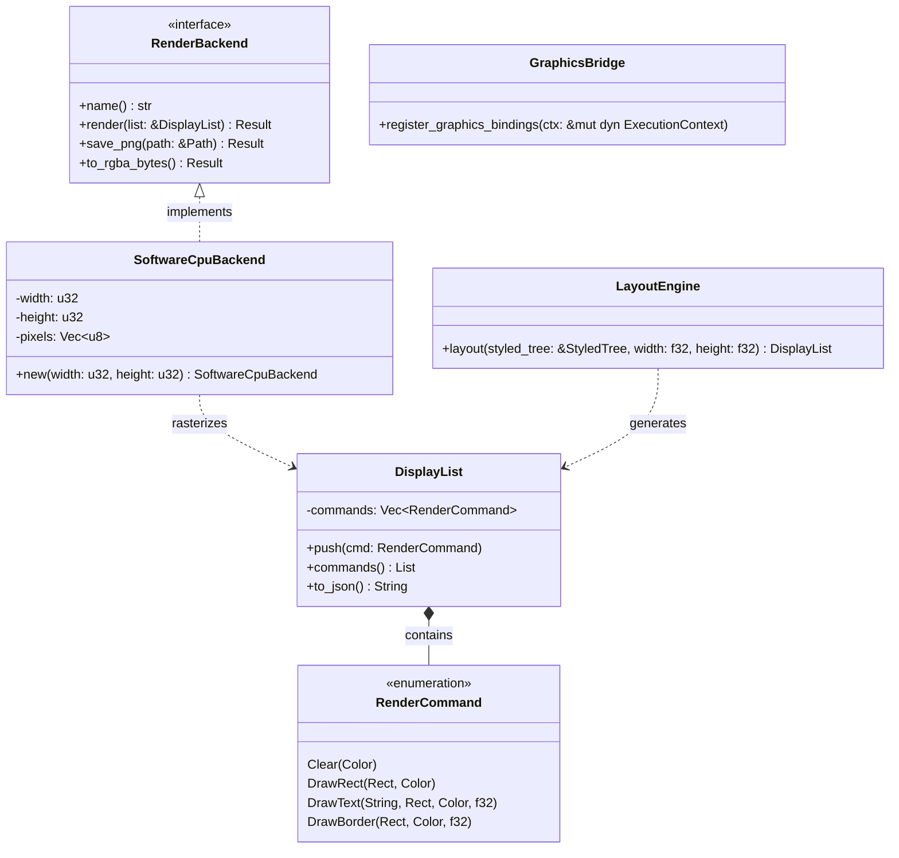

# Graphics Pipeline, DisplayList & SoftwareCpuBackend (core/graphics & I2)

## Requirements

Implement the abstract graphics pipeline, display list commands, CPU rasterizer backend, and headless rendering CLI
subcommand in `core/graphics` and `alloy`, closing criteria C-14, C-17, C-18, and delivering Release v0.3 (Integration
I2).

## Entities

## Approach

1. **Architecture & Clean Layering**:
    - `core/graphics/src/domain/`: `geometry.rs`, `command.rs`, `display_list.rs`, `backend.rs`, `error.rs`.
    - `core/graphics/src/application/`: `cpu_backend.rs`, `layout.rs`, `factory.rs`.
    - `core/graphics/src/infrastructure/`: `rhai_bridge.rs`.
    - `alloy/src/main.rs`: Adds `render` subcommand.

2. **Rasterization Strategy (C-17)**:
    - `SoftwareCpuBackend` owns a byte buffer (`Vec<u8>`) representing 32-bit RGBA pixels.
    - Clears, draws solid rectangles, borders, and text bounding areas.
    - Saves to PNG using `image::save_buffer`.

3. **Layout Translation**:
    - `LayoutEngine` walks `StyledTree`, allocating vertical boxes for block elements.
    - Emits `DrawRect` for backgrounds, `DrawBorder` for outlines, and `DrawText` for text nodes.

4. **Script Bindings (C-18)**:
    - Guarded by `Capability::GRAPHICS_DRAW`.
    - Functions to create display lists, push draw commands, and serialize to string.

5. **CLI Subcommand (I2)**:
    - `alloy render <html_path> -o <output_png>` parses HTML, evaluates cascade, runs layout, rasterizes to PNG.

## Structure

### Dependencies

- `core/graphics`: depends on `dom`, `engine`, `css`, `image`.
- `alloy`: depends on `graphics`, `html`, `css`, `dom`, `engine`, `rhai-runtime`, `clap`.

## Operations

### 1. Update Manifests

1. `core/graphics/Cargo.toml`: add dependencies on `dom`, `engine`, `css`, `image`.
2. `alloy/Cargo.toml`: add dependencies on `graphics`, `html`, `css`, `dom`.

### 2. Implement Domain Layer

1. `domain/geometry.rs`: `Rect`, `Point`, `Size`.
2. `domain/command.rs`: `RenderCommand`.
3. `domain/display_list.rs`: `DisplayList`.
4. `domain/backend.rs`: `RenderBackend` trait.
5. `domain/error.rs`: `GraphicsError`.

### 3. Implement Application Layer

1. `application/cpu_backend.rs`: `SoftwareCpuBackend`.
2. `application/layout.rs`: `LayoutEngine`.
3. `application/factory.rs`: `GraphicsBackendFactory`.

### 4. Implement Infrastructure Layer

1. `infrastructure/rhai_bridge.rs`: `register_graphics_bindings`.

### 5. Update Alloy CLI

1. Add `Render` subcommand to `alloy/src/main.rs`.

### 6. Automated Tests

1. `core/graphics/tests/graphics_conformance.rs` closing C-14, C-17, C-18.
2. End-to-end headless CLI test generating a real PNG image (I2).

## Norms

1. Object Calisthenics: Newtypes, no `else`.
2. Clean separation between display list generation and backend rasterization.

## Safeguards

1. Headless environment never requires GPU libraries.
2. `GRAPHICS_DRAW` capability strictly enforced on script bindings.
