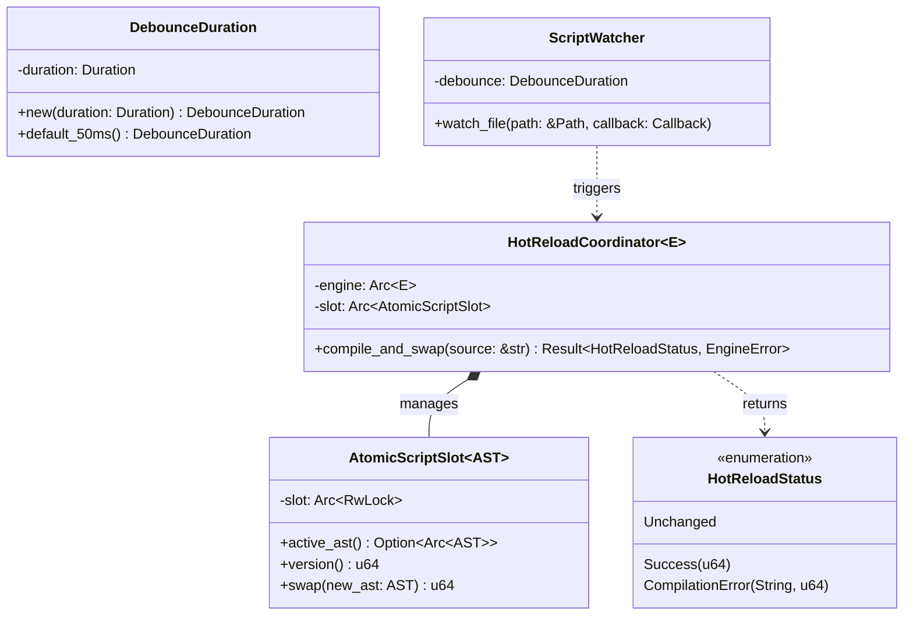

# Runtime Hot-Reload Subsystem (core/engine & F11)

## Requirements

Implement the file watching with debounce, background compilation, atomic AST pointer swapping, and syntax error
rollback in `core/engine`, closing criteria C-10, C-11, C-12, C-13, and delivering Release v0.4.

## Entities

## Approach

1. **Architecture & Clean Layering**:
    - `core/engine/src/domain/hot_reload.rs`: `DebounceDuration`, `HotReloadStatus`, `ReloadableScript`.
    - `core/engine/src/application/hot_reload.rs`: `AtomicScriptSlot`, `HotReloadCoordinator`, `ScriptWatcher`.
    - `core/engine/src/lib.rs`: Public facade.

2. **Atomic Swap & Error Rollback (C-11, C-12)**:
    - When a reload is triggered, `HotReloadCoordinator` compiles the new source using `engine.compile(source)`.
    - If compilation produces an `EngineError::SyntaxError` or other error:
        - Retains the previously active AST.
        - Returns `HotReloadStatus::CompilationError { error, previous_version }`.
        - Logs diagnostic without affecting the active subsystem.
    - If compilation succeeds:
        - Swaps the active AST in `AtomicScriptSlot`.
        - Increments version counter.
        - Returns `HotReloadStatus::Success { version }`.

3. **Debounced File Watching (C-10)**:
    - Uses `notify` with a debounce filter of 50ms.
    - Filters events specifically for `.rhai` script paths.

4. **State Preservation (C-13)**:
    - Demonstrates that DOM tree nodes, attributes, and hierarchy remain 100% intact across multiple reloads.

## Structure

### Dependencies

- `core/engine` adds `notify = { workspace = true }`.

### Layered Module Layout

- `src/domain/hot_reload.rs`
- `src/domain/mod.rs`
- `src/application/hot_reload.rs`
- `src/application/mod.rs`
- `src/lib.rs`

## Operations

### 1. Update Manifest - `core/engine/Cargo.toml`

1. Add `notify = { workspace = true }` under `[dependencies]`.

### 2. Implement Domain Layer - `src/domain/hot_reload.rs`

1. `DebounceDuration`, `HotReloadStatus`.

### 3. Implement Application Layer - `src/application/hot_reload.rs`

1. `AtomicScriptSlot<AST>`, `HotReloadCoordinator<E>`, `ScriptWatcher`.

### 4. Update Public Facade - `src/lib.rs`

1. Re-export `AtomicScriptSlot`, `HotReloadCoordinator`, `HotReloadStatus`, `DebounceDuration`.

### 5. Automated Tests - `core/engine/tests/hot_reload_conformance.rs`

1. Test C-10: File watcher detects `.rhai` modification with debounce.
2. Test C-11: Background compilation and atomic swap.
3. Test C-12: Syntax error does not replace active AST and reports error.
4. Test C-13: DOM tree and application state intact after multiple consecutive reloads.

## Norms

1. Object Calisthenics: Newtypes, no `else`.
2. Concurrency Safety: Thread-safe atomic swaps via `Arc`.

## Safeguards

1. Malformed script never invalidates active AST.
2. 100% test pass rate in CI.
