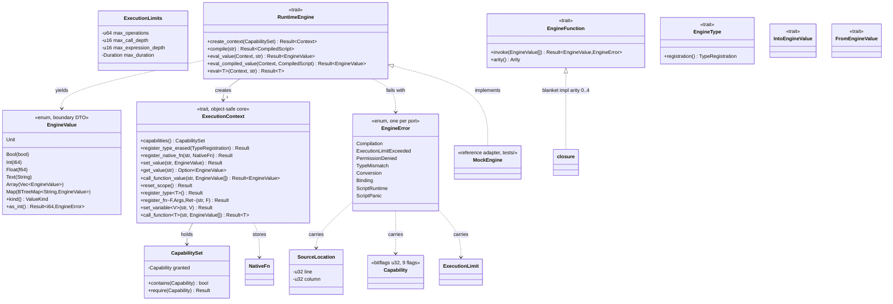

# Abstract runtime-engine port (`core/engine`) + workspace foundation

## Requirements

- Establish the Skeleton-side contract for browser _muscle_ scripting so any interpreter (Rhai first, JS/Wasm later) can
  be attached without changing a domain crate (`PRD-002`, `ADR-0002`).
- Deliver it as a **replaceable port** under the `ADR-0011` contract: neutral boundary type, one typed error, an in-repo
  reference adapter, a conformance suite, and CI proof the abstraction links no interpreter.
- Stand up the workspace foundation the roadmap's F0 gates depend on: pinned toolchain, versioned lockfile, centralised
  dependency versions, `#![forbid(unsafe_code)]`, supply-chain and CI gates.
- Close acceptance criteria **C-01** and **C-05**; leave C-02/C-04 for the Rhai adapter increment.

## Entities

## Approach

1. **Layering (`ADR-0010` §1)**
    - `domain/` — `EngineValue`, `ValueKind`, `EngineError`, `Capability`, `CapabilitySet`, `profiles`,
      `ExecutionLimits`, `ExecutionLimit`, `SourceLocation`. Zero I/O; `bitflags` is the only external crate and only
      inside `capability.rs`.
    - `application/` — `ports.rs` (`RuntimeEngine`, `ExecutionContext`, `NativeFn`), `conversion.rs`, `function.rs`,
      `engine_type.rs`.
    - `infrastructure/` — none in this crate; adapters live in `core/runtime/*`.
    - `conformance.rs` — public, backend-agnostic suite (`ADR-0011` item 6).
2. **Boundary discipline (`ADR-0011` items 2-4)**
    - Every crossing value is `EngineValue`; every failure is `EngineError`.
    - No `rhai` type in any signature. `rhai::CustomType` → own `EngineType`.
3. **Object-safety**
    - `ExecutionContext` required methods speak only `EngineValue` / `EngineError` → `dyn ExecutionContext` is legal
      now.
    - PRD-002 generics (`eval::<T>`, `register_fn`, `set_variable`, `call_function`, `register_type`) kept as
      **provided** methods with `where Self: Sized`.
    - `dyn RuntimeEngine` companion deferred to v0.2 / ADR-0013; documented.
4. **Hot-reload readiness (`ADR-0005`)**
    - `compile()` returns `CompiledScript: Send + Sync + 'static`; `eval_compiled_value` is the path a running subsystem
      uses.
5. **Foundation (roadmap F0)**
    - `rust-toolchain.toml` pins `1.97.1` + `rustfmt`,`clippy`.
    - `Cargo.lock` un-ignored and versioned.
    - `[workspace.package]` + `[workspace.dependencies]` (`bitflags` exact; `rhai` declared, unused, features frozen for
      F2).
    - `#![forbid(unsafe_code)]` in every `core/*` + `devtools` + `extension`.
    - `deny.toml`; `.github/workflows/ci.yml` with the v0.1 gates.

## Structure

### Trait/impl relationships

1. `RuntimeEngine` associates `Context: ExecutionContext` and `CompiledScript: Send + Sync + 'static`.
2. `MockEngine` (in `core/engine/tests/`) implements `RuntimeEngine`; its `MockContext` implements `ExecutionContext`.
3. Any `Fn(A0..A3) -> R` where `Ai: FromEngineValue`, `R: IntoEngineValue` blanket-implements `EngineFunction`.
4. `EngineError` implements `Display` + `std::error::Error` by hand.

### Dependencies (inward only)

1. `application/ports` depends on `domain::{value,error,capability}` and
   `application::{conversion,function,engine_type}`.
2. `conformance` depends on `application::ports` + `domain`.
3. `domain` depends on nothing but `core`/`std` and (in `capability`) `bitflags`.
4. No workspace crate gains a dependency on `engine` in this increment.

### Layers

1. `lib.rs` — facade: `pub use` of the domain value objects, the ports, the support traits, and `pub mod conformance`.
2. `domain/` — value objects + typed error.
3. `application/` — ports + conversions + `EngineFunction` + `EngineType`.
4. `tests/` — `mock_engine.rs` (reference adapter + C-05 + conformance run), `value_objects.rs`, `conversions.rs`
   (domain unit coverage).

## Operations

### Create value object — `EngineValue` (`domain/value.rs`)

- Enum with the seven variants above; `#[derive(Clone, Debug, PartialEq)]`.
- `kind(&self) -> ValueKind`; `is_unit`; `as_bool/as_int/as_float/as_text/ as_array/as_map` returning
  `Result<_, EngineError::TypeMismatch>`. `as_float` widens `Int`.
- `Display`: scalars plain, arrays `[a, b]`, maps `{k: v}`.
- `ValueKind` enum with `name(self) -> &'static str` + `Display`.

### Create typed error — `EngineError` (`domain/error.rs`)

- Eight variants (`Compilation`, `ExecutionLimitExceeded`, `PermissionDenied`, `TypeMismatch`, `Conversion`, `Binding`,
  `ScriptRuntime`, `ScriptPanic`), `#[non_exhaustive]`.
- Constructors: `compilation`, `execution_limit_exceeded`, `permission_denied`, `type_mismatch`, `conversion`,
  `binding`, `script_runtime`, `script_panic`.
- Hand-written `Display`; empty `impl std::error::Error`.

### Create value object — `Capability` / `CapabilitySet` (`domain/capability.rs`)

- `bitflags! struct Capability: u32` — the nine PRD-003:37-46 flags, exact.
- `CapabilitySet(Capability)`: `empty`, `new`, `contains`, `granted`,
  `require(needed) -> Result<(), PermissionDenied{ missing }>`. `Default = empty`.
- `mod profiles`: `dom_parser`, `css_style`, `network_interceptor`, `ui_window` per PRD-003:53-58.

### Create value object — `ExecutionLimits` (`domain/limits.rs`)

- `ExecutionLimit` enum {`Operations`,`CallDepth`,`ExpressionDepth`,`Duration`}
    - `Display`.
- `ExecutionLimits` with `strict()` defaults, `with_*` const builders, accessors, `Default = strict`.

### Create value object — `SourceLocation` (`domain/source.rs`)

- `{ line: u32, column: u32 }`; `new`, `line_only`, accessors, `Display` (`line N` / `line N, column M`).

### Define port — `ExecutionContext` (`application/ports.rs`)

- Required object-safe: `capabilities`, `register_type_erased`, `register_native_fn`, `set_value`, `get_value`,
  `call_function_value`, `reset_scope`.
- Provided (`where Self: Sized`): `register_type::<T: EngineType>`, `register_fn::<F: EngineFunction<Args,Ret>>`,
  `set_variable::<V: IntoEngineValue>`, `call_function::<T: FromEngineValue>`.
- `type NativeFn = Arc<dyn Fn(&[EngineValue]) -> Result<EngineValue, EngineError> + Send + Sync>`.

### Define port — `RuntimeEngine` (`application/ports.rs`)

- `Send + Sync`; `type Context: ExecutionContext`; `type CompiledScript: Send + Sync + 'static`.
- Required: `create_context`, `compile`, `eval_value`, `eval_compiled_value`.
- Provided: `eval::<T>`, `eval_compiled::<T>`.

### Define trait — `EngineFunction<Args, Ret>` (`application/function.rs`)

- `invoke(&self, &[EngineValue]) -> Result<EngineValue, EngineError>`; `arity(&self) -> Arity`.
- Blanket impls arity 0-4: `check_arity`, then `argument::<Ai>(args, i)` which clones the slot and calls
  `FromEngineValue`.
- `Arity(usize)` with `exact` / `count`.

### Define trait — `EngineType` (`application/engine_type.rs`)

- `registration() -> TypeRegistration where Self: Sized`.
- `TypeRegistration { script_name: &'static str }`, `#[non_exhaustive]`, `new` / `script_name`.

### Define traits — `IntoEngineValue` / `FromEngineValue` (`application/conversion.rs`)

- Impls: `EngineValue` (identity), `()`, `bool`, `i64`, `i32` (checked), `f64`, `String`, `&str` (into only), `Vec<T>`,
  `BTreeMap<String, T>`, `Option<T>` (None ⇄ Unit).

### Create reference adapter — `MockEngine` (`core/engine/tests/mock_engine.rs`)

- Tiny interpreter: literals, scope var lookup, `name()` zero-arg call, integer `+`, unterminated string →
  `Compilation`.
- `MockContext` holds `CapabilitySet` + three maps; `reset_scope` clears only variables.
- `evaluate_subject<E: RuntimeEngine>` — generic consumer proving **C-05**.
- `run_core_suite(MockEngine::new)` — proves the conformance suite green.

### Create conformance suite — `conformance.rs`

- `run_core_suite<E: RuntimeEngine, M: Fn() -> E>(make)` runs nine checks: literal eval, typed sugar, variable
  roundtrip, compiled==source, invalid source ⇒ `Compilation`, context isolation, native-fn dispatch, capabilities
  carried, `reset_scope` clears locals. Panics with a descriptive message on first violation. No `Debug` bound on
  `E::CompiledScript`.

### Foundation files

- `rust-toolchain.toml`, `.gitignore` (drop `Cargo.lock`), `Cargo.lock` (versioned), root `Cargo.toml`
  (`[workspace.package]` + `[workspace.dependencies]`), `deny.toml`, `.github/workflows/ci.yml`,
  `#![forbid(unsafe_code)]` in the nine stub crates.

## Norms

- **Object Calisthenics (`ADR-0010` §4)**: no `else` (guard clauses / `match` / `if let`); one indentation level per
  function; no naked primitives in domain types (boundary DTO `EngineValue` is the documented exception); first-class
  wrappers (`CapabilitySet`, `Arity`, `TypeRegistration`); full names (`script_source`, not `src`); private fields,
  methods for mutation.
- **Errors**: exactly one `EngineError`; adapters map into it; no `Box<dyn Error>`, no foreign error type across the
  seam.
- **Docs**: every public item has a doc comment citing the PRD/ADR line it serves. Deviations from PRD-002 are stated in
  the `ports.rs` module doc.
- **Lints**: `#![forbid(unsafe_code)]`; `cargo clippy --all-targets --all-features -D warnings` clean, tests included.
- **Formatting**: tabs, `cargo fmt` clean (matches `.prettierrc` tab style).

## Safeguards

1. **Functional**: `RuntimeEngine` + `ExecutionContext` exist with the PRD-002 method set (C-01); `evaluate_subject`
   runs on `MockEngine` with no `rhai` anywhere (C-05); `cargo test -p engine` green (30 tests).
2. **Architecture**: `cargo tree -p engine` contains only `bitflags` — CI `no-engine` job greps for
   `rhai|boa_engine|rquickjs|…` and fails on a hit (`ADR-0002:49`, `ADR-0011` item 2).
3. **Boundary**: no public signature in `core/engine` names a `rhai` type; the only external type is
   `bitflags::bitflags!`-generated `Capability`.
4. **Object-safety**: `dyn ExecutionContext` compiles; `dyn RuntimeEngine` is knowingly deferred (documented, ADR-0013).
5. **Supply chain**: `Cargo.lock` versioned; `deny.toml` license allow-list covers `bitflags` (`MIT OR Apache-2.0`);
   `cargo deny check` blocking in CI.
6. **Memory**: `#![forbid(unsafe_code)]` on every crate; no exception used.
7. **Limits**: `ExecutionLimits::strict()` is defined and engine-agnostic; enforcement is wired by the adapter in F2
   (mechanism of C-04).
8. **Coverage**: `domain/` exercised by `value_objects.rs` + `conversions.rs`; CI gate
   `cargo llvm-cov -p engine --fail-under-lines 85`.
9. **Not in scope, must not appear**: per-binding capability checks, hot-reload watcher, `rhai` marshaling, `alloy`
   binary — all later phases.
