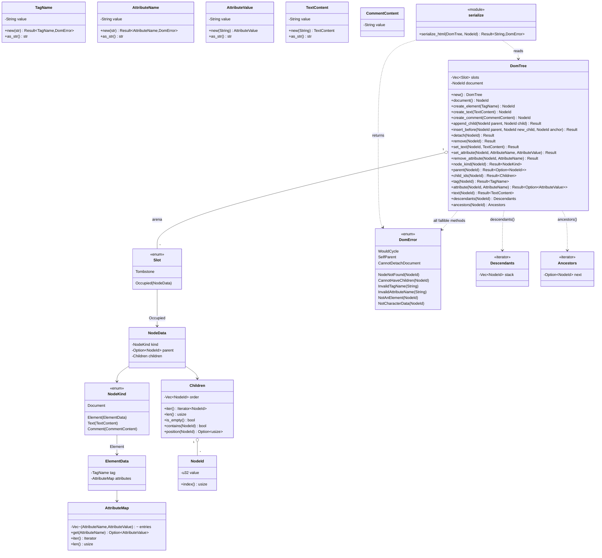

# `core/dom` — the DOM tree aggregate (v0.2 F3)

## Requirements

- Implement `core/dom` as a **zero-dependency domain crate** (`ADR-0010`, report decision 2.1): entities, value objects,
  invariants, one typed error, non-recursive traversal, and a deterministic HTML serializer. It names no `engine` type,
  links no crate, and keeps the "Domínio sem engine" gate (`PRD-001:99`, N-04) green by construction.
- Model the tree as an **arena** `Vec<Slot>` indexed by `NodeId(u32)`; removal leaves a `Tombstone` and never reuses the
  index (no generational id in v0.2 — deferred to C-13).
- Enforce, **only through `DomTree` methods** (no public mutable field), the five invariants of report §2.2: acyclicity,
  single parent, no self-parent, `Document` is the irremovable root, and `Children`⇄`parent` coherence.
- Provide `descendants` / `ancestors` as explicit-stack iterators — **no recursion** (Object Calisthenics rule 1 applies
  in full; `core/dom` gets no exception).
- Provide `serialize_html(&DomTree, NodeId) -> Result<String, DomError>`: pure, deterministic, attributes in insertion
  order, `&` `<` `>` escaped in text and `&` `<` `>` `"` in attribute values, void elements emitted without a close tag.
- Ship tests proving acyclicity refusal, single-parent move, `Document` detach refusal, traversal order, and a
  `build → serialize` round-trip.

## Entities

## Approach

1. **Layering** (`ADR-0010:54-74`):
    - `src/lib.rs` — `#![forbid(unsafe_code)]`, facade: `pub use domain::{…}` +
      `pub use application::serialize::serialize_html`.
    - `src/domain/` — `node.rs` (`NodeId`, `NodeKind`, `ElementData`, `NodeData`, `Slot`), `tag_name.rs`, `text.rs`
      (`TextContent`, `CommentContent`), `attributes.rs` (`AttributeName`, `AttributeValue`, `AttributeMap`),
      `children.rs` (`Children`), `tree.rs` (`DomTree` + invariants), `traversal.rs` (`Descendants`, `Ancestors`),
      `error.rs` (`DomError`).
    - `src/application/serialize.rs` — the one service.
    - `Cargo.toml` — no `[dependencies]`; `*.workspace = true` metadata only.
2. **Value-object validation on construction** (rule 3):
    - `TagName::new` — trim-free; reject empty; reject any char that is not ASCII alphanumeric or `-`; reject a leading
      digit or `-`; lowercase the rest. Error `InvalidTagName(original.to_owned())`.
    - `AttributeName::new` — reject empty; reject ASCII control, whitespace, and any of `"' /=>`; lowercase. Error
      `InvalidAttributeName`.
    - `AttributeValue::new` / `TextContent::new` / `CommentContent::new` — infallible; store as given.
3. **First-class collections** (rule 4): `Children` wraps `Vec<NodeId>`, insertion order; `push`, `remove_value`
   (returns `bool`), `insert_before_value(anchor, value) -> Option<()>`, `position`, `contains`, `iter`, `len`,
   `is_empty`. `AttributeMap` wraps `Vec<(AttributeName, AttributeValue)>`; `set` updates in place when the name is
   present else appends; `get`, `remove`, `iter`, `len`, `is_empty`. Neither exposes the inner `Vec`.
4. **Arena mechanics** (`tree.rs`, rule 1 — one indentation level per fn, rule 2 — no `else`):
    - `DomTree::new()` pushes `Slot::Occupied(NodeData { kind: Document, parent: None, children: empty })` at index 0,
      sets `document = NodeId(0)`.
    - Private helpers: `slot(id) -> Result<&Slot>`, `slot_mut(id) -> Result<&mut Slot>` (bounds + `Tombstone` →
      `NodeNotFound`); `node_data(id) -> Result<&NodeData>`, `node_data_mut(id) -> Result<&mut NodeData>`;
      `is_ancestor(candidate, of) -> Result<bool>` (walks `ancestors(of)`); `detach_from_parent(child)` (find current
      parent, remove `child` from its `Children`, set `child.parent = None`) — sequential single-index writes, never two
      overlapping `&mut`.
    - `create_*` push a detached `Occupied` slot, return its `NodeId`.
    - `append_child(parent, child)`: `parent == child` → `SelfParent`; resolve both (`NodeNotFound` on either);
      `node_kind(parent)` must be `Document` or `Element` → else `CannotHaveChildren(parent)`;
      `is_ancestor(child, parent)?` → `WouldCycle`; `detach_from_parent(child)`; push `child` to `parent.children`; set
      `child.parent = Some(parent)`.
    - `insert_before(parent, new_child, anchor)`: same guards as `append_child`; `anchor` must be in `parent.children` →
      else `NodeNotFound`; detach `new_child`; insert before `anchor`'s position; set parent.
    - `detach(node)`: `node == document` → `CannotDetachDocument`; resolve; `detach_from_parent(node)`.
    - `remove(node)`: `node == document` → `CannotDetachDocument`; `detach_from_parent(node)`; iterative post-order over
      an explicit `Vec<NodeId>` stack collecting `node` + all descendants; set each collected slot to `Tombstone`.
    - `set_text(node, content)`: `node_kind` must be `Text` → else `NotCharacterData(node)`; replace.
    - `set_attribute` / `remove_attribute`: `node_kind` must be `Element` → else `NotAnElement(node)`; delegate to
      `ElementData.attributes`.
    - Read accessors return cloned value objects or `Children` snapshots (`child_ids`), keeping `NodeData` private.
5. **Traversal** (`traversal.rs`, no recursion):
    - `Descendants { stack: Vec<NodeId> }` — `descendants(root)` seeds the stack with `root`'s children in **reverse**;
      `next()` pops, then pushes that node's children in reverse, and returns the popped id (yields strict descendants
      in document / pre-order). An invalid `root` seeds an empty stack.
    - `Ancestors { tree: &DomTree, next: Option<NodeId> }` — `ancestors(node)` sets
      `next = parent(node).ok().flatten()`; `next()` returns the current and advances to its parent; ends after
      `Document` (whose parent is `None`).
6. **Serializer** (`application/serialize.rs`, no recursion):
    - `serialize_html(tree, root) -> Result<String, DomError>`. Resolve `root` first (`NodeNotFound`).
    - Explicit work-stack of `Step { Enter(NodeId), Exit(TagName) }`. Pop `Enter(id)`: match `node_kind`:
        - `Document` → push each child as `Enter` in reverse (no markup of its own).
        - `Element(e)` → write `<tag`, then a `name="value"` token per entry of `attributes.iter()` with the attribute
          escape table, then `>`; if `tag` ∈ the void set, do **not** recurse or emit a close; else push
          `Exit(tag.clone())` then each child `Enter` in reverse.
        - `Text(t)` → write `escape_text(t.as_str())`.
        - `Comment(c)` → write `<!--`, raw content, `-->`.
    - Pop `Exit(tag)`: write `</tag>`.
    - `escape_text`: `&`→`&amp;`, `<`→`&lt;`, `>`→`&gt;`. `escape_attr`: adds `"`→`&quot;`.
    - Void set: `area base br col embed hr img input link meta param source track wbr`.

## Structure

### Types and impls

1. `NodeId(u32)` — `Copy`, `Eq`, `Hash`, `Debug`; `index() -> usize`; constructor `pub(crate) fn new(u32)`.
2. `DomError` — `#[non_exhaustive]`, `#[derive(Clone, Debug, PartialEq, Eq)]`, hand-written `Display` +
   `impl std::error::Error` (no derive-macro dep, matching `core/engine`'s `error.rs`).
3. `DomTree` — the only type with mutating methods; every field private; `Default` = `new`.
4. `Descendants` / `Ancestors` — `impl Iterator<Item = NodeId>`.
5. `serialize_html` — free function in `application::serialize`.

### Dependencies

1. `core/dom` → **nothing** (no `[dependencies]` table at all).
2. Nothing in the workspace depends on `core/dom` yet — `core/runtime/rhai` gains the edge in I1.

### Layers

1. `src/lib.rs` — facade + `#![forbid(unsafe_code)]`.
2. `src/domain/{node,tag_name,text,attributes,children,tree,traversal,error}.rs`.
3. `src/application/serialize.rs`.
4. `tests/{tree_invariants,traversal,serialize}.rs`.

## Operations

### Create value objects (`domain/tag_name.rs`, `domain/text.rs`, `domain/attributes.rs`)

- `TagName(String)` — `new(&str) -> Result<Self, DomError>` per Approach 2; `as_str`; `Display`.
- `TextContent(String)`, `CommentContent(String)` — `new(impl Into<String>)`; `as_str`.
- `AttributeName(String)` — `new(&str) -> Result<Self, DomError>` per Approach 2; `as_str`; `PartialEq` for lookup.
- `AttributeValue(String)` — `new(impl Into<String>)`; `as_str`.

### Create first-class collections (`domain/children.rs`, `domain/attributes.rs`)

- `Children` — `new()` (empty), `push`, `remove_value(NodeId) -> bool`,
  `insert_before_value(anchor, value) -> Option<()>`, `position(NodeId) -> Option<usize>`, `contains(NodeId) -> bool`,
  `iter() -> impl Iterator<Item = NodeId> + '_`, `len`, `is_empty`. `#[derive(Clone, Debug, Default, PartialEq, Eq)]`.
- `AttributeMap` — `new()`, `set(AttributeName, AttributeValue)` (update-in-place or append),
  `get(&AttributeName) -> Option<&AttributeValue>`, `remove(&AttributeName) -> bool`,
  `iter() -> impl Iterator<Item = (&AttributeName, &AttributeValue)> + '_`, `len`, `is_empty`.
  `#[derive(Clone, Debug, Default, PartialEq, Eq)]`.

### Create node model (`domain/node.rs`)

- `NodeId(u32)` per Structure 1.
- `ElementData { tag: TagName, attributes: AttributeMap }` — `new(TagName)`; `tag()`, `attributes()`, `attributes_mut()`
  (`pub(crate)`).
- `NodeKind` enum per Entities.
- `NodeData { kind: NodeKind, parent: Option<NodeId>, children: Children }` — `pub(crate)` constructors/accessors only.
- `Slot` enum: `Occupied(NodeData)`, `Tombstone`.

### Implement `DomError` (`domain/error.rs`)

- Nine variants per Entities. `Display` messages: `NodeNotFound` → "node {id} does not exist"; `WouldCycle` → "append
  would make the tree cyclic"; `SelfParent` → "a node cannot be its own parent"; `CannotDetachDocument` → "the document
  root cannot be detached or removed"; `CannotHaveChildren` → "node {id} cannot hold children"; `InvalidTagName` → "not
  a valid tag name: {s}"; `InvalidAttributeName` → "not a valid attribute name: {s}"; `NotAnElement` → "node {id} is not
  an element"; `NotCharacterData` → "node {id} is not character data".

### Implement `DomTree` (`domain/tree.rs`)

- Fields `slots: Vec<Slot>`, `document: NodeId`. `new()` / `Default` per Approach 4.
- Private: `slot`, `slot_mut`, `node_data`, `node_data_mut`, `is_ancestor`, `detach_from_parent`, `collect_subtree`
  (iterative, returns `Vec<NodeId>` in post-order).
- Public mutators: `create_element`, `create_text`, `create_comment`, `append_child`, `insert_before`, `detach`,
  `remove`, `set_text`, `set_attribute`, `remove_attribute` — logic per Approach 4; every branch is an early return or a
  `match` arm, never `else`.
- Public readers: `document`, `node_kind`, `parent`, `child_ids` (clones the `Children`), `tag`, `attribute`, `text`,
  `descendants`, `ancestors`.

### Implement traversal (`domain/traversal.rs`)

- `Descendants` + `DomTree::descendants(root)` per Approach 5. `next()` is a single `match` on `stack.pop()`.
- `Ancestors` + `DomTree::ancestors(node)` per Approach 5.

### Implement `serialize_html` (`application/serialize.rs`)

- `serialize_html(tree, root) -> Result<String, DomError>` — explicit `Vec<Step>` work-stack per Approach 6.
- Free helpers: `escape_text`, `escape_attr`, `is_void(&TagName) -> bool`. No recursion, one indentation level per fn.

### Tests (`core/dom/tests/`)

- `tree_invariants.rs`:
    - building `a → b`, then `append_child(b, a)` returns `DomError::WouldCycle` and `tree` is byte-for-byte unchanged
      (assert `child_ids`, `parent`, `slots` length).
    - `append_child(p2, x)` when `x` is already a child of `p1` removes `x` from `p1.child_ids()` and appends to
      `p2.child_ids()`.
    - `detach(tree.document())` and `remove(tree.document())` both return `DomError::CannotDetachDocument`.
    - `append_child(n, n)` returns `DomError::SelfParent`.
    - `remove(subtree_root)` tombstones the whole subtree: every id in it now returns `DomError::NodeNotFound` from
      `node_kind`.
    - `set_text` on an element → `NotCharacterData`; `set_attribute` on a text node → `NotAnElement`.
- `traversal.rs`:
    - a known tree yields the exact expected `Vec<NodeId>` from `descendants(document())` (document / pre-order).
    - `ancestors(leaf)` yields `[…, document()]` and stops.
- `serialize.rs`:
    - `Document → html → body → p("Hi & <ok>")` with `p` carrying `class="a"` `data-x="\"q\""` serialises to exactly
      `<html><body>
Hi &amp; &lt;ok&gt;
</body></html>`.
    - a tree containing ` ` serialises it with no closing tag.
    - attribute insertion order is preserved across `set_attribute` calls including an update-in-place.

## Norms

- **Object Calisthenics (`ADR-0010:127-137`), all nine, no exception for `core/dom`**: no `else`; one indentation level
  per function (use `?`, early return, `match`, iterator combinators, private helpers); wrap every primitive in a
  newtype (`NodeId`, `TagName`, `AttributeName`, `AttributeValue`, `TextContent`, `CommentContent`); first-class
  collections (`Children`, `AttributeMap`) — no public `Vec`/`HashMap`; one dot per line; full names (`attribute_name`,
  not `attr`); structs < ~100 lines, single responsibility; **no public mutable field** — all mutation through
  invariant-validating `DomTree` methods; entities bundle data + behaviour (no anemic structs).
- `#![forbid(unsafe_code)]` at crate root; **no `unsafe`** anywhere, including the arena moves (sequential single-index
  `&mut`, never overlapping).
- **No recursion** in `tree.rs`, `traversal.rs`, or `serialize.rs` — explicit `Vec` stacks only.
- `core/dom` names **no** `engine` type and has **no** `[dependencies]`. `DomError` is the only error type; it does not
  know `EngineError`.
- Hand-written `Display` + `std::error::Error` for `DomError` (no derive-macro dependency), matching `core/engine`.
- `cargo fmt` clean; `cargo clippy --workspace --all-targets --all-features -- -D warnings` clean with the new modules
  and tests.

## Safeguards

1. **Zero-dependency gate**: `core/dom/Cargo.toml` has no `[dependencies]`; `cargo tree -p dom` lists only `dom`;
   `cargo test -p dom --no-default-features` compiles and passes. (CI assertion wired alongside the other new gates in
   the I1 delivery.)
2. **Acyclicity**: `append_child` / `insert_before` run `is_ancestor` and the `SelfParent` check **before** any
   mutation; a rejected call leaves `slots` and every `Children` / `parent` identical (asserted).
3. **Single parent**: after `append_child(p2, x)` where `x ∈ p1`, `x` appears in exactly one `Children` and
   `parent(x) == Some(p2)`.
4. **`Document` root**: `detach` / `remove` on `document()` is always `CannotDetachDocument`; `new()` creates exactly
   one `Document` and it sits at a fixed id for the tree's life.
5. **`Children` ⇄ `parent` coherence**: no public method leaves an id in a `Children` that resolves to `Tombstone` or
   whose `parent` disagrees; `remove` cascades to the whole subtree.
6. **Determinism**: `serialize_html` of the same `(tree, root)` returns byte-identical `String` on repeated calls;
   attribute order equals insertion order; the escape tables are fixed.
7. **No stack overflow**: traversal and serialization use explicit heap stacks; a pathologically deep tree does not
   crash them.
8. **Object Calisthenics**: `cargo clippy -D warnings` clean; manual review confirms no `else`, no naked domain
   primitive, no public mutable field, no method with two indentation levels.
9. **Not in scope**: `EngineError` / `rhai` / `engine` (decision 2.1); `NodeHandle`, the `document` global, and
   `DomError → EngineError::Dom` (I1); generational `NodeId` (C-13); doctype, pretty-printing, comment-close escaping
   (documented limitations).
