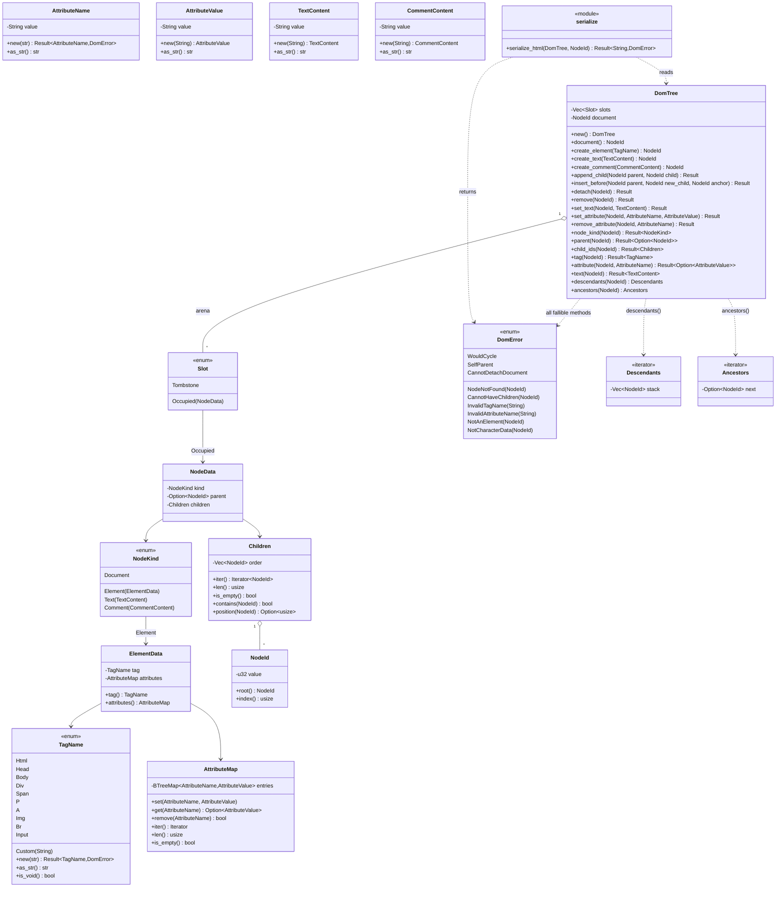

# `core/dom` — the DOM tree aggregate (v0.2 F3)

## Requirements

- Implement `core/dom` as a **domain-pure crate** (`ADR-0010`, report decision 2.1, ADR-0015): entities, value objects,
  invariants, one typed error derived with `thiserror`, non-recursive traversal, and a deterministic HTML serializer. It
  names no `engine` type, and its architectural isolation is verified by `arch-lint`.
- Model the tree as an **arena** `Vec<Slot>` indexed by `NodeId(u32)` with a semantic `NodeId::root()` constructor;
  removal leaves a `Tombstone` and never reuses the index (no generational id in v0.2 — deferred to C-13).
- Enforce, **only through `DomTree` methods** (no public mutable field), the five invariants of report §2.2: acyclicity,
  single parent, no self-parent, `Document` is the irremovable root, and `Children`⇄`parent` coherence.
- Model element tags with a strongly typed enum `TagName` covering standard HTML5 W3C elements plus `Custom(String)` for
  custom tags, embedding `TagName::is_void(&self) -> bool` as a domain query method.
- Store attributes in `AttributeMap` backed by `std::collections::BTreeMap<AttributeName, AttributeValue>`, providing
  fast lookups and deterministic alphabetical ordering for serialization.
- Provide `descendants` / `ancestors` as explicit-stack iterators — **no recursion** (Object Calisthenics rule 1 applies
  in full; `core/dom` gets no exception).
- Provide `serialize_html(&DomTree, NodeId) -> Result<String, DomError>`: pure, deterministic, calling
  `element.tag().is_void()`, escaping markup characters and full W3C HTML named entities (`&amp;`, `&lt;`, `&gt;`,
  `&quot;`, `&nbsp;`, `&copy;`, `&euro;`, `&trade;`, etc.), with void elements emitted without closing tags.
- Ship tests proving acyclicity refusal, single-parent move, `Document` detach refusal, traversal order, typed `TagName`
  parsing, `BTreeMap` attribute determinism, full entity escaping, and a `build → serialize` round-trip.

## Entities

## Approach

1. **Layering** (`ADR-0010:54-74`, `ADR-0015`):
    - `src/lib.rs` — `#![forbid(unsafe_code)]`, facade: `pub use domain::{…}` +
      `pub use application::serialize::serialize_html`.
    - `src/domain/` — `node.rs` (`NodeId`, `NodeKind`, `ElementData`, `NodeData`, `Slot`), `tag_name.rs` (`TagName`),
      `text.rs` (`TextContent`, `CommentContent`), `attributes.rs` (`AttributeName`, `AttributeValue`, `AttributeMap`),
      `children.rs` (`Children`), `tree.rs` (`DomTree` + invariants), `traversal.rs` (`Descendants`, `Ancestors`),
      `error.rs` (`DomError` with `thiserror`).
    - `src/application/serialize.rs` — the HTML serialization service.
    - `Cargo.toml` — `thiserror = { workspace = true }`.
2. **Strongly-typed `TagName` enum & Value-object validation on construction**:
    - `TagName` — enum with standard HTML5 elements + `Custom(String)`. `new(&str)` validates ASCII syntax, lowercases,
      and maps to a standard variant or `Custom`. Embeds `is_void(&self) -> bool` covering the standard void set
      (`area`, `base`, `br`, `col`, `embed`, `hr`, `img`, `input`, `link`, `meta`, `param`, `source`, `track`, `wbr`).
    - `AttributeName::new` — reject empty; reject ASCII control, whitespace, and any of `"' /=>`; lowercase. Implements
      `Ord` and `PartialOrd`.
    - `AttributeValue::new` / `TextContent::new` / `CommentContent::new` — infallible string wrappers.
3. **First-class collections**:
    - `Children` wraps `Vec<NodeId>`, insertion order; `push`, `remove_value` (returns `bool`), `insert_before_value`,
      `position`, `contains`, `iter`, `len`, `is_empty`.
    - `AttributeMap` wraps `std::collections::BTreeMap<AttributeName, AttributeValue>`, providing fast lookups and
      inherent alphabetical key sorting for deterministic HTML serialization.
4. **Arena mechanics** (`tree.rs`, rule 1 — one indentation level per fn, rule 2 — no `else`):
    - `DomTree::new()` pushes `Slot::Occupied(NodeData { kind: Document, parent: None, children: empty })` at index 0,
      sets `document = NodeId::root()`.
    - Private helpers: `slot`, `slot_mut`, `node_data`, `node_data_mut`, `is_ancestor`, `detach_from_parent` —
      sequential single-index writes, never two overlapping `&mut`.
    - `create_*` push a detached `Occupied` slot, return its `NodeId`.
    - `append_child(parent, child)`: `parent == child` → `SelfParent`; resolve both (`NodeNotFound` on either);
      `node_kind(parent)` must be `Document` or `Element` → else `CannotHaveChildren(parent)`;
      `is_ancestor(child, parent)?` → `WouldCycle`; `detach_from_parent(child)`; push `child` to `parent.children`; set
      `child.parent = Some(parent)`.
    - `insert_before(parent, new_child, anchor)`: same guards as `append_child`; `anchor` must be in `parent.children` →
      else `NodeNotFound`; detach `new_child`; insert before `anchor`'s position; set parent.
    - `detach(node)`: `node == document` → `CannotDetachDocument`; resolve; `detach_from_parent(node)`.
    - `remove(node)`: `node == document` → `CannotDetachDocument`; `detach_from_parent(node)`; iterative post-order over
      an explicit `Vec<NodeId>` stack collecting `node` + all descendants; set each collected slot to `Tombstone`.
    - `set_text(node, content)`: `node_kind` must be `Text` → else `NotCharacterData(node)`; replace.
    - `set_attribute` / `remove_attribute`: `node_kind` must be `Element` → else `NotAnElement(node)`; delegate to
      `ElementData.attributes`.
5. **Traversal** (`traversal.rs`, no recursion):
    - `Descendants { stack: Vec<NodeId> }` — `descendants(root)` seeds the stack with `root`'s children in **reverse**;
      `next()` pops, pushes children in reverse, and returns popped id (document pre-order).
    - `Ancestors { tree: &DomTree, next: Option<NodeId> }` — `ancestors(node)` yields parents up to `Document`.
6. **Serializer** (`application/serialize.rs`, no recursion):
    - `serialize_html(tree, root) -> Result<String, DomError>`. Resolve `root` first (`NodeNotFound`).
    - Explicit work-stack of `Step { Enter(NodeId), Exit(TagName) }`.
    - Pop `Enter(id)`:
        - `Document` → push each child as `Enter` in reverse.
        - `Element(e)` → write `<tag`, iterate `attributes.iter()` with attribute escaping, write `>`; if
          `e.tag().is_void()` do not push `Exit`; else push `Exit(e.tag().clone())` and children in reverse.
        - `Text(t)` → write `escape_text(t.as_str())` with full HTML named entity mapping.
        - `Comment(c)` → write `<!--`, raw content, `-->`.
    - Pop `Exit(tag)`: write `</tag>`.

## Structure

### Types and impls

1. `NodeId(u32)` — `Copy`, `Eq`, `Hash`, `Debug`; `root() -> Self`, `index() -> usize`.
2. `DomError` — `#[non_exhaustive]`, `#[derive(thiserror::Error, Clone, Debug, PartialEq, Eq)]`.
3. `TagName` — strongly typed HTML5 + `Custom` enum; `is_void(&self) -> bool`.
4. `AttributeMap` — first-class collection wrapping `BTreeMap<AttributeName, AttributeValue>`.
5. `DomTree` — the arena aggregate with mutating and query methods.
6. `serialize_html` — free function in `application::serialize`.

### Dependencies

1. `core/dom` depends only on `thiserror` (ADR-0015).
2. `arch-lint.toml` defines scopes `dom_domain`, `dom_application`, and `dom` and asserts layer isolation.

## Operations

### Implement `TagName` enum (`domain/tag_name.rs`)

- Strongly typed enum with standard HTML5 elements + `Custom(String)`.
- `new(&str) -> Result<Self, DomError>` validating syntax and normalizing tag name.
- `as_str(&self) -> &str` and `fmt::Display`.
- `is_void(&self) -> bool` returning `true` for standard void elements.

### Implement `AttributeMap` with `BTreeMap` (`domain/attributes.rs`)

- `AttributeName` implementing `Clone`, `Debug`, `PartialEq`, `Eq`, `Hash`, `Ord`, `PartialOrd`, `Display`.
- `AttributeMap` holding `entries: BTreeMap<AttributeName, AttributeValue>`.
- Methods: `new()`, `set(name, value)`, `get(&name)`, `remove(&name)`, `iter()`, `len()`, `is_empty()`.

### Implement `DomError` with `thiserror` (`domain/error.rs`)

- Derive `thiserror::Error` with message templates for all 9 variants.

### Implement `NodeId::root()` and `DomTree::new()` (`domain/node.rs`, `domain/tree.rs`)

- Add `pub const fn root() -> Self { Self(0) }`.
- Use `NodeId::root()` in `DomTree::new()`.

### Implement W3C Named Entity Serialization (`application/serialize.rs`)

- Replace string matching with `element.tag().is_void()`.
- Implement comprehensive named entity escaping for text and attributes.

### Configure `arch-lint.toml` & `.github/workflows/ci.yml`

- Add `dom` scopes and boundary deny rules to `arch-lint.toml`.
- Remove redundant bash `cargo tree` assertion from `ci.yml`.

## Norms

- **Object Calisthenics (`ADR-0010:127-137`)**: no `else`; one indentation level per function; wrap primitives;
  first-class collections (`Children`, `AttributeMap`); no public mutable fields.
- `#![forbid(unsafe_code)]` at crate root.
- **No recursion** in `tree.rs`, `traversal.rs`, or `serialize.rs`.
- `thiserror` for typed domain errors outside `core/engine` (ADR-0015).
- `tracing` for structured logging across libraries (ADR-0014).

## Safeguards

1. **Architecture isolation**: `arch-lint` verifies `core/dom` does not import engine or runtime adapters.
2. **Determinism**: `serialize_html` with `BTreeMap` attributes produces byte-identical output across runs.
3. **HTML Standard Compliance**: `TagName` and `is_void` strictly follow W3C void tag and named entity specifications.
4. **Tree Invariants**: Acyclicity, single parent, irremovable root, and bidirectional child-parent integrity enforced.
