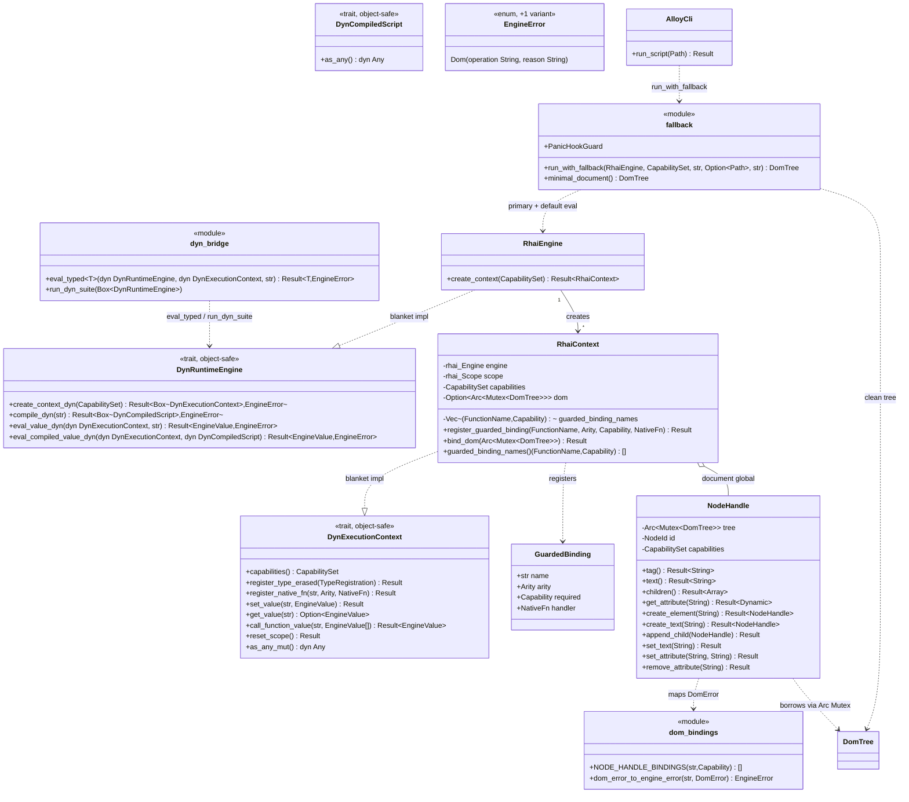

# Capability sandbox + scriptable DOM (`core/engine`, `core/runtime/rhai`, `alloy`) — v0.2 F6 + I1

## Requirements

- Add an object-safe **`dyn` companion** to the `RuntimeEngine` port (`ADR-0013`, `ADR-0011:67-69`): `DynRuntimeEngine`
  / `DynExecutionContext` / `DynCompiledScript` + a free `eval_typed::<T>`, in `core/engine/application/dyn_bridge.rs`.
  Purely additive — no existing signature changes. Blanket impls give `MockEngine` and `RhaiEngine` the companion free.
- Add **one** new port error variant `EngineError::Dom { operation, reason }` and bump `PORT_SCHEMA_VERSION` 1 → 2 with
  a `PRD-002` migration note and a contract-record update.
- Route **every** DOM binding through a single capability chokepoint (**C-06**): `RhaiContext::register_guarded_binding`
  wraps a `NativeFn` so `CapabilitySet::require(cap)` runs first; a `NodeHandle` method checks its own baked-in
  `CapabilitySet`; a `NODE_HANDLE_BINDINGS` manifest + a `GuardedBinding` table are both walked by the conformance
  sweep.
- A denied capability returns `EngineError::PermissionDenied` with the missing flag (**C-07**).
- Contexts are isolated (**C-08**): separate `rhai::Engine`, `Scope`, `CapabilitySet`, **and `Rc<RefCell<DomTree>>`**
  per context; a fault in one does not disturb the next `eval` of another.
- A panicking script never aborts the host and triggers the fallback (**C-09**): `catch_unwind` → `ScriptPanic` → stderr
  diagnostic → embedded `default_dom.rhai` on a **clean** tree → Rust minimal `<html><body></body></html>` → process
  continues; `alloy` exits 0. A scoped panic hook captures the location and suppresses the default backtrace.
- Make a `core/dom` `DomTree` node readable and mutable from a Rhai script (**C-03**): `NodeHandle` (`EngineType` +
  `rhai::CustomType`), a global `document`, `RhaiContext::bind_dom`, and a `DomError → EngineError::Dom` mapping in the
  adapter (`core/dom` never names `EngineError`).
- Correct `overview.md` + `CLAUDE.md` so `core/dom` shows **no** dependency; add the ADR-0013 MADR + README row; append
  a sync note to `IMPLEMENTACAO-DETALHADA-V0-2.md`; add the blocking panic-injection CI job and the `cargo tree -p dom`
  emptiness assertion.

## Entities

## Approach

1. **ADR-0013 companion (`core/engine/src/application/dyn_bridge.rs`, additive)**:
    - `pub trait DynExecutionContext` — the seven object-safe methods of `ExecutionContext` verbatim, plus
      `fn as_any_mut(&mut self) -> &mut dyn core::any::Any`. Blanket
      `impl<T: ExecutionContext + 'static> DynExecutionContext for T` delegates each method and returns `self` from
      `as_any_mut`.
    - `pub trait DynCompiledScript: Send + Sync { fn as_any(&self) -> &dyn core::any::Any; }`; blanket
      `impl<T: Send + Sync + 'static> DynCompiledScript for T`.
    - `pub trait DynRuntimeEngine: Send + Sync` with `create_context_dyn`, `compile_dyn`, `eval_value_dyn`,
      `eval_compiled_value_dyn`, all `-> Result<_, EngineError>`. Blanket
      `impl<E> DynRuntimeEngine for E where E: RuntimeEngine, E::Context: 'static, E::CompiledScript: 'static`:
      `create_context_dyn` boxes `E::create_context(caps)?`; `eval_value_dyn` downcasts `context.as_any_mut()` to
      `E::Context` (`EngineError::binding("dyn context does not match this engine")` on `None`) then calls
      `E::eval_value`; `compile_dyn` boxes the compiled script; `eval_compiled_value_dyn` downcasts both.
    - `eval_typed::<T: FromEngineValue>(engine, context, src) -> Result<T, EngineError>` — a free function taking
      `&dyn DynRuntimeEngine` and `&mut dyn DynExecutionContext`, body
      `T::from_engine_value(engine.eval_value_dyn(context, src)?)`.
    - `pub fn run_dyn_suite(engine: Box<dyn DynRuntimeEngine>)` in `conformance.rs` (or `dyn_bridge`): literal eval,
      variable round-trip, context isolation, native-fn dispatch, capabilities carried, reset_scope — all through the
      `dyn` API.
    - `lib.rs` re-exports `DynRuntimeEngine`, `DynExecutionContext`, `DynCompiledScript`, `eval_typed`.
2. **`EngineError::Dom` (`core/engine/src/domain/error.rs`)**: add `Dom { operation: String, reason: String }` +
   `pub fn dom(operation, reason) -> Self` + a `Display` arm reading _dom operation &lt;operation&gt; failed:
   &lt;reason&gt;_. Change `PORT_SCHEMA_VERSION` to `2` and extend its doc comment with the v0.2 delta.
3. **Guarded bindings (`core/runtime/rhai/src/infrastructure/sandbox.rs`)**:
    - `pub struct GuardedBinding { pub name: &'static str, pub arity: Arity, pub required: Capability, pub handler:`
      `NativeFn }`.
    - `RhaiContext::register_guarded_binding(&self, name: &FunctionName, arity: Arity, required: Capability, handler:`
      `NativeFn) -> Result<(), EngineError>`: `let caps = self.capabilities();` (Copy), wrap
      `move |args| { caps.require(required)?; handler(args) }` as a `NativeFn`, call `native::register`, and push
      `(name.clone(), required)` to `self.guarded_bindings`.
    - `RhaiContext::guarded_binding_names(&self) -> &[(FunctionName, Capability)]` for the sweep.
    - `install_guarded_table(ctx, &[GuardedBinding])` helper iterates once at context build (used by `bind_dom` and any
      future subsystem wiring).
4. **`NodeHandle` (`core/runtime/rhai/src/infrastructure/dom_bindings.rs`)**:
    - `#[derive(Clone)] pub struct NodeHandle { tree: Arc<Mutex<DomTree>>, id: NodeId, capabilities: CapabilitySet }`.
    - `impl engine::EngineType for NodeHandle { fn registration() -> TypeRegistration { TypeRegistration::new("Node") } }`.
    - `impl rhai::CustomType for NodeHandle`: `build` registers `with_name("Node")` and, via `with_fn`, every method of
      the Entities list. Each method body: `self.capabilities.require(CAP).map_err(engine_error_to_eval)?;` →
      `let tree = self.tree.lock().unwrap_or_else(PoisonError::into_inner);` → call the `DomTree` op →
      `.map_err(|e| dom_bindings::dom_error_to_engine_error("op", e)) .map_err(engine_error_to_eval)?;` → marshal the
      result (`String`, `rhai::Array` of `NodeHandle`, `Dynamic`, or `()`).
    - `create_element` / `create_text` return a `NodeHandle` sharing `self.tree.clone()` and `self.capabilities`.
    - `append_child(child)`: `Arc::ptr_eq(&self.tree, &child.tree)` guard →
      `EngineError::dom("append_child", "node belongs to another document")` otherwise.
    - `pub const NODE_HANDLE_BINDINGS: &[(&str, Capability)]` — one row per method with its required capability
      (`tag/text/children/get_attribute` → `DOM_READ`; the rest → `DOM_MUTATE`).
    - `pub fn dom_error_to_engine_error(operation: &str, error: DomError) -> EngineError` →
      `EngineError::dom(operation, error.to_string())`.
    - `fn engine_error_to_eval(error: EngineError) -> Box<rhai::EvalAltResult>` (reuse / expose
      `native::to_eval_error`).
5. **`bind_dom` (`context.rs`, concrete, outside the trait)**:
   `RhaiContext::bind_dom(&mut self, tree: Arc<Mutex<DomTree>>) -> Result<(), EngineError>`:
   `self.register_custom_type::<NodeHandle>()?;` →
   `let root = tree.lock().unwrap_or_else(PoisonError::into_inner).document();` →
   `let handle = NodeHandle { tree: Arc::clone(&tree), id: root, capabilities: self.capabilities };` →
   `self.set_custom_value("document", handle);` → `self.dom = Some(tree);`. `RhaiContext` gains
   `dom: Option<Arc<Mutex<DomTree>>>` and `guarded_bindings: Vec<(FunctionName, Capability)>`; `RhaiContext` remains
   `Send + Sync` (matching `rhai` `sync` feature).
6. **Fallback (`core/runtime/rhai/src/infrastructure/fallback.rs`)**:
    - `pub struct PanicHookGuard { previous: Option<Box<dyn Fn(&PanicHookInfo) + Sync + Send>> }` — `new()` installs a
      hook that records `location` into a shared `Arc<Mutex<Option<String>>>` and prints nothing; `Drop` restores
      `previous`. (Or simpler: `set_hook(Box::new(|_| {}))` + restore; location comes from the `ScriptPanic` message the
      v0.1 `panic_message` already builds.)
    - `run_with_fallback(engine, capabilities, primary_source, primary_path, default_dom_source) -> DomTree` (params:
      `&RhaiEngine`, `CapabilitySet`, `&str`, `Option<&Path>`, `&str`):
        1. `let tree = Rc::new(RefCell::new(DomTree::new()));` build a guarded context, `ctx.bind_dom(tree.clone())`,
           `{ let _hook = PanicHookGuard::new(); engine.eval_value(&mut ctx, primary_source) }`. `Ok(_)` →
           `Rc::try_unwrap(tree).unwrap_or_else(|rc| rc.borrow().clone()).into_inner()` (return the tree).
        2. `Err(error)` → `write_diagnostic(primary_path, &error)` to `stderr` (path, `SourceLocation` if the variant
           carries one, the variant name).
        3. fresh `let clean = Rc::new(RefCell::new(DomTree::new()));` fresh guarded context + `bind_dom` + scoped hook +
           `engine.eval_value(default_dom_source)`. `Ok(_)` → return `clean`'s tree.
        4. `Err(_)` → `minimal_document()`.
    - `pub fn minimal_document() -> DomTree` — `DomTree::new()` + `create_element("html")` + `create_element("body")` +
      two `append_child` calls; returns the tree. No script involved.
    - `DomTree` needs `Clone` (F3 already derives it) for the `try_unwrap` fallback path.
7. **`alloy/src/main.rs`**:
    - `run_script(path)`: read the file; `let engine = RhaiEngine::new();`
      `let tree = fallback::run_with_fallback(&engine, engine::profiles::dom_parser(), &source, Some(path), include_str!("../../scripts/default_dom.rhai"));`
      `println!("{}", dom::serialize_html(&tree, tree.document()).map_err(|e| e.to_string())?);` → `Ok(())`. Always
      exits 0 on a script that merely fails (the fallback absorbs it); only I/O / usage errors exit 1.
    - `alloy/Cargo.toml`: `+ dom = { path = "../core/dom" }`.
8. **Scripts**: `scripts/default_dom.rhai` —
   `let html = document.create_element("html"); let body = html.create_element("body"); document.append_child(html); html.append_child(body);`.
   `scripts/hello_dom.rhai` — the micro-deliverable: builds `html > body > p` with text and a `class` attribute.
9. **Docs & CI** — per the Operations "Docs" and "CI" tasks below.

## Structure

### Traits / impls

1. `DynExecutionContext`, `DynCompiledScript`, `DynRuntimeEngine` — new object-safe traits in `core/engine`; blanket
   impls only. No hand impl anywhere.
2. `RhaiEngine: DynRuntimeEngine` and `RhaiContext: DynExecutionContext` — via the blanket impls, for free.
3. `NodeHandle: engine::EngineType + rhai::CustomType` — the `rhai::CustomType` bound stays inside `rhai-runtime`.
4. `EngineError` gains `Dom`; still `#[non_exhaustive]`, still hand-written `Display` / `Error`.

### Dependencies

1. `core/engine` — unchanged dependency graph (`bitflags` only). `dyn_bridge.rs` uses only `core::any` + existing
   domain/application types.
2. `core/runtime/rhai/Cargo.toml` — `+ dom = { path = "../../dom" }`.
3. `alloy/Cargo.toml` — `+ dom = { path = "../core/dom" }` (already has `engine`, `rhai-runtime`).
4. `core/dom` — still zero dependencies.

### Layers

1. `core/engine/src/application/dyn_bridge.rs` — companion; `mod.rs` + `lib.rs` re-exports.
2. `core/engine/src/domain/error.rs` — `+ Dom`; `lib.rs` — `PORT_SCHEMA_VERSION = 2`.
3. `core/engine/src/conformance.rs` — `+ run_dyn_suite`.
4. `core/runtime/rhai/src/infrastructure/sandbox.rs` — `GuardedBinding`, `register_guarded_binding`.
5. `core/runtime/rhai/src/infrastructure/dom_bindings.rs` — `NodeHandle`, manifest, `DomError` map.
6. `core/runtime/rhai/src/infrastructure/fallback.rs` — `run_with_fallback`, `minimal_document`, `PanicHookGuard`.
7. `core/runtime/rhai/src/infrastructure/context.rs` — `RhaiContext` `+ dom` `+ guarded_binding_names` `+ bind_dom`.
8. `core/runtime/rhai/tests/` — `sandbox.rs` (C-06/C-07), `isolation.rs` (C-08), `fault_injection.rs` (C-09 matrix),
   `scriptable_dom.rs` (C-03), `dyn_conformance.rs`.
9. `core/engine/tests/mock_engine.rs` — `+ run_dyn_suite` call.
10. `alloy/src/main.rs` — DOM demo through `run_with_fallback`.
11. `scripts/default_dom.rhai`, `scripts/hello_dom.rhai`.

## Operations

### Implement the ADR-0013 companion (`core/engine/src/application/dyn_bridge.rs`)

1. `DynExecutionContext` trait — 7 delegating methods + `as_any_mut`. Blanket
   `impl<T: ExecutionContext + 'static> DynExecutionContext for T`.
2. `DynCompiledScript` trait + blanket `impl<T: Send + Sync + 'static>`.
3. `DynRuntimeEngine` trait — `create_context_dyn`, `compile_dyn`, `eval_value_dyn`, `eval_compiled_value_dyn`. Blanket
   `impl<E> DynRuntimeEngine for E where E: RuntimeEngine, E::Context: 'static, E::CompiledScript: 'static` with the
   downcast logic.
4. `eval_typed::<T>` free function.
5. `mod.rs`: `pub mod dyn_bridge;`. `lib.rs`: re-export the three traits + `eval_typed`.
6. Doc comment: state it is the `ADR-0011` item-2 companion, additive, and that `run_dyn_suite` is its conformance form.

### Extend the conformance suite (`core/engine/src/conformance.rs`)

1. `pub fn run_dyn_suite(engine: Box<dyn DynRuntimeEngine>)` — mirror `run_core_suite`'s checks through the `dyn` API:
   `eval_value_dyn("1")` → `Int(1)`; `set_value` + `eval_value_dyn("answer")` round-trip; two `create_context_dyn` boxes
   stay isolated; `register_native_fn` + `call_function_value` dispatch; `capabilities()` carried; `reset_scope()`
   clears a local.
2. Note in the module doc that both `MockEngine` and `RhaiEngine` now run `run_core_suite` **and** `run_dyn_suite`.

### Add `EngineError::Dom` (`core/engine/src/domain/error.rs`, `lib.rs`)

1. Variant `Dom { operation: String, reason: String }` + `pub fn dom(...)` + `Display` arm.
2. `PORT_SCHEMA_VERSION = 2`; extend the doc comment: "v0.2 (F6/I1): added `EngineError::Dom`; added the
   `DynRuntimeEngine` object-safe companion (additive). See `PRD-002` migration note."

### Implement guarded bindings (`core/runtime/rhai/src/infrastructure/sandbox.rs`)

1. `GuardedBinding` struct.
2. `RhaiContext::register_guarded_binding` — capture `CapabilitySet` by value, wrap with `require`, register via
   `native::register`, record `(name, required)`.
3. `RhaiContext::guarded_binding_names` accessor.
4. `install_guarded_table(&mut RhaiContext, &[GuardedBinding]) -> Result<(), EngineError>`.
5. `mod.rs`: `pub mod sandbox;`. `lib.rs`: re-export `GuardedBinding`.

### Implement `NodeHandle` + the DOM binding surface (`core/runtime/rhai/src/infrastructure/dom_bindings.rs`)

1. `NodeHandle` struct (`tree`, `id`, `capabilities`); `Clone`.
2. `impl engine::EngineType` (`"Node"`).
3. `impl rhai::CustomType` — `build` wires every method via `with_fn`, each returning `Result<_, Box<EvalAltResult>>`,
   each doing: capability check → `try_borrow[_mut]` → `DomTree` op → `DomError` map → marshal. Methods: `tag`, `text`,
   `children`, `get_attribute` (`DOM_READ`); `create_element`, `create_text`, `append_child`, `set_text`,
   `set_attribute`, `remove_attribute` (`DOM_MUTATE`).
4. `NODE_HANDLE_BINDINGS: &[(&str, Capability)]` — 10 rows.
5. `dom_error_to_engine_error(operation, DomError) -> EngineError`;
   `engine_error_to_eval(EngineError) -> Box<EvalAltResult>`; `dom_busy(operation) -> EngineError`.
6. `mod.rs`: `pub mod dom_bindings;`. `lib.rs`: re-export `NodeHandle`, `NODE_HANDLE_BINDINGS`.

### Extend `RhaiContext` (`core/runtime/rhai/src/infrastructure/context.rs`)

1. Fields `dom: Option<Rc<RefCell<DomTree>>>`, `guarded_binding_names: Vec<(String, Capability)>`.
2. `bind_dom(&mut self, tree: Rc<RefCell<DomTree>>) -> Result<(), EngineError>` per Approach 5.
3. Doc: `RhaiContext` is now `!Send` (holds `Rc`); `RhaiEngine` remains `Send + Sync`. The port only promises
   `Send + Sync` on `RuntimeEngine` (`PRD-002:35`, contract §5.2).

### Implement the fallback (`core/runtime/rhai/src/infrastructure/fallback.rs`)

1. `PanicHookGuard` — install a quiet hook on `new`, restore on `Drop`.
2. `run_with_fallback(engine, capabilities, primary_source, primary_path, default_dom_source) -> DomTree` — the four
   steps of Approach 6.
3. `write_diagnostic(path: Option<&Path>, error: &EngineError)` → `stderr`: script path, `SourceLocation` when the
   variant carries one, the variant name.
4. `minimal_document() -> DomTree` — Rust-built `<html><body></body></html>`.
5. `mod.rs`: `pub mod fallback;`. `lib.rs`: re-export `run_with_fallback`, `minimal_document`.

### Wire the `alloy` binary (`alloy/src/main.rs`, `alloy/Cargo.toml`)

1. `+ dom = { path = "../core/dom" }`.
2. `run_script` builds the DOM demo through `run_with_fallback` with `profiles::dom_parser()` and the embedded
   `default_dom.rhai`, then prints `dom::serialize_html`. Script failures are absorbed by the fallback → exit 0; only
   I/O / usage errors exit 1. Update `USAGE` text.

### Add the scripts (`scripts/`)

1. `default_dom.rhai` — minimal `<html><body></body></html>` builder.
2. `hello_dom.rhai` — `html > body > p("Hello from Rhai")` with `p.set_attribute("class", "greeting")`.

### Tests

1. `core/runtime/rhai/tests/sandbox.rs` (**C-06/C-07**): a context with `DOM_READ` only — `document.tag()` works,
   `document.create_element("div")` and `document.set_attribute(...)` return `EngineError::PermissionDenied` (assert the
   missing flag); the C-06 sweep iterates `NODE_HANDLE_BINDINGS` and, for each, a handle built with
   `CapabilitySet::empty()` returns `PermissionDenied`.
2. `core/runtime/rhai/tests/isolation.rs` (**C-08**): two contexts from one `RhaiEngine` — `x` set in A is invisible in
   B; a guarded binding denied in B is allowed in A (different capability sets); a `panic!`-injected script in A leaves
   B's next `eval` returning the correct value.
3. `core/runtime/rhai/tests/fault_injection.rs` (**C-09** matrix, single-threaded): for **each** `NODE_HANDLE_BINDINGS`
   entry and each `GuardedBinding`, a handler that `panic!`s → `eval` returns `EngineError::ScriptPanic`, the test
   process is still alive, and `run_with_fallback` returns a well-formed tree (`serialize_html` non-empty). Also: a
   `default_dom.rhai` forced to fail falls through to `minimal_document()`.
4. `core/runtime/rhai/tests/scriptable_dom.rs` (**C-03**): a context with `DOM_READ | DOM_MUTATE`, `bind_dom` a fresh
   `Rc<RefCell<DomTree>>`, `eval` a script that builds `html > body > p` with text + attribute; after `eval`,
   `serialize_html` of the host's tree equals the expected string.
5. `core/runtime/rhai/tests/dyn_conformance.rs`: `run_dyn_suite(Box::new(RhaiEngine::new()))`.
6. `core/engine/tests/mock_engine.rs`: add `engine::conformance::run_dyn_suite(Box::new(MockEngine::new()))`.

### Docs

1. `docs/adr/0013-object-safe-runtime-engine-companion.md` — MADR: context (generic sugar breaks object-safety),
   decision (additive `DynRuntimeEngine`/`DynExecutionContext`/`DynCompiledScript` + `eval_typed`), consequences.
   Numbered **0013** (0012 reserved for the JS engine, `ADR-0011:108`).
2. `docs/adr/README.md` — index row for ADR-0013.
3. `docs/requirements/PRD-002-abstract-runtime-engine.md` — a "v0.2 amendment" block: the object-safe companion form
   (`ADR-0011:67-69` satisfied); `EngineError::Dom` added; `PORT_SCHEMA_VERSION 1 → 2` migration note (out-of-tree
   adapters gain a `_` arm requirement on `EngineError`, unchanged method contracts).
4. `docs/architecture/runtime-engine-port-contract.md` — item 2 → ✅ (companion delivered, ADR-0013); item 3/7 →
   `PORT_SCHEMA_VERSION = 2`; §5.6 fault behaviour → fallback now implemented (`fallback.rs` + `alloy`).
5. `docs/adr/0011-…` — realisation note: ADR-0013 delivers item 2.
6. `docs/architecture/overview.md` — crate map: `core/dom` Dependencies → **None**; mark the v0.2 criteria closed.
7. `CLAUDE.md` — "Current State": v0.2 delivered (F3 + F6 + I1), C-03/C-06/C-07/C-08/C-09 closed; crate map `core/dom`
   row → no deps; note `core/dom` is domain-pure and the DOM↔engine bridge is `core/runtime/rhai/infrastructure/`.
8. `docs/reports/IMPLEMENTACAO-DETALHADA-V0-2.md` — append a "Nota de sincronização" recording what was actually built
   (mirrors the v0.1 report's amendment style).

### CI (`.github/workflows/ci.yml`)

1. `no-engine` job — add `test -z "$(cargo tree -p dom --edges normal --prefix none | grep -v '^dom ')"` (assert
   `core/dom` pulls nothing).
2. New **blocking** job `fault-injection` — `cargo test -p rhai-runtime --test fault_injection -- --test-threads=1`
   (roadmap §5: this gate "passa a bloquear na v0.2"; it also fails immediately if any profile sets `panic = "abort"`).
3. The `dyn` conformance runs inside the existing `cargo test --workspace` job.

## Norms

- **Object Calisthenics (`ADR-0010:127-137`)**, all nine, in the adapter code too: no `else`; one indentation level
  (`?`, early return, `match`, helpers); full names (`capability`, `operation`, not `cap`, `op` — except where `cap` is
  the local for a `Capability` already named by its row); no naked domain primitive in a domain position (the boundary
  `EngineValue` / DTO strings are the documented exception); no public mutable field on `RhaiContext` / `NodeHandle` —
  mutation via methods; small focused modules.
- **`rhai` containment**: no `rhai::*` type in any signature outside `core/runtime/rhai`. `NodeHandle`'s
  `rhai::CustomType` impl and `Box<EvalAltResult>` returns live only in `dom_bindings.rs` / `sandbox.rs` /
  `fallback.rs`.
- **One typed error out**: every `DomError` and every `rhai` failure maps to `engine::EngineError`; `core/dom` never
  names `EngineError`; the mapping is an explicit function (`ADR-0011` item 3), never a re-export.
- **`#![forbid(unsafe_code)]`** holds in every crate; `AssertUnwindSafe` and `set_hook` are safe API. **No
  `panic = "abort"`** in any Cargo profile.
- **Additive-only for the port**: `dyn_bridge.rs` adds types and blanket impls; it changes **no** existing signature.
  The only boundary-aggregate change is `EngineError::Dom`, and it drives the `PORT_SCHEMA_VERSION` bump + `PRD-002`
  note (`ADR-0011:83-85`).
- **Capability guard shape**: `and` of `Copy` bits + a branch, captured once at context build, no per-call relookup, no
  allocation on the hot path (`PRD-001:96` budget preserved, not measured).
- `cargo fmt` clean; `cargo clippy --workspace --all-targets --all-features -- -D warnings` clean with all new modules
  and tests.

## Safeguards

1. **C-06**: no code path reaches `DomTree` from a script without a prior `CapabilitySet::require`. The conformance
   sweep walks `NODE_HANDLE_BINDINGS` **and** `RhaiContext::guarded_binding_names()`; adding an unguarded DOM binding
   fails the sweep.
2. **C-07**: a `DOM_READ`-only context returns `EngineError::PermissionDenied { capability: DOM_MUTATE }` from every
   mutator; getters still succeed. Asserted on the exact variant and flag.
3. **C-08**: `check_contexts_are_isolated` (core + dyn) passes on `RhaiEngine`; the v0.2 isolation test adds: distinct
   `CapabilitySet` per context honoured, and a fault in A does not change B's next `eval` result.
4. **C-09**: the panic-injection matrix — every guarded binding and every `NodeHandle` method — returns `ScriptPanic`,
   the process survives, `run_with_fallback` yields a well-formed tree; `default_dom.rhai` failure falls through to
   `minimal_document()`. `alloy --script <panicking>` writes a diagnostic to stderr and exits 0.
5. **C-03**: after `bind_dom` + `eval` of a build script, the host's `DomTree` (read via its own `Rc` clone) serialises
   to the expected HTML; an unrelated node is untouched.
6. **Object-safety companion**: `Box<dyn DynRuntimeEngine>` and `&mut dyn DynExecutionContext` compile and pass
   `run_dyn_suite` for both `MockEngine` and `RhaiEngine`; `cargo build` proves `dyn_bridge` added no non-additive
   change (existing tests untouched).
7. **Boundary integrity**: `cargo tree -p engine` still lists only `bitflags`; `cargo tree -p dom` lists nothing;
   `rhai-runtime` is still the only crate importing `rhai`. `PORT_SCHEMA_VERSION == 2` with a matching `PRD-002` note.
8. **Reproducibility**: `Cargo.lock` versioned; `dom` path dep only; `cargo deny check` still green (no new external
   crate); `--test-threads=1` on the fault-injection job keeps the process-global panic hook deterministic.
9. **Docs consistent with code**: `overview.md` / `CLAUDE.md` show `core/dom` with no dependency; ADR-0013 + README row
   present; contract record item 2 marked done; the v0.2 report carries a sync note.
10. **Not in scope**: `Origin` / `WEB_CONTENT` / per-tab isolation (F7); DevTools event bus (stub); hot-reload;
    `criterion`; generational `NodeId`; `NodeHandle` methods beyond the v0.2 surface; runtime capability revocation.
