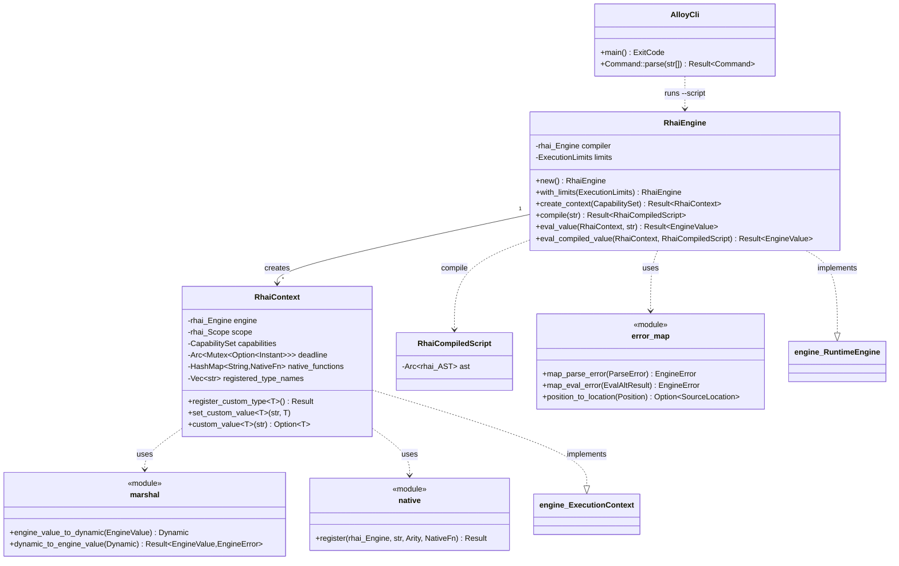

# Rhai backend (`core/runtime/rhai`) + the `alloy` CLI

## Requirements

- Implement the `engine` port with Rhai as the concrete interpreter, keeping every `rhai::*` type inside
  `core/runtime/rhai/src/infrastructure/` (`ADR-0002`, `ADR-0011`).
- Enforce execution ceilings so a runaway script is aborted, not hung — close **C-04**.
- Trap script and native-function panics so the host process never dies — mechanism of **C-09**.
- Make a registered Rust struct readable and mutable from a Rhai script, and pass the backend-agnostic conformance suite
  — close **C-02**.
- Ship the `alloy` binary: opens/exits cleanly, and runs a `.rhai` file under the sandbox (`ROADMAP §3.1`
  micro-deliverables).

## Entities

## Approach

1. **Layering**: `lib.rs` re-exports `RhaiEngine` / `RhaiContext` / `RhaiCompiledScript`;
   `infrastructure/{engine,context,marshal,error_map,native}.rs`. `#![forbid(unsafe_code)]`.
2. **Isolation** (C-08): each `RhaiContext` owns a fresh `rhai::Engine` + `rhai::Scope<'static>`; nothing shared between
   contexts.
3. **Limits** (C-04): `configured_engine` applies the three `set_max_*` from `ExecutionLimits`; `on_progress` reads a
   per-eval `Arc<Mutex<Option<Instant>>>` deadline and returns `Some(Dynamic::UNIT)` past it.
   `error_map::map_eval_error` turns `ErrorTooManyOperations` / `ErrorStackOverflow` / `ErrorTerminated` into
   `ExecutionLimitExceeded { Operations | CallDepth | Duration }`.
4. **Fault trapping** (C-09 mechanism): `evaluate_ast` wraps `eval_ast_with_scope::<Dynamic>` in
   `catch_unwind(AssertUnwindSafe(…))`; `Err(payload)` → `EngineError::ScriptPanic` with a best-effort message.
5. **Marshaling**: `match` on `EngineValue` → `Dynamic`; typed accessors (`is_unit`, `as_bool`, `as_int`, `as_float`,
   `is_string`, `is_array`, `is_map`) back. Nested arrays/maps recurse. Unrepresentable → `TypeMismatch`.
6. **Custom types** (C-02): `RhaiContext::register_custom_type::<T>()` where `T: EngineType + rhai::CustomType` calls
   `engine.build_type::<T>()`; `set_custom_value` / `custom_value` push/read a concrete `T` in the scope.
7. **`alloy` CLI**: `Command::{Idle, Help, Version, RunScript(PathBuf)}` parsed from `env::args`; `run_script` = read
   file → `RhaiEngine::new` → `create_context(CapabilitySet::empty())` → `eval_value` → print if non-unit. Errors →
   stderr + `ExitCode::FAILURE`.

## Structure

### Trait/impl

1. `RhaiEngine: engine::RuntimeEngine` (`Context = RhaiContext`, `CompiledScript = RhaiCompiledScript`).
2. `RhaiContext: engine::ExecutionContext` — `register_native_fn` also stores the handler in a map for
   `call_function_value`.
3. `FixtureNode` (in `tests/`) implements both `engine::EngineType` and `rhai::CustomType`.

### Dependencies

1. `rhai-runtime` → `engine` (path) + `rhai` (workspace, `=1.26.0`, `default-features = false`, `["std", "sync"]`).
2. `alloy` → `engine` + `rhai-runtime` (path).
3. `engine` gains nothing — its graph is still `bitflags` only.

### Layers

1. `core/runtime/rhai/src/lib.rs` — facade.
2. `infrastructure/engine.rs` — `RhaiEngine`, limit wiring, `catch_unwind`.
3. `infrastructure/context.rs` — `RhaiContext`, `RhaiCompiledScript`.
4. `infrastructure/{marshal,error_map,native}.rs` — conversions.
5. `core/runtime/rhai/tests/` — `conformance`, `execution_limits`, `fault_isolation`, `fixture_node`.
6. `alloy/src/main.rs` — CLI.

## Operations

### Implement `RhaiEngine` (`infrastructure/engine.rs`)

- `new` / `with_limits`; `Default`.
- `configured_engine(limits, deadline)`: `rhai::Engine::new()` + `set_max_operations` + `set_max_call_levels` +
  `set_max_expr_depths` + `on_progress` closure over `deadline`.
- `create_context`: fresh `deadline` `Arc<Mutex<None>>`, fresh configured engine, `RhaiContext::new`.
- `compile`: `self.compiler.compile(src)` → `RhaiCompiledScript::new`, map error via `error_map::map_parse_error`.
- `eval_value`: compile with `context.engine`, then `evaluate_ast`.
- `eval_compiled_value`: `Arc::clone(&compiled.ast)`, then `evaluate_ast`.
- `evaluate_ast`: `arm_deadline` → `catch_unwind` eval → `disarm_deadline` → match
  `Err(panic) | Ok(Err(eval)) | Ok(Ok(dynamic))`.
- helpers: `arm_deadline`, `disarm_deadline`, `deadline_reached`, `panic_message` (downcast `&'static str` / `String`).

### Implement `RhaiContext` (`infrastructure/context.rs`)

- fields per Entities; `new`.
- adapter extensions: `register_custom_type::<T: EngineType + rhai::CustomType>`,
  `set_custom_value::<T: Clone + Send + Sync + 'static>`, `custom_value::<T>`, `registered_type_names`.
- `ExecutionContext`: `capabilities`; `register_type_erased` (name only); `register_native_fn` (→ `native::register` +
  store in map); `set_value` / `get_value` via `marshal`; `call_function_value` (map lookup + call); `reset_scope`
  (`scope.clear()`).

### Implement `marshal` (`infrastructure/marshal.rs`)

- `engine_value_to_dynamic(EngineValue) -> Dynamic` — `match`, recurse for `Array` / `Map`.
- `dynamic_to_engine_value(Dynamic) -> Result<EngineValue, EngineError>` — ordered checks unit → bool → int → float →
  string → array → map; else `type_mismatch("engine-representable value", type_name)`.

### Implement `error_map` (`infrastructure/error_map.rs`)

- `position_to_location(Position) -> Option<SourceLocation>`.
- `map_parse_error(&ParseError) -> EngineError::Compilation`.
- `map_eval_error(&EvalAltResult)` — the limit variants, `ErrorParsing`, `ErrorVariableNotFound`,
  `ErrorFunctionNotFound`, `ErrorMismatchOutputType`, `_ => ScriptRuntime`.

### Implement `native` (`infrastructure/native.rs`)

- `register(engine, name, arity, handler)`: call `register_raw_fn` with a parameter list of `arity.count()`
  `TypeId::of::<Dynamic>()` slots and a closure that marshals `args` in, calls `handler`, and marshals the result out.
  Port errors become `Box<EvalAltResult>` via `to_string`.

### Implement the `alloy` binary (`alloy/src/main.rs`)

- `#![forbid(unsafe_code)]`; `USAGE` const.
- `main` → `run(&args)` → `ExitCode`.
- `Command::parse` (`match args.first().map(String::as_str)` — no `else`).
- `run_script(&Path)` per Approach 7.

### Tests

- `conformance.rs`: `engine::conformance::run_core_suite(RhaiEngine::new)`.
- `execution_limits.rs`: operation-ceiling abort; wall-clock-ceiling abort with `max_operations(0)`; a bounded loop
  completes.
- `fault_isolation.rs`: panicking native fn → `ScriptPanic`, engine still usable; a runtime error carries its line.
- `fixture_node.rs`: `FixtureNode` (`EngineType` + `CustomType`), script reads `node.tag` and mutates `node.text`,
  mutation visible in Rust.

### Supply chain

- `deny.toml`: add `MPL-2.0`, `CC0-1.0`.
- `Cargo.toml` members: add `"alloy"` (keep the `core/runtime/*` glob).

## Norms

- Object Calisthenics (`ADR-0010` §4): no `else`; one indentation level; full names; no naked domain primitives
  (boundary `EngineValue` excepted).
- No `rhai` type in any _public_ signature outside `rhai-runtime` (`register_custom_type`'s `rhai::CustomType` bound is
  inside the adapter and is acceptable — the type it registers is the caller's).
- One typed error out: every `rhai` failure maps to `engine::EngineError`.
- No `panic = "abort"` in any Cargo profile.
- `cargo fmt` clean; `cargo clippy --all-targets --all-features -D warnings` clean (tests included);
  `#![forbid(unsafe_code)]`.

## Safeguards

1. **C-02**: `RhaiEngine` passes `engine::conformance::run_core_suite`; `fixture_node` proves a registered struct is
   read and mutated from script.
2. **C-04**: `while true {}` aborts as `ExecutionLimitExceeded` in < 5 s (measured), via either the operation or the
   wall-clock ceiling.
3. **C-09 mechanism**: a `panic!` in a registered native fn returns `ScriptPanic`; the same engine evaluates `1 + 1`
   afterwards.
4. **Isolation (C-08)**: conformance `check_contexts_are_isolated` passes on `RhaiEngine` — two contexts keep
   independent `x`.
5. **Boundary**: `cargo tree -p engine` is still `bitflags` only; no `rhai` type in `engine`. `rhai-runtime` is the sole
   crate importing `rhai`.
6. **64-bit fidelity**: `EngineValue::Int(i64)` / `Float(f64)` round-trip through `rhai::Dynamic` (pinned `INT = i64`,
   `FLOAT = f64`).
7. **Reproducibility**: `rhai = "=1.26.0"`; `Cargo.lock` versioned; `bitflags` single-version; `cargo deny check`
   blocking in CI.
8. **Binary**: `cargo run -p alloy` exits 0; `alloy --script <ok>` prints the value and exits 0; `<runaway>` / missing
   file / bad flag exit 1 with a message.
9. **Not in scope**: per-binding capability checks, script-fn invocation from Rust, hot-reload watcher, DevTools
   fallback handler.
