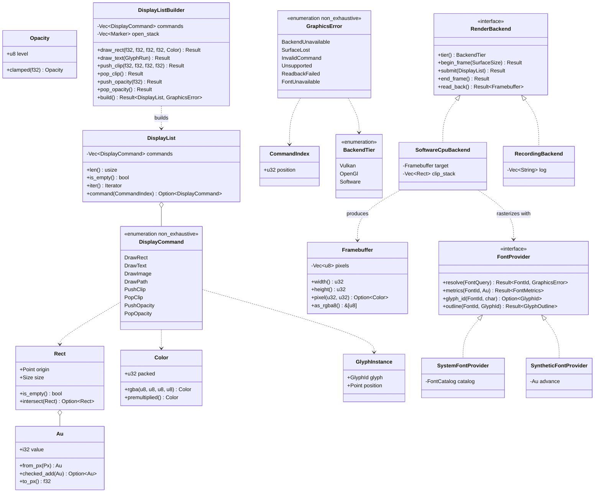

# `core/graphics` — display list, render backend and text (v0.3 F4)

## Requirements

Implement the declarative rasterization seam of the browser: turn an immutable, sanitized `DisplayList` into an RGBA8
`Framebuffer` on a CPU backend that needs no GPU and no window, so that a page can be rendered byte-for-byte identically
on Linux, macOS and Windows in CI.

Define `RenderBackend` as a replaceable port under `ADR-0011` — object-safe, with a conformance suite and a reference
adapter — and write the **whole** three-tier selection cascade of `PRD-005:33-58` now, with the Vulkan and OpenGL rungs
returning `BackendUnavailable`, so that the headless fallback is the real algorithm falling through rather than a
tautology.

Render text through a `FontProvider` port so runtime resolves system fonts while tests and goldens use deterministic
synthetic metrics, keeping the CI gate independent of what fonts a runner happens to have.

**Boundary**: `core/graphics` knows nothing of DOM, CSS, or the script engine. It receives a `DisplayList` and returns
pixels. Closes **C-14** (`PRD-005:87`) and **C-17** (`PRD-005:90`). `VulkanBackend` and `OpenGLBackend` actually drawing
(**C-15**/**C-16**) are F12 and explicitly out of scope; display-list scripting (**C-18**) is I2b.

## Entities

## Approach

1. **Layering** (`ADR-0010:54-74`, `ADR-0015`):
    - `src/lib.rs` — `#![forbid(unsafe_code)]`, `#![allow(clippy::missing_errors_doc)]` (house convention:
      `core/dom/src/lib.rs:24`), `pub const PORT_SCHEMA_VERSION: u32 = 1;`, facade re-exporting `domain` and the ports.
    - `src/domain/` — `unit.rs` (`Au`, `Px`), `geometry.rs` (`Point`, `Size`, `Rect`, `SurfaceSize`), `color.rs`
      (`Color`, `Opacity`), `font.rs` (`FontId`, `GlyphId`, `GlyphInstance`, `FontMetrics`, `FontQuery`), `command.rs`
      (`DisplayCommand`, `CommandIndex`), `display_list.rs` (`DisplayList`), `framebuffer.rs` (`Framebuffer`), `tier.rs`
      (`BackendTier`), `error.rs` (`GraphicsError` with `thiserror`).
    - `src/application/` — `ports.rs` (`RenderBackend`, `FontProvider`), `builder.rs` (`DisplayListBuilder`),
      `conformance.rs` (`run_backend_suite`).
    - `src/infrastructure/` — `cascade.rs` (`select_backend`), `software/` (rasterizer), `font/` (`SystemFontProvider`,
      `FontCatalog`, glyph raster + cache), `png.rs`.
    - `Cargo.toml` — `thiserror = { workspace = true }`, `ttf-parser = { workspace = true }`; features
      `software-backend` (default) and `no-backend`.
2. **Fixed-point geometry** (`ADR-0016`):
    - `Au(i32)` is 1/64 px, the 26.6 convention shared with font metrics. All box arithmetic is integer.
    - `Px(f32)` is the **input** type only. Exactly one documented conversion `Au::from_px(Px) -> Result<Au, …>`
      performs the finiteness check and the `f32 → i32` narrowing, using `TryFrom`, never `as`.
    - Floating point survives only in glyph outlines. No `mul_add`, no transcendental, no variable-order reduction;
      Bézier flattening uses a **fixed** subdivision count derived from `+ - * / sqrt` only.
3. **Two distinct sanitization rules at the builder boundary** (`PRD-005:80`) — mixing them is the common error:
    - `NaN`, `±inf`, negative width/height, unbalanced `Pop*` → **refuse** with `InvalidCommand { index, reason }`.
      There is no correct interpretation; swallowing it becomes a silent bug.
    - Finite but outside the envelope (`|coord| > MAX_EXTENT`), `Opacity` outside `[0,1]` → **clamp** and continue. A
      legitimate page has a giant box; refusing would break the page.
    - Because the builder takes `f32` only at the boundary, the finiteness check happens **exactly once**.
4. **Object-safe port, no `dyn` companion**:
    - Every `RenderBackend` method speaks only this crate's types, so `Box<dyn RenderBackend>` compiles and
      `ADR-0011:87-89` item 2 is satisfied without repeating `ADR-0013`. The contrast with `RuntimeEngine` is recorded
      in `docs/architecture/render-backend-port-contract.md`.
    - `read_back` lives on the trait, not just on the software backend: it is what makes I6 verifiable when Vulkan
      arrives in F12.
5. **The three-tier cascade written whole** (`PRD-005:33-58`):
    - `select_backend(BackendPreference) -> Box<dyn RenderBackend>` walks Vulkan → OpenGL → Software.
    - `infrastructure/vulkan.rs` and `infrastructure/opengl.rs` exist and return `Err(BackendUnavailable { tier })` —
      **not** `todo!()` (which the lint gate denies anyway), not absent.
    - `GRAPHICS_FORCE_TIER=vulkan|opengl|software` forces a rung to fail, so each fall is exercised. Forcing only Vulkan
      to fail must yield the **next** rung, not the last one.
6. **Software rasterizer** (`infrastructure/software/`):
    - Rectangle fill with anti-aliased coverage computed in integers; clip by an explicit stack; `src-over` composition
      on premultiplied `u8`. No `unsafe`, no explicit SIMD.
    - `DrawImage` and `DrawPath` return `Unsupported { command }` — the contract is born whole, the implementation is
      incremental.
7. **Text through a port** (`ROADMAP-IMPLEMENTACAO-V1.md:315`):
    - `FontProvider` decouples face and metric acquisition. `SystemFontProvider` scans the OS font directories in pure
      Rust with no FFI, building a lazy `FontCatalog` and loading file bytes on demand; a procedural bitmap generator is
      the emergency fallback for a bare container with no fonts installed.
    - `SyntheticFontProvider` gives deterministic metrics and outlines, and is what every test and golden uses.
    - Shaping is deliberately naive: `cmap` char→glyph 1:1, horizontal advances, simple `kern`/`GPOS`. **Out**:
      ligatures, BiDi, complex scripts, dictionary line breaking.
    - Glyph raster cache keyed by `(FontId, GlyphId, Au)`. The cache **must not** change the result — proven by a
      cold-vs-warm test demanding identical bytes.
8. **PNG with zero dependencies** (`infrastructure/png.rs`): signature, `IHDR`, `IDAT` with **stored** deflate blocks
   (`BTYPE=00`), `IEND`, CRC-32 and Adler-32 written by hand. The golden compares the decoded `Framebuffer`, not the PNG
   bytes, so the encoder is never the gate.

## Structure

### Types and impls

1. `Au(i32)` — `Copy`, `Ord`, `Hash`; `from_px`, `to_px`, `checked_add`, `checked_sub`, `saturating_*`.
2. `GraphicsError` — `#[non_exhaustive]`, `#[derive(thiserror::Error, Clone, Debug, PartialEq, Eq)]`, carrying
   `CommandIndex` on `InvalidCommand` (the `SourceLocation` analogue of `ADR-0011:93-95`).
3. `DisplayCommand` — `#[non_exhaustive]` enum, the six commands of `PRD-005:65-70`.
4. `DisplayList` — first-class collection over `Vec<DisplayCommand>`; no public `Vec`, immutable once built.
5. `DisplayListBuilder` — the only construction path; owns the clip/opacity stack and the sanitization rules.
6. `RenderBackend` — object-safe trait, `Send + Sync`.
7. `FontProvider` — object-safe trait, `Send + Sync`.
8. `SoftwareCpuBackend`, `RecordingBackend` — the concrete adapter and the reference adapter.
9. `Framebuffer` — first-class collection over `Vec<u8>`; `pixel()` returns `Option`, never indexes.
10. `run_backend_suite(&mut dyn RenderBackend)` — `pub` library code in `application/conformance.rs`, not
    `#[cfg(test)]`, mirroring `core/engine/src/conformance.rs`.

### Dependencies

1. `core/graphics` depends on `thiserror` and `ttf-parser` only. It does **not** depend on `engine`, `dom` or `css` —
   every script bridge lives in `core/runtime/rhai` (v0.3 report decision 2.1). This corrects
   `docs/architecture/overview.md:89`, which lists `graphics → engine` as the target.
2. `arch-lint.toml` gains scopes `graphics_domain`, `graphics_application`, `graphics` with `deny-scope-dep` rules
   mirroring `dom`'s (`arch-lint.toml:37-47,64-73`), and `application/conformance.rs` joins the `analyzer.exclude` list
   next to `core/engine/src/conformance.rs`.
3. Features `software-backend` (default) and `no-backend` — the first `[features]` section in the workspace.

## Operations

### Implement the value objects and `GraphicsError` (`domain/`)

- `Au`, `Px`, `Point`, `Size`, `Rect`, `SurfaceSize`, `Color`, `Opacity`, `FontId`, `GlyphId`, `ImageId`,
  `GlyphInstance`, `CommandIndex`, `BackendTier`.
- One documented `Px → Au` conversion performing the finiteness check and a `TryFrom` narrowing.
- `GraphicsError` with `thiserror`: `BackendUnavailable { tier }`, `SurfaceLost`, `InvalidCommand { index, reason }`,
  `Unsupported { command }`, `ReadbackFailed`, `FontUnavailable { query }`.
- `pub const PORT_SCHEMA_VERSION: u32 = 1;` in `lib.rs`.

### Implement `DisplayList`, `DisplayCommand` and the sanitizing builder (`domain/`, `application/builder.rs`)

- Six `#[non_exhaustive]` commands; `DrawImage`/`DrawPath` declared, refused by the v0.3 backend.
- `DisplayList` with `len`, `is_empty`, `iter`, `command(CommandIndex)`; no public `Vec`.
- `DisplayListBuilder` applying refuse-vs-clamp, balancing the clip/opacity stack, and converting `f32 → Au` exactly
  once.
- Property test feeding `NaN`, `±inf`, `f32::MAX`, subnormals and negative zeros.

### Implement `RenderBackend`, the conformance suite and `RecordingBackend` (`application/`)

- Object-safe trait with `tier`, `begin_frame`, `submit`, `end_frame`, `read_back`.
- `run_backend_suite(&mut dyn RenderBackend)` — a factory is unnecessary because the trait is object-safe.
- `RecordingBackend` logging submitted commands, the in-repo reference adapter of `ADR-0011:99-102`.
- Feature `no-backend` building and testing the crate with no concrete backend linked.

### Implement `SoftwareCpuBackend` (`infrastructure/software/`)

- `Framebuffer` RGBA8; integer-coverage anti-aliased rectangle fill; clip stack; opacity; premultiplied `src-over`
  composition.
- `#[allow(clippy::arithmetic_side_effects, clippy::indexing_slicing)]` per function, commented, citing `ADR-0017`.

### Implement the three-tier cascade (`infrastructure/cascade.rs`)

- `select_backend(BackendPreference) -> Box<dyn RenderBackend>`.
- `vulkan.rs` and `opengl.rs` returning `Err(BackendUnavailable { tier })`.
- `GRAPHICS_FORCE_TIER` override; tests forcing each rung to fail. Closes **C-17**.

### Implement `FontProvider` and the glyph rasterizer (`application/ports.rs`, `infrastructure/font/`)

- Port; `SystemFontProvider` with lazy OS directory scan and a procedural bitmap emergency fallback;
  `SyntheticFontProvider` for tests and goldens.
- `ttf-parser` for `cmap`, metrics and outlines; fixed-count Bézier flattening; integer-coverage scanline; 8-bit alpha
  mask.
- Glyph cache keyed by `(FontId, GlyphId, Au)` plus a cold-vs-warm identity test.
- `DrawText` in the software backend.

### Implement the PNG encoder and golden infrastructure (`infrastructure/png.rs`, `tests/`)

- Signature, `IHDR`, `IDAT` with stored deflate blocks, `IEND`, hand-written CRC-32 and Adler-32; zero deps.
- `assert_golden(&Framebuffer, path)` comparing decoded pixels and, on failure, writing `<name>.actual.png` plus a
  difference map.
- Determinism job wired from the **first box golden**, not after text (risk §6.2).

### Configure `arch-lint.toml` and the workspace manifest

- Add the three `graphics` scopes and their `deny-scope-dep` rules; add `application/conformance.rs` to
  `analyzer.exclude`.
- Add `ttf-parser = "=0.25.1"` to `[workspace.dependencies]`, exact-pinned per the file's convention.

## Norms

- **Object Calisthenics (`ADR-0010:127-137`)**: no naked primitives in `domain/`; first-class `DisplayList` and
  `Framebuffer`; no `else`; one indentation level per function; no public mutable fields; no abbreviated names.
- `#![forbid(unsafe_code)]` at the crate root — no exception, including the rasterizer.
- **`domain/` keeps the full clippy gate with no exception**: `checked_*`/`saturating_*` for arithmetic, `TryFrom` for
  narrowing (never `as`), `.get()` for collection access. `core/dom/src/domain/tree.rs:351` and
  `core/dom/src/domain/node.rs:31,37` are the reference.
- **`#[allow(clippy::…)]` is permitted in exactly two files of this phase** — `infrastructure/software/` and
  `infrastructure/png.rs` — always at the narrowest scope (function, not module), always commented, always citing
  `ADR-0017`. It never covers `unwrap`/`expect`/`panic!` on an input-reachable path.
- `thiserror` for the typed domain error (ADR-0015); `tracing` for structured diagnostics (ADR-0014).
- Command–Query Separation: `begin_frame`/`submit`/`end_frame` mutate and return `Result<(), _>`; `tier` and `read_back`
  answer and mutate nothing.
- No boolean parameters — `BackendPreference` and `BackendTier` are enums.
- Tests live in `tests/`, one file per behavioural theme; never `#[cfg(test)] mod tests` in `src/`.

## Safeguards

1. **C-14**: `run_backend_suite` passes for both `SoftwareCpuBackend` and `RecordingBackend`;
   `cargo test -p graphics --no-default-features` proves the port compiles with no concrete backend linked.
2. **C-17**: forcing Vulkan and OpenGL to fail yields `SoftwareCpuBackend` and the page still renders; forcing **only**
   Vulkan yields the next rung, not the last — the fall is the real algorithm, not a tautology.
3. **Sanitization** (`PRD-005:80`): a property test finds no input that reaches the backend unsanitized; non-finite and
   negative dimensions are refused with `InvalidCommand { index }`; unbalanced `Pop*` is refused at construction. A
   10.000 px page is **not** clipped by `MAX_EXTENT`.
4. **Determinism**: 100 renders of the same input produce an identical `Framebuffer`; the box golden and the text golden
   match pixel-for-pixel on Linux, macOS and Windows; the glyph cache produces identical bytes cold and warm.
5. **Domain without engine (N-04, `PRD-001:99`)**: `cargo tree -p graphics` shows `ttf-parser` and nothing else — no
   `engine`, no `rhai`, no `dom`.
6. **Architecture isolation**: `arch-lint` verifies `graphics_domain` imports neither `graphics_application` nor any
   adapter crate.
7. **Coverage**: `domain/` of `graphics` at or above 85% lines, the threshold `core/engine` already holds.
8. **`ADR-0011` contract**: all seven items recorded in `docs/architecture/render-backend-port-contract.md`, including
   the note that item 2 is satisfied without a `dyn` companion — the contrast with `RuntimeEngine`/`ADR-0013`.
