# `core/css` — boundary aggregates and the cascade/layout/measure ports (v0.5 B0)

## Requirements

Realizar a fronteira `PRD-007` do `core/css` a partir do stub de 8 linhas (`core/css/src/lib.rs`): três portas
substituíveis object-safe (`CascadeResolver`, `LayoutEngine`, `TextMeasurer`), os agregados de fronteira imutáveis e
versionados (`DomSnapshot`, `StyleSheetSet`, `StyledTree`, `LayoutBoxTree`, mais `ViewportConstraints`), o mapeamento
explícito `dom::DomTree -> DomSnapshot`, e um caminho de referência mínimo dogfooded (`UaCascade` / `BlockLayout` /
`MonospaceMetrics`) mais mocks que provam a troca da porta. Entregar a suíte de conformidade
`run_css_conformance(&dyn CascadeResolver, &dyn LayoutEngine)` que pina a **porta** (passa para built-in **e** mock) e o
padrão novo de manifesto bidirecional (`tests/data/MANIFEST.md` + `manifest_runner`). Não parsear CSS (isso é B1); não
congelar os agregados (isso é I3, fim da B4). `core/css` depende só de `dom` e `graphics` (este só por
`Au`/`Px`/`Color`/`Rect`) — nunca `engine`/`rhai`.

## Entities

```mermaid
classDiagram
direction TB

class DomSnapshot {
    -Vec~SnapshotNode~ nodes
    -SnapshotId root
    +root() SnapshotId
    +node(SnapshotId) Option~NodeRef~
    +nodes_in_document_order() Iterator~SnapshotId~
    +len() usize
}

class NodeRef {
    +id() SnapshotId
    +kind() SnapshotNodeKind
    +tag() Option~str~
    +attribute(str) Option~str~
    +attributes() Iterator
    +parent() Option~SnapshotId~
    +children() Iterator~SnapshotId~
}

class SnapshotId {
    +u32 value
}

class SnapshotNodeKind {
    <<enumeration non_exhaustive>>
    Document
    Element
    Text
    Comment
}

class StyleSheetSet {
    -Vec~OriginRule~ rules
    +new() StyleSheetSet
    +push_rule(Origin, StyleRule)
    +rules() Iterator
    +is_empty() bool
}

class Origin {
    <<enumeration>>
    UserAgent
    User
    Author
}

class StyleRule {
    -String selector_text
    -DeclarationBlock declarations
}

class StyledTree {
    -Vec~StyledNode~ nodes
    -SnapshotId root
    +root() SnapshotId
    +node(SnapshotId) Option~StyledNode~
    +nodes_in_document_order() Iterator
    +recompute_in_document_order(DomSnapshot, FnMut) StyledTree
    +len() usize
}

class StyledNode {
    +SnapshotId node
    +Option~SnapshotId~ parent
    +ChildIds children
    +ComputedStyle style
}

class ComputedStyle {
    -Display display
    -CssColor color
    -CssColor background_color
    -LengthEdges margin
    -LengthEdges padding
    -Length font_size
    +initial() ComputedStyle
    +inheriting_from(ComputedStyle) ComputedStyle
    +with_display(Display) ComputedStyle
}

class Display {
    <<enumeration non_exhaustive>>
    None
    Block
    Inline
    Flex
}

class Length {
    <<enumeration non_exhaustive>>
    Pixels
    Em
    Rem
    Percent
    Points
    +zero() Length
    +resolve_to_au(Au fontSize, Au container) Option~Au~
}

class LengthEdges {
    +Length top
    +Length right
    +Length bottom
    +Length left
}

class CssColor {
    -Color inner
    +BLACK CssColor
    +TRANSPARENT CssColor
    +rgba(u8,u8,u8,u8) CssColor
    +from_graphics(Color) CssColor
    +to_graphics() Color
}

class LayoutBoxTree {
    -Vec~LayoutBox~ boxes
    -Option~SnapshotId~ root
    +root() Option~SnapshotId~
    +box_of(SnapshotId) Option~LayoutBox~
    +boxes_in_document_order() Iterator
    +len() usize
}

class LayoutBox {
    +SnapshotId node
    +Rect content
    +EdgeSizes margin
    +EdgeSizes padding
    +ChildIds children
}

class EdgeSizes {
    +Au top
    +Au right
    +Au bottom
    +Au left
}

class ViewportConstraints {
    -Au width
    -Au height
    +new(Au, Au) ViewportConstraints
    +width() Au
    +height() Au
}

class TextRun {
    -String text
    +new(str) TextRun
    +char_count() usize
}

class ComputedText {
    -Au font_size
    +new(Au) ComputedText
    +font_size() Au
}

class TextMetrics {
    +Au width
    +Au height
}

class CssError {
    <<enumeration non_exhaustive>>
    UnknownNode
    MissingComputedStyle
    Unsupported
    +unknown_node(CssStage, SnapshotId) CssError
    +missing_computed_style(CssStage, SnapshotId) CssError
    +unsupported(CssStage, String) CssError
    +with_span(SourceSpan) CssError
}

class CssStage {
    <<enumeration non_exhaustive>>
    Parse
    Selector
    Cascade
    Layout
    Measure
}

class SourceSpan {
    -u32 line
    -u32 column
    +new(u32, u32) SourceSpan
}

class CascadeResolver {
    <<interface>>
    +resolve(DomSnapshot, StyleSheetSet) Result~StyledTree, CssError~
}

class LayoutEngine {
    <<interface>>
    +layout(StyledTree, ViewportConstraints) Result~LayoutBoxTree, CssError~
}

class TextMeasurer {
    <<interface>>
    +measure(TextRun, ComputedText) Result~TextMetrics, CssError~
}

class UaCascade {
    +new() UaCascade
}
class BlockLayout {
    +new() BlockLayout
}
class MonospaceMetrics {
    +new() MonospaceMetrics
}
class MockCascadeResolver {
    +SENTINEL_COLOR CssColor
    +new() MockCascadeResolver
}
class MockLayoutEngine {
    +new() MockLayoutEngine
}
class MockTextMeasurer {
    +new() MockTextMeasurer
}

CascadeResolver <|.. UaCascade
CascadeResolver <|.. MockCascadeResolver
LayoutEngine <|.. BlockLayout
LayoutEngine <|.. MockLayoutEngine
TextMeasurer <|.. MonospaceMetrics
TextMeasurer <|.. MockTextMeasurer
DomSnapshot o-- SnapshotNodeKind
DomSnapshot ..> NodeRef : lends
NodeRef ..> SnapshotId
CascadeResolver ..> DomSnapshot : reads
CascadeResolver ..> StyleSheetSet : reads
CascadeResolver ..> StyledTree : produces
StyledTree o-- StyledNode
StyledNode o-- ComputedStyle
ComputedStyle o-- Display
ComputedStyle o-- CssColor
ComputedStyle o-- Length
ComputedStyle o-- LengthEdges
LayoutEngine ..> StyledTree : reads
LayoutEngine ..> ViewportConstraints : reads
LayoutEngine ..> LayoutBoxTree : produces
LayoutBoxTree o-- LayoutBox
LayoutBox o-- EdgeSizes
StyleSheetSet o-- Origin
StyleSheetSet o-- StyleRule
CssError ..> CssStage
CssError ..> SourceSpan
```

## Approach

1. **Layering (`ADR-0010:54-74`, `ADR-0015`)**:
    - `src/lib.rs` — `#![forbid(unsafe_code)]`, `#![allow(clippy::missing_errors_doc)]` (convenção da casa,
      `core/dom/src/lib.rs:24` — comentar cruzando a referência); doc-comment H1 com uma lista `## Layout (ADR-0010 §1)`
      e uma nota `## Contract record` apontando `docs/architecture/style-cascade-port-contract.md` (freeze em I3);
      `pub mod {domain, application, infrastructure};`; `pub const PORT_SCHEMA_VERSION: u32 = 1;` com doc-comment
      citando `ADR-0011` item 3; e o facade `pub use` agrupado (molde `core/graphics/src/lib.rs:44-77`).
    - `src/domain/` — sem I/O, sem `else`, um nível de indentação: `dom_snapshot.rs`, `stylesheet_set.rs`,
      `styled_tree.rs`, `computed/{mod,display,style,edges}.rs`, `length.rs`, `color.rs`, `layout_box_tree.rs`,
      `viewport.rs`, `text.rs`, `error.rs`, `mod.rs`.
    - `src/application/` — `ports.rs` (as três traits), `snapshot.rs` (o único ponto que nomeia `dom::DomTree` /
      `dom::NodeId`), `conformance.rs` (`run_css_conformance`, header `#![allow(clippy::panic, clippy::expect_used)]`
      comentado citando `core/graphics/src/application/conformance.rs:29`), `mod.rs`.
    - `src/infrastructure/` — `ua_sheet.rs` (`UaCascade`), `cascade/mod.rs` (re-export), `layout/{block,mod}.rs`
      (`BlockLayout`), `text_metrics.rs` (`MonospaceMetrics`), `mock.rs` (os três mocks), `mod.rs`.
    - `Cargo.toml` — `description`; deps `dom = { path = "../dom" }`, `graphics = { path = "../graphics" }`,
      `thiserror = { workspace = true }`; `[features] default = ["builtin-adapters"]`, `builtin-adapters = []` com um
      comentário no molde de `core/graphics/Cargo.toml:9-15` dizendo que o adaptador scriptável mora em `rhai-bindings`,
      então `--no-default-features` (`no-script`) é trivialmente satisfeito; `[lints] workspace = true`.
2. **`DomSnapshot` é projeção, não empréstimo (`PRD-007:35-36`)**:
    - `snapshot(tree: &dom::DomTree, root: dom::NodeId) -> DomSnapshot` — não-recursivo, work-stack no molde de
      `core/dom/src/application/serialize.rs:16-24`. Pré-ordem DFS: os `SnapshotId` saem em ordem de documento e todo
      `parent_id < child_id`, o que torna a cascata um laço de uma passada.
    - Tag e atributos viram `String` / `&str` — `dom::TagName` é tipo interno de `core/dom` e `PRD-007:83` o proíbe na
      fronteira. `dom::TagName::as_str()` / `element.attributes().iter()` são a superfície lida.
    - `SnapshotId(u32)` é opaco; não é `dom::NodeId`. `NodeRef<'a>` é a visão emprestada com `tag()`/`attribute()`/
      `children()`/`kind()`/`parent()`.
3. **`StyledTree` carrega a forma da árvore**: `LayoutEngine::layout` recebe só `&StyledTree` (`PRD-007:56-60`), então
   `StyledNode` guarda `parent` + `children` copiados do snapshot.
   `StyledTree::recompute_in_document_order(&DomSnapshot, |node_ref, parent_style: Option<&ComputedStyle>| ComputedStyle)`
   faz uma passada em ordem de documento (pai computado antes do filho) — `UaCascade` usa `parent_style` para herdar
   `color`/`font-size`, `MockCascadeResolver` ignora e força o sentinel.
4. **Geometria só em `Au` (`ADR-0016`)**: `LayoutBoxTree` usa `graphics::Rect` (já `Au`) e
   `EdgeSizes { top, right, bottom, left: Au }`. `BlockLayout` resolve `Length -> Au` exatamente uma vez, com
   `Au::from_whole_px` / `i32::checked_mul` / `checked_div` sob o portão de clippy — nenhum `as`, nenhum `#[allow]` em
   código de lib.
5. **Portas object-safe, sem tipo estrangeiro (`PRD-007:45,57,83-84`, `ADR-0011` item 2)**: toda assinatura fala só
   tipos de `css` (e `Au`/`Px`/`Color`/`Rect` de `graphics`, unidades compartilhadas). `&dyn CascadeResolver` /
   `&dyn LayoutEngine` compilam — `run_css_conformance` os recebe assim, no molde de
   `core/graphics/src/application/conformance.rs:41`.
6. **`CssError` com `thiserror` (correção do plano `:35-38`)**:
   `#[derive(thiserror::Error, Clone, Debug, PartialEq, Eq)]` + `#[error("…")]` + `#[non_exhaustive]`; cada variante
   carrega `CssStage` + `Option<SourceSpan>`; helpers construtores `#[must_use]` + `with_span`. `Eq` além de `PartialEq`
   porque todo campo é `Eq`-capaz e o `nursery` `derive_partial_eq_without_eq` exigiria — igual a `DomError`
   (`core/dom/src/domain/error.rs:10`).
7. **Adaptadores de referência mínimos (B2/B4 substituem)**:
    - `UaCascade` — regras UA hard-coded por tag (`body/div/p/h1..h6 -> block`, `span/a/em/strong -> inline`,
      `head/style/script/title -> none`, `p/h1 -> margin`), herança só de `color`/`font-size`, `sheets` ignorado
      (origens/`!important` stubados para UA-only).
    - `BlockLayout` — `margin`/`padding`/`width`/`height`, empilhamento vertical, **sem** colapso de margem; pula
      `display: none` e sua subárvore.
    - `MonospaceMetrics` — avanço `font_size * 0.6` (`raw * 3 / 5` em `Au`), uma altura de linha (`font_size * 1.2`).
8. **Mocks provam a troca (`PRD-007:94`)**: `MockCascadeResolver` reusa `recompute_in_document_order` mas força
   `ComputedStyle.color = MockCascadeResolver::SENTINEL_COLOR`; `MockLayoutEngine` dá a toda caixa um `Rect` fixo
   `1x1 Au`; `MockTextMeasurer` dá `TextMetrics` fixo. Nenhum gateia por feature — compilam sob `--no-default-features`.
9. **`run_css_conformance` (molde `core/graphics/src/application/conformance.rs`)**: `pub fn` de biblioteca, não
   `#[cfg(test)]`; cada checagem uma `fn` privada; header `#![allow(clippy::panic, clippy::expect_used)]` comentado.
   Checagens: determinismo da cascata (100 runs → `StyledTree` idêntico), determinismo do layout (100 runs →
   `LayoutBoxTree` idêntico), granularidade de árvore inteira (uma chamada estiliza **todos** os nós), sem-tipo-
   estrangeiro (documentado + leitura de valor computado só por API `css`), robustez (`Document` vazio não entra em
   pânico).
10. **`MANIFEST.md` + `manifest_runner` (padrão novo, plano `:44`, `:387-388`; reusado em B5)**: `css` expõe
    `pub const SUPPORTED_PROPERTIES: [&str; 6]` e `pub const SUPPORTED_SELECTORS: [&str; 0]` — o registro canônico que
    `ComputedStyle` reflete. `core/css/tests/data/MANIFEST.md` lista os mesmos itens sob `## Properties` /
    `## Selectors`. `manifest_runner.rs` parseia o arquivo, compara os dois conjuntos e **falha nos dois sentidos**
    (código suporta algo não-listado OU manifesto lista algo não-suportado), com um teste que prova a detecção de
    divergência mecanicamente. Gate `UPDATE_MANIFEST` no molde de `UPDATE_GOLDEN`
    (`core/graphics/src/infrastructure/golden.rs:62-66`) — caminho default **falha** na divergência.

## Structure

### Inheritance / trait relationships

1. `CascadeResolver` (`application/ports.rs`) define
   `resolve(&DomSnapshot, &StyleSheetSet) -> Result<StyledTree, CssError>`; `Send + Sync`; object-safe.
2. `LayoutEngine` define `layout(&StyledTree, &ViewportConstraints) -> Result<LayoutBoxTree, CssError>`; `Send + Sync`;
   object-safe.
3. `TextMeasurer` define `measure(&TextRun, &ComputedText) -> Result<TextMetrics, CssError>`; `Send + Sync`;
   object-safe.
4. `UaCascade` e `MockCascadeResolver` implementam `CascadeResolver`.
5. `BlockLayout` e `MockLayoutEngine` implementam `LayoutEngine`.
6. `MonospaceMetrics` e `MockTextMeasurer` implementam `TextMeasurer`.
7. `CssError` deriva `thiserror::Error` (`std::error::Error` + `Display`), `Clone`, `Debug`, `PartialEq`, `Eq`,
   `#[non_exhaustive]`.

### Dependencies

1. `core/css` depende de `dom` (path), `graphics` (path — só `Au`/`Px`/`Color`/`Rect`/`Point`/`Size`/`Rect`) e
   `thiserror` (workspace). **Não** depende de `engine`, `rhai`, `rhai-runtime`, `rhai-bindings` — provado por
   `cargo tree -p css` e pelo job `no-engine`/`layering`.
2. `domain/` → nada (só outros módulos `domain/` + `graphics` VOs); `application/` → `domain/` + `dom` (só em
   `snapshot.rs`); `infrastructure/` → `application/` + `domain/`.
3. `arch-lint.toml` ganha `[[scopes]]` `css_domain` (`core/css/src/domain/**`), `css_application`
   (`core/css/src/application/**`), `css` (`core/css/**`); `[[deny-scope-dep]]`
   `from = "css_domain" to = ["css_application", "engine", "runtime_rhai", "runtime_rhai_bindings", "alloy_cli"]` e
   `from = "css" to = ["engine", "runtime_rhai", "runtime_rhai_bindings", "alloy_cli"]` — **sem** `dom`/`graphics` na
   deny-list de `css` (ao contrário de `graphics`, `arch-lint.toml:118`). `core/css/src/application/conformance.rs` e
   `core/css/tests/manifest_runner.rs` entram em `[analyzer].exclude` (molde `arch-lint.toml:11-15`).
4. Features: `default = ["builtin-adapters"]`, `builtin-adapters = []` (nominal em B0 — nada gateado; comentário
   explica).

### Layered responsibilities (`ADR-0010:54-74`)

1. `domain/` — VOs (`Length`, `CssColor`, `SnapshotId`, `SourceSpan`), enums de valor computado (`Display`, `CssStage`,
   `Origin`, `SnapshotNodeKind`), agregados de fronteira (`DomSnapshot`, `StyleSheetSet`, `StyledTree`, `LayoutBoxTree`,
   `ViewportConstraints`), `CssError`. Zero I/O.
2. `application/` — as três portas, `snapshot()` (mapeamento `dom::DomTree -> DomSnapshot`), `run_css_conformance`.
3. `infrastructure/` — os adaptadores de referência (`UaCascade`, `BlockLayout`, `MonospaceMetrics`) e os mocks.
4. `tests/` — `css_conformance.rs`, `port_swap.rs`, `value_objects.rs`, `pipeline.rs`, `manifest_runner.rs` (+
   `tests/data/MANIFEST.md`). Um `//!` por arquivo nomeando a regra que guarda; `#![allow(...)]` escopado.

## Operations

### Create `core/css/Cargo.toml` and `core/css/src/lib.rs`

1. `Cargo.toml`: `description` nomeando os agregados de fronteira e as três portas substituíveis (`PRD-007`,
   `ADR-0011`); `[dependencies]` `dom` (path), `graphics` (path), `thiserror` (workspace);
   `[features] default = ["builtin-adapters"]`, `builtin-adapters = []` + comentário no molde de
   `core/graphics/Cargo.toml:9-15`; `[lints] workspace = true`.
2. `lib.rs`: `#![forbid(unsafe_code)]`; `#![allow(clippy::missing_errors_doc)]` + comentário cruzando
   `core/dom/src/lib.rs:24`; doc-comment H1 com `## Layout (ADR-0010 §1)` e `## Contract record`;
   `pub mod {domain, application, infrastructure};`; `pub const PORT_SCHEMA_VERSION: u32 = 1;` com doc-comment
   `ADR-0011` item 3 (freeze em I3); `pub use` agrupado re-exportando os agregados, os enums, as portas, `snapshot`,
   `conformance`, os adaptadores, os mocks, `SUPPORTED_PROPERTIES`, `SUPPORTED_SELECTORS`.

### Implement the value objects and enums (`domain/`)

1. `length.rs` — `Length` (`#[non_exhaustive]` soma `Pixels`/`Em`/`Rem`/`Percent`/`Points`, payload `f32`), `zero()`,
   `resolve_to_au(font_size: Au, container: Au) -> Option<Au>` (px → `Au::from_whole_px`-style; em/rem → fração de
   `font_size`; % → fração de `container`; pt → `* 96 / 72`), tudo `checked_*` / `i32::try_from`, sem `as`.
2. `color.rs` — `CssColor(graphics::Color)`, `#[derive(Clone, Copy, Debug, PartialEq, Eq, Hash)]`, `BLACK`,
   `TRANSPARENT`, `rgba`, `from_graphics`, `to_graphics`, todos `const` + `#[must_use]`.
3. `computed/display.rs` — `Display` (`#[non_exhaustive]` `None`/`Block`/`Inline`/`Flex`), `is_none()`, `Display` trait.
4. `computed/edges.rs` — `LengthEdges { top, right, bottom, left: Length }`, `uniform(Length)`, `zero()`, acessores.
5. `computed/style.rs` — `ComputedStyle` (`#[non_exhaustive]`, campos privados: `display`, `color`, `background_color`,
   `margin`, `padding`, `font_size`), `initial()` (valores iniciais CSS), `inheriting_from(&ComputedStyle)` (copia
   `color` + `font_size`, reseta o resto para inicial), `with_display`/`with_color`/`with_margin`/`with_padding`/
   `with_font_size` (consumindo `self`, devolvendo `Self`), acessores `#[must_use]`.
6. `computed/mod.rs` — `pub mod {display, edges, style};` + `pub use`;
   `pub const SUPPORTED_PROPERTIES: [&str; 6] = ["display", "color", "background-color", "margin", "padding", "font-size"];`.
7. `error.rs` — `CssStage` (`#[non_exhaustive]`, `Parse`/`Selector`/`Cascade`/`Layout`/`Measure`, `Display` → `"parse"`
   etc.), `SourceSpan { line: u32, column: u32 }` (`new` + acessores + `Display` `"L:C"`), `CssError`
   (`#[derive(thiserror::Error, Clone, Debug, PartialEq, Eq)]`, `#[non_exhaustive]`; variantes
   `UnknownNode { stage, node: SnapshotId, span: Option<SourceSpan> }`, `MissingComputedStyle { … }`,
   `Unsupported { stage, detail: String, span: Option<SourceSpan> }`; helpers `#[must_use]`
   `unknown_node`/`missing_computed_style`/`unsupported`/`with_span`).
8. `viewport.rs` — `ViewportConstraints { width: Au, height: Au }`, `new`, `width()`, `height()`, todos `const` +
   `#[must_use]`.
9. `text.rs` — `TextRun { text: String }` (`new(impl Into<String>)`, `as_str`, `char_count`),
   `ComputedText { font_size: Au }` (`new`, `font_size`), `TextMetrics { width: Au, height: Au }` (`new`, `width`,
   `height`).

### Implement `DomSnapshot` (`domain/dom_snapshot.rs`)

1. `SnapshotId(u32)` — `#[derive(Clone, Copy, Debug, PartialEq, Eq, Hash, PartialOrd, Ord)]`, `Display`
   `"snapshot node #N"`, `pub(crate) fn from_index`, `pub fn index() -> usize` (`usize::try_from`).
2. `SnapshotNodeKind` — `#[non_exhaustive]` `Document`/`Element`/`Text`/`Comment` (sem payload — a tag vem de
   `NodeRef`).
3. `ChildIds` — coleção de primeira classe sobre `Vec<SnapshotId>` (`iter`, `len`, `is_empty`), sem `Vec` público.
4. `AttributeList` — coleção de primeira classe sobre `Vec<(String, String)>` em ordem de inserção (`get(&str)`,
   `iter() -> (&str, &str)`, `len`).
5. `SnapshotNode` (privado) — `kind`, `parent: Option<SnapshotId>`, `children: ChildIds`,
   `element: Option<ElementFacts>` (`ElementFacts { tag: String, attributes: AttributeList }`, `tag` lowercased).
6. `DomSnapshot` — `nodes: Vec<SnapshotNode>`, `root: SnapshotId`; `root()`, `node(SnapshotId) -> Option<NodeRef<'_>>`,
   `nodes_in_document_order() -> impl Iterator<Item = SnapshotId>` (`0..len`), `len()`, `is_empty()`. Sem construtor
   público.
7. `pub(crate) struct SnapshotBuilder` — `add_node(kind, parent, element) -> SnapshotId` (empurra e liga em `children`
   do pai), `finish(root) -> DomSnapshot`.
8. `NodeRef<'a>` — `{ snapshot: &'a DomSnapshot, id: SnapshotId }`; `id()`, `kind()`, `tag() -> Option<&str>`,
   `attribute(&str) -> Option<&str>`, `attributes() -> impl Iterator<Item = (&str, &str)>`,
   `parent() -> Option<SnapshotId>`, `children() -> impl Iterator<Item = SnapshotId>`.

### Implement `StyleSheetSet` (`domain/stylesheet_set.rs`)

1. `Origin` — `UserAgent`/`User`/`Author` (enum fechado, `Copy`, `Display`).
2. `DeclarationBlock` — coleção de primeira classe sobre `Vec<(String, String)>` (`push`, `iter`, `len`, `is_empty`).
3. `StyleRule` — `{ selector_text: String, declarations: DeclarationBlock }`, `new`, acessores.
4. `OriginRule` (privado) — `{ origin: Origin, rule: StyleRule }`.
5. `StyleSheetSet` — `rules: Vec<OriginRule>`; `new()` (vazio), `push_rule(Origin, StyleRule)`,
   `rules() -> impl Iterator<Item = (Origin, &StyleRule)>`, `len()`, `is_empty()`. `#[non_exhaustive]`.

### Implement `StyledTree` (`domain/styled_tree.rs`)

1. `StyledNode` — `{ node: SnapshotId, parent: Option<SnapshotId>, children: ChildIds, style: ComputedStyle }`, acessor
   `style() -> &ComputedStyle`, `node()`, `parent()`, `children()`.
2. `StyledTree` — `nodes: Vec<StyledNode>`, `root: SnapshotId`; `root()`, `node(SnapshotId) -> Option<&StyledNode>`,
   `nodes_in_document_order() -> impl Iterator<Item = &StyledNode>`, `len()`. `#[non_exhaustive]`.
   `#[derive(Clone, Debug, PartialEq)]` (sem `Eq` — `ComputedStyle` tem `f32`).
3. `recompute_in_document_order(&DomSnapshot, compute)` onde `compute` é
   `impl FnMut(NodeRef<'_>, Option<&ComputedStyle>) -> ComputedStyle` — uma passada `0..len`; para cada nó chama
   `compute(node_ref, parent_style)` onde `parent_style` é o `&ComputedStyle` já produzido do pai (ou `None` na raiz);
   copia `parent`/`children` do snapshot.

### Implement `LayoutBoxTree` (`domain/layout_box_tree.rs`)

1. `EdgeSizes { top, right, bottom, left: Au }` — `zero()`, `uniform(Au)`, `horizontal() -> Au` (`checked_add`),
   `vertical() -> Au`, acessores; todos `#[must_use]`.
2. `LayoutBox` —
   `{ node: SnapshotId, content: graphics::Rect, margin: EdgeSizes, padding: EdgeSizes, children: ChildIds }`,
   acessores.
3. `LayoutBoxTree` — `boxes: Vec<LayoutBox>`, `root: Option<SnapshotId>`; `root()`,
   `box_of(SnapshotId) -> Option<&LayoutBox>`, `boxes_in_document_order() -> impl Iterator<Item = &LayoutBox>`, `len()`,
   `is_empty()`. `#[non_exhaustive]`, `#[derive(Clone, Debug, PartialEq, Eq)]`.
4. `pub(crate) struct LayoutBoxTreeBuilder` — `push(LayoutBox)`, `finish(root: Option<SnapshotId>) -> LayoutBoxTree`.

### Implement the ports (`application/ports.rs`)

1. `CascadeResolver` — doc-comment citando `PRD-007:42-52` e a invariante "whole-tree in, whole-tree out — coarse
   granularity is mandated" (`PRD-007:51`, `:78`).
2. `LayoutEngine` — doc-comment citando `PRD-007:54-61`.
3. `TextMeasurer` — doc-comment: entrada/estilo/resultado; consumido por `LayoutEngine` a partir de B4.

### Implement `snapshot()` (`application/snapshot.rs`)

1. `pub fn snapshot(tree: &dom::DomTree, root: dom::NodeId) -> DomSnapshot` — o único ponto que nomeia `dom::DomTree` /
   `dom::NodeId` / `dom::NodeKind`.
2. Work-stack não-recursivo (molde `core/dom/src/application/serialize.rs:16-24`): empilha
   `(dom::NodeId, Option<SnapshotId> pai)`; para cada nó resolve `tree.node_kind()`, mapeia para `SnapshotNodeKind`,
   para `Element` colhe `tree.tag().as_str().to_string()` + itera `attribute` via `element.attributes().iter()` →
   `AttributeList`, chama `SnapshotBuilder::add_node`, empilha os filhos em ordem via `tree.children()`.
3. Pré-ordem DFS para que `SnapshotId` saia em ordem de documento e `parent_id < child_id`.
4. `tree.node_kind(root)` que falha (id inválido) → snapshot de um nó `Document` só (não entra em pânico; `snapshot` não
   devolve `Result` — a assinatura do plano é infalível).

### Implement `run_css_conformance` (`application/conformance.rs`)

1. Header `#![allow(clippy::panic, clippy::expect_used)]` + comentário citando
   `core/graphics/src/application/ conformance.rs:29`.
2. `pub fn run_css_conformance(cascade: &dyn CascadeResolver, layout: &dyn LayoutEngine)` chama, em ordem:
   `check_cascade_is_deterministic`, `check_layout_is_deterministic`, `check_whole_tree_granularity`,
   `check_no_foreign_type_escapes`, `check_empty_document_is_handled`.
3. `fn fixture_snapshot() -> DomSnapshot` — constrói um `dom::DomTree` pequeno (`html > body > (h1 + p > text)`) e
   devolve `snapshot(&tree, tree.document())`.
4. `check_cascade_is_deterministic` — resolve 100 vezes o mesmo `(snapshot, StyleSheetSet::new())`; `assert_eq!` de
   todos contra o primeiro (`StyledTree: PartialEq`).
5. `check_layout_is_deterministic` — resolve uma vez, depois `layout` 100 vezes com o mesmo `ViewportConstraints`;
   `assert_eq!` (`LayoutBoxTree: PartialEq`).
6. `check_whole_tree_granularity` — uma única chamada a `resolve` produz um `StyledTree` cujo `len()` == contagem de nós
   do snapshot; comenta que a assinatura não tem callback por nó (`PRD-007:78`).
7. `check_no_foreign_type_escapes` — lê um valor computado (`styled.node(root).style().color()`) e o vincula a
   `let _: css::CssColor`; comentário: nenhum tipo interno de `core/dom`/`core/graphics` na API.
8. `check_empty_document_is_handled` — `snapshot(&dom::DomTree::new(), root)` → `resolve` → `layout` sem pânico;
   `StyledTree` de 1 nó, `LayoutBoxTree` de 0 caixas (ou 1, conforme a regra de `display` do `Document`).

### Implement the reference adapters (`infrastructure/`)

1. `ua_sheet.rs` — `UaCascade` (ZST, `new()` `const`, `Default`), `impl CascadeResolver`: `resolve` =
   `Ok(StyledTree::recompute_in_document_order(dom, |node_ref, parent| self.style_for(node_ref, parent)))`. `style_for`
   — base = `parent.map_or(ComputedStyle::initial(), ComputedStyle::inheriting_from)`; ajusta `display` por tag
   (`block`/`inline`/`none` conforme a lista); ajusta `margin` para `body`/`p`/`h1`; ajusta `font_size` para `h1..h6`.
   `sheets` ignorado (comentário: origens/`!important` stubados para UA-only até B2).
2. `cascade/mod.rs` — `pub use crate::infrastructure::ua_sheet::UaCascade;` (B2 cresce aqui).
3. `layout/block.rs` — `BlockLayout` (ZST, `new()` `const`, `Default`), `impl LayoutEngine`: passada em ordem de
   documento sobre `styled.nodes_in_document_order()`; pula nós com `style.display().is_none()` e a subárvore; para cada
   nó resolve `margin`/`padding` `Length -> Au` (`resolve_to_au(font_size_au, container_width_au)`), calcula `content`
   (`x = pai.content.x + pai.padding.left + margin.left`; `y` = cursor vertical do pai; `width` = largura de contêiner −
   margens − paddings horizontais; `height` = soma das alturas dos filhos + padding vertical, ou `Au::ZERO` numa folha);
   empurra `LayoutBox` no `LayoutBoxTreeBuilder`. **Sem** colapso de margem (comentário: B4 substitui).
4. `layout/mod.rs` — `mod block; pub use block::BlockLayout;`.
5. `text_metrics.rs` — `MonospaceMetrics` (ZST), `impl TextMeasurer`:
   `advance_raw = style.font_size().raw() .checked_mul(3)?.checked_div(5)?`;
   `width_raw = advance_raw.checked_mul(i32::try_from(run.char_count()).ok()?)?`;
   `height_raw = style.font_size().raw().checked_mul(6)?.checked_div(5)?`; `None` em qualquer passo →
   `CssError::unsupported(CssStage::Measure, "text run too long to measure")`.
6. `mock.rs` — `MockCascadeResolver` (`SENTINEL_COLOR: CssColor = CssColor::rgba(0x0B, 0xAD, 0xC0, 0xFF)` associado,
   `resolve` = `recompute_in_document_order` com `|_, _| ComputedStyle::initial().with_color(Self::SENTINEL_COLOR)`),
   `MockLayoutEngine` (toda caixa `Rect` de `1x1 Au` na origem), `MockTextMeasurer`
   (`TextMetrics::new(Au::from_raw(7), Au::from_raw(13))`). Nenhum `#[cfg(feature = ...)]`.
7. `infrastructure/mod.rs` — `pub mod {cascade, layout, mock, text_metrics, ua_sheet};` + `pub use` de `UaCascade`,
   `BlockLayout`, `MonospaceMetrics`, `MockCascadeResolver`, `MockLayoutEngine`, `MockTextMeasurer`.

### Tests (`core/css/tests/`)

1. `css_conformance.rs` — `//!` nomeando o contrato `PRD-007 §4`;
   `run_css_conformance(&UaCascade::new(), &BlockLayout::new())` e
   `run_css_conformance(&MockCascadeResolver::new(), &MockLayoutEngine::new())` em dois `#[test]`.
2. `port_swap.rs` — `//!` citando `PRD-007:94`; constrói `dom::DomTree` (`body > p`), `snapshot()`, resolve com
   `UaCascade` e `MockCascadeResolver`, `assert_ne!` das cores computadas da raiz,
   `assert_eq!(mock_color, MockCascadeResolver::SENTINEL_COLOR)`, `let _: css::CssColor = mock_color;` + comentário
   "nenhum tipo `core/dom`/ `core/graphics` nomeado ao ler a API de `StyledTree`".
3. `value_objects.rs` — `#![allow(clippy::float_cmp)]`; cobre `Length` (variantes, `zero`, `resolve_to_au` px/em/%/pt),
   `CssColor` (`rgba`, `from_graphics`/`to_graphics`, `BLACK`/`TRANSPARENT`), `SnapshotId` (`Display`, `index`),
   `SourceSpan` (`new`/acessores/`Display`), `CssStage` (`Display`), `ViewportConstraints`, `EdgeSizes`/`LengthEdges`,
   `CssError` (helpers + `with_span` + `Display` + `std::error::Error`), `Display` enum, `PORT_SCHEMA_VERSION == 1`.
4. `pipeline.rs` — `//!` "o caminho DomSnapshot -> Cascade -> Layout -> LayoutBoxTree ponta a ponta"; `snapshot()` de
   uma árvore `html > body > (h1 > text) + (p > text)`, `UaCascade::resolve`, `BlockLayout::layout` com viewport
   `800x600`, asserções de retângulo: a raiz existe, `h1` está acima de `p` (`h1.content.min_y() <= p.content.min_y()`),
   toda `content` cabe no viewport.
5. `manifest_runner.rs` — `parse_manifest(text, section)` devolve o conjunto ordenado dos nomes listados como itens de
   lista com nome entre crases sob o heading `## <section>`; `divergence(manifest, code)` devolve as linhas de
   divergência **nos dois sentidos** (código suporta algo ausente do manifesto; manifesto lista algo ausente do código).
   `#[test] manifest_matches_code` lê `tests/data/MANIFEST.md`, compara a seção `Properties` contra
   `css::SUPPORTED_PROPERTIES` e a seção `Selectors` contra `css::SUPPORTED_SELECTORS`, e faz `assert!` de que
   `divergence` é vazio. `#[test] divergence_is_detected_in_both_directions` prova a detecção com fixtures sintéticas.
   `UPDATE_MANIFEST` grava o arquivo em vez de comparar (molde `core/graphics/src/infrastructure/golden.rs:62-66`); o
   caminho default falha na divergência.
6. `tests/data/MANIFEST.md` — heading `## Properties` com um item de lista por propriedade suportada (`display`,
   `color`, `background-color`, `margin`, `padding`, `font-size`, cada nome entre crases); heading `## Selectors` sem
   itens (comentário "B1 preenche").

### Config: `arch-lint.toml`, `justfile`, `.github/workflows/ci.yml`

1. `arch-lint.toml` — adicionar os três `[[scopes]]` e os dois `[[deny-scope-dep]]` (ver Structure › Dependencies);
   adicionar `core/css/src/application/conformance.rs` e `core/css/tests/manifest_runner.rs` a `[analyzer].exclude`.
2. `justfile` — `gate: fmt-check lint check test deny coverage arch no-engine` (adicionar `no-engine`, recon do plano
   `:47`); estender a recipe `no-engine` com uma asserção `cargo tree -p css --edges normal --prefix none` sem `engine`
   nem `rhai`/`rhai-runtime`/`rhai-bindings` no início de linha.
3. `.github/workflows/ci.yml` — no job `no-engine`, adicionar um passo que roda a mesma asserção de `cargo tree -p css`
   e um passo `cargo test -p css --no-default-features`. **Não** adicionar job `css-conformance` (isso é B1).

## Norms

1. **Object Calisthenics mecanicamente checado (`CLAUDE.md`, `ADR-0010:127-137`, `arch-lint.toml`)**: sem primitivo cru
   nos modelos de `domain/` (newtypes / somas tipadas — `Length` é o VO, como `graphics::Px`); coleções de primeira
   classe (`ChildIds`, `AttributeList`, `DeclarationBlock` — nada de `Vec`/`HashMap` público); sem `else` (early return
   / `match` / `if let`; `let … else` também conta); um nível de indentação por função (extrair helper privado antes de
   um segundo nível); um dot por linha (cadeias de iterador / builder são ok); nomes sem abreviação; entidades < ~100
   linhas; sem campo público mutável (mutação por método que valida invariante).
2. **Clippy `pedantic` + `nursery` = `deny` (`Cargo.toml:51-66`)**: nada de `unwrap`/`expect`/`panic`/`todo`/
   `unimplemented`/`unreachable`/cast `as` em código de lib. `checked_*`/`saturating_*` para aritmética de `Au`/`i32`;
   `i32::try_from`/`u32::try_from`/`usize::try_from` para estreitar; `.get()` para acesso a coleção. `#[must_use]` em
   todo getter/construtor puro; `const fn` onde o corpo permite (`missing_const_for_fn`); `Self` no lugar do nome do
   tipo (`use_self`). Referência exaustiva: `core/graphics/src/domain/*`, `core/dom/src/domain/tree.rs:351`.
3. **`#[allow(clippy::...)]` só em dois lugares nesta fase**: o header de `application/conformance.rs`
   (`#![allow(clippy::panic, clippy::expect_used)]`, comentado citando
   `core/graphics/src/application/conformance.rs:29`) e os `tests/` (via `clippy.toml` `allow-*-in-tests` +
   `#![allow(...)]` escopado por arquivo). Nunca em `domain/`, `application/ports.rs`, `application/snapshot.rs`,
   `infrastructure/`.
4. **Erros tipados, `#[non_exhaustive]` (`ADR-0011` item 4, `ADR-0015`)**: `CssError` com
   `#[derive(thiserror::Error, Clone, Debug, PartialEq, Eq)]` + `#[error("…")]` — **não** `Display` à mão (carve-out só
   de `core/engine`, correção do plano `:35-38`). Todo agregado de fronteira `#[non_exhaustive]`. Helpers construtores
   `#[must_use]`.
5. **Command–Query Separation (`CLAUDE.md`)**: um método muda estado e devolve `()` (builders internos) OU responde e
   não muda nada (todos os getters, `resolve`, `layout`, `measure`, `snapshot`). Sem parâmetro booleano — usar enum
   nomeado (`Display`, `Origin`, `CssStage`, `SnapshotNodeKind`) ou dois métodos.
6. **Comentários explicam o _porquê_, citando `ADR`/`PRD`/critério** — nunca o _quê_. Sem código comentado.
7. **`tracing`, nunca `log` (`ADR-0014`, `arch-lint.toml:139-144`)** — se houver diagnóstico (B0 não precisa de nenhum).
   `#![forbid(unsafe_code)]` no `lib.rs`.
8. **Testes em `tests/`, um arquivo por tema, `//!` nomeando a regra que guarda**; nunca `#[cfg(test)] mod tests` em
   `src/`. Molde: `core/graphics/tests/value_objects.rs:1-8`.

## Safeguards

1. **`PRD-007:92` (portas + agregados definidos)**: `cargo build -p css` linka `CascadeResolver`, `LayoutEngine`,
   `TextMeasurer`, `DomSnapshot`, `StyleSheetSet`, `StyledTree`, `LayoutBoxTree`, `ViewportConstraints`; `lib.rs` os
   re-exporta e aponta `docs/architecture/style-cascade-port-contract.md` (o record e o freeze são B4/I3).
2. **`PRD-007:93` (built-in passa a conformidade)**: `run_css_conformance(&UaCascade::new(), &BlockLayout::new())` verde
   em `tests/css_conformance.rs`.
3. **`PRD-007:94` (mock troca sem tocar dom/gfx)**: `tests/port_swap.rs` — `MockCascadeResolver` força `color` a
   `SENTINEL_COLOR`, `assert_ne!` contra `UaCascade`, e o teste só nomeia tipos `css::`. Nenhuma edição em `core/dom` /
   `core/graphics`.
4. **`PRD-007:97` (`--no-default-features`)**: `cargo test -p css --no-default-features` verde (DoD + job `layering` do
   CI). Nada de teste ou adaptador gateado por `builtin-adapters` em B0.
5. **`PRD-007:98` (determinismo, 100 runs)**: `check_cascade_is_deterministic` e `check_layout_is_deterministic` — 100
   `resolve`/`layout` da mesma entrada, `assert_eq!` de `StyledTree`/`LayoutBoxTree`. Toda geometria em `Au(i32)`
   (`ADR-0016`); ordem de iteração fixada por `SnapshotId` em ordem de documento.
6. **`PRD-007:78,83-84` (árvore inteira, sem tipo estrangeiro)**: assinaturas sem callback por nó;
   `check_whole_tree_granularity` prova uma-chamada-estiliza-tudo; `check_no_foreign_type_escapes` +
   `tests/port_swap.rs` provam que nenhum tipo interno de `core/dom`/`core/graphics` aparece na API dos agregados.
   `snapshot.rs` é o único arquivo que nomeia `dom::DomTree`/`dom::NodeId`.
7. **`ADR-0002` / `PRD-001:99` (domínio sem engine)**: `cargo tree -p css` mostra só `dom`, `graphics`, `thiserror` (+
   deps transitivas de proc-macro) — nem `engine`, nem `rhai`, nem `rhai-runtime`/`rhai-bindings`. Asserido por
   `just no-engine` e pelo job `no-engine` do CI.
8. **`arch-lint` (isolamento de camada)**: `css_domain` não importa `css_application` nem `engine`/`runtime_rhai`/
   `runtime_rhai_bindings`/`alloy_cli`; `css` não importa `engine`/`runtime_rhai`/`runtime_rhai_bindings`/`alloy_cli`
   (mas **pode** `dom`/`graphics`). `arch-lint check` verde com os escopos novos.
9. **Manifesto bidirecional**: `manifest_runner.rs` falha se `css::SUPPORTED_PROPERTIES` e `tests/data/MANIFEST.md`
   divergem em qualquer sentido; o teste `divergence_is_detected_in_both_directions` prova a detecção. `UPDATE_MANIFEST`
   grava; o caminho default falha.
10. **`just gate` verde** (`fmt-check` + `lint` + `check` + `test` + `deny` + `coverage` (só `-p engine`, não afetado) +
    `arch` + `no-engine`) e **`just no-engine` verde** (incl. a asserção `css` nova). `cargo fmt --all` +
    `pnpm format:md` aplicados; `pnpm lint:md` limpo. Um commit
    `feat(css): boundary aggregates + CascadeResolver/ LayoutEngine/TextMeasurer ports (v0.5 B0)` com os trailers do
    repo. Sem push, sem PR, sem tocar `main` ou outras fases.
