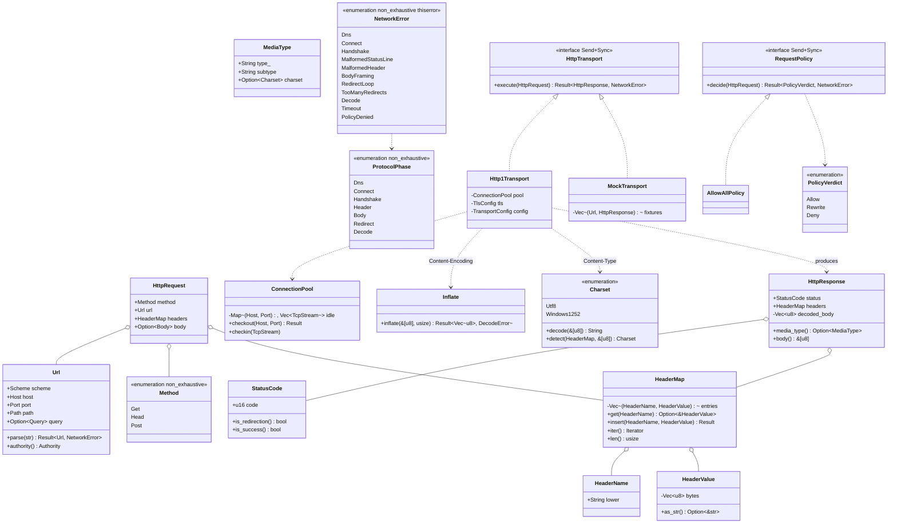

# `core/network` — HTTP transport and request-policy ports (v0.5 C1)

## Requirements

Transformar a fatia de rede de `HtmlStream → DomTree` num par de portas substituíveis (`ADR-0011`): um `HttpRequest`
entra por `RequestPolicy::decide`, e se aprovado por `HttpTransport::execute` sai um `HttpResponse` com bytes de corpo
**já decodificados** (charset + `Content-Encoding`), ou um `NetworkError` tipado com a `ProtocolPhase` em que falhou —
**nunca** um hang nem um pânico, mesmo com servidor hostil.

Definir `HttpTransport` (mecanismo) e `RequestPolicy` (política) como portas object-safe sob `ADR-0011` — com
`run_transport_suite` / `run_policy_suite` (`application/conformance.rs`, código `pub` de biblioteca), o adaptador de
referência `Http1Transport` (HTTP/1.1 à mão sobre `std::net::TcpStream` + `rustls` + `webpki-roots`) e os adaptadores
in-repo `MockTransport` + `AllowAllPolicy`. TLS pelo provider decidido no spike C0
(`docs/reports/SPIKE-C0-TLS-PROVIDER.md` §6): **`ring`**, sob a carve-out linha-1 do `ADR-0018`.

**Fronteira**: `core/network` não conhece `engine`, `rhai` nem `dom` (`arch-lint.toml`, job `layering`). Recebe
`HttpRequest`, devolve `HttpResponse`. Nenhum tipo `rustls` / `std::net` / `webpki` numa assinatura de porta (`ADR-0011`
item 2). Trait **síncrona**; o bloqueio de I/O roda num worker de pool `std::thread` do consumidor (`ADR-0019`,
`docs/adr/0019-single-event-loop-owns-the-main-thread.md:45-48`). Congela em **I4**
(`~/.claude/plans/…-fancy-dijkstra.md:747`). Spec completa:
`~/.claude/plans/verifique-o-docs-reports-implementacao-d-fancy-dijkstra.md` "## Fase C1" (linhas 517-556) + os 7 itens
do `ADR-0011` (linhas 737-747).

## Entities



## Approach

1. **Layering** (`ADR-0010:54-74`, `ADR-0015`) — molde `core/graphics`
   (`spdd/prompt/202609031011-[Feat]-graphics-display-list-and-render-backend-v0-3-f4.md:170-182`):
    - `src/lib.rs` — `#![forbid(unsafe_code)]`, `#![allow(clippy::missing_errors_doc)]` (convenção da casa,
      `core/dom/src/lib.rs:24`), `pub const PORT_SCHEMA_VERSION: u32 = 1;`, facade re-exportando `domain` + as portas.
    - `src/domain/` — `url.rs`, `header_map.rs` (first-class collection), `request.rs`, `response.rs`, `status.rs`,
      `method.rs`, `media_type.rs`, `error.rs` (`NetworkError` com `thiserror`), `mod.rs`. Zero I/O, zero `rustls`.
    - `src/application/` — `ports.rs` (`HttpTransport`, `RequestPolicy`, `PolicyVerdict`), `conformance.rs`
      (`run_transport_suite`, `run_policy_suite`), `mod.rs`.
    - `src/infrastructure/` — `http1/{mod.rs, chunked.rs, pool.rs}`, `tls.rs`, `dns.rs`, `charset.rs`, `inflate.rs`,
      `redirect.rs`, `mock.rs`, `mod.rs`.
    - `Cargo.toml` — `thiserror = { workspace = true }`, `rustls = { workspace = true }`,
      `webpki-roots = { workspace = true }`, `ring = { workspace = true }`; features `real-transport` (default) e
      `no-transport`.
2. **TLS pelo achado do spike C0** (`docs/reports/SPIKE-C0-TLS-PROVIDER.md` §6):
    - `infrastructure/tls.rs` é o **único** arquivo que nomeia `rustls`. Construção do `ClientConfig` (verbatim do
      spike, `docs/reports/SPIKE-C0-TLS-PROVIDER.md` §7):

        ```rust
        let provider = rustls::crypto::ring::default_provider();
        let roots = RootCertStore { roots: webpki_roots::TLS_SERVER_ROOTS.to_vec() };
        ClientConfig::builder_with_provider(Arc::new(provider))
            .with_safe_default_protocol_versions()?
            .with_root_certificates(roots)
            .with_no_client_auth()
        ```

        Nunca `ClientConfig::builder()` sem argumento (esconde a escolha de provider).

    - `rustls` é sans-I/O: `StreamOwned<ClientConnection, TcpStream>` para o caminho simples, ou dirigir
      `ClientConnection` à mão se C1 quiser seu próprio laço de timeout-por-fase.
    - `webpki-roots =1.0.9` embarcado — **não** o trust store do SO (`~/.claude/plans/…-fancy-dijkstra.md:124`).
3. **HTTP/1.1 à mão sobre `std::net`** (`infrastructure/http1/`):
    - `mod.rs` — request line + headers + leitura de status line + headers de resposta; `Content-Length` **ou**
      `Transfer-Encoding: chunked` (ambos presentes ⇒ ignora `Content-Length`, RFC 9112).
    - `chunked.rs` — de-chunk com tamanho hex validado, chunk final `0\r\n\r\n` obrigatório, teto de tamanho.
    - `pool.rs` — `ConnectionPool` `keep-alive` por `(host, porta)`; conexão morta detectada no 1º `read`/`write` →
      reconecta uma vez, transparente; **nunca muda o resultado**.
    - `redirect.rs` — limite 20 + detecção de ciclo por conjunto de URLs visitadas.
    - Timeout por fase (`connect` / `handshake` / `header` / `body-idle`) de um `TransportConfig` com defaults
      documentados — nunca booleano, nunca hard-coded.
4. **Decodificação de corpo, uma vez só, dentro do transporte**:
    - `inflate.rs` — RFC 1951 à mão (Huffman + LZ77), **módulo público** (`pub mod inflate`) porque a Fase X re-exporta
      `network::inflate` para o decodificador PNG (`~/.claude/plans/…-fancy-dijkstra.md:632`). Teto de saída contra
      bomba de descompressão → `NetworkError::Decode`. `gzip` = header RFC 1952 + `inflate` + CRC.
    - `charset.rs` — UTF-8 (`std`, `U+FFFD` em byte inválido) + windows-1252 (tabela de 256). Detecção: BOM → `charset`
      do `Content-Type` → `<meta charset>` nos primeiros 1024 bytes → windows-1252
      (`~/.claude/plans/…-fancy-dijkstra.md:544`). Rótulo não suportado → `NetworkError::Decode`.
    - `HttpResponse::body()` devolve os bytes já decodificados; `core/html` (B5) recebe UTF-8.
5. **DNS = wrapper fino** (`infrastructure/dns.rs`): `std::net::ToSocketAddrs` só
   (`~/.claude/plans/…-fancy-dijkstra.md:540`); sem cliente DNS. Roda no mesmo worker de pool do `execute` (não tem
   timeout no `std` — o consumidor cancela via drop).
6. **Duas portas object-safe** (`application/ports.rs`):
    - `HttpTransport::execute(&self, &HttpRequest) -> Result<HttpResponse, NetworkError>` — `Send + Sync`, **síncrona**
      (`ADR-0019:49`). Só tipos deste crate na assinatura.
    - `RequestPolicy::decide(&self, &HttpRequest) -> Result<PolicyVerdict, NetworkError>` — roda **antes** de `execute`;
      `PolicyVerdict::Deny` nunca abre socket.
    - `PolicyVerdict { Allow, Rewrite(HttpRequest), Deny { reason } }`.
7. **Conformance + mocks** (`ADR-0011` item 6):
    - `run_transport_suite(&dyn HttpTransport)` — totalidade do mapeamento de status, round-trip de headers, resposta
      hostil → erro tipado, determinismo (pool não muda resultado).
    - `run_policy_suite(&dyn RequestPolicy)` — `Allow`/`Rewrite`/`Deny` observáveis.
    - `MockTransport` serve `HttpResponse` de `core/network/tests/fixtures/`; `AllowAllPolicy` sempre `Allow`
      (documentar: **não** é segura para conteúdo não confiável — SSRF é decisão de `RequestPolicy`).
    - Feature `no-transport` compila e testa só domínio + `MockTransport` + `AllowAllPolicy`.
8. **Ciclo de vida** (`ADR-0019`): a porta não é `async`; `alloy` (I4) roda `execute` num worker de pool `std::thread`,
   resultado por `std::sync::mpsc` como evento do laço. C1 documenta isso no contract record (Fase P), não deixa como
   convenção.

## Structure

### Types and impls

1. `Url` — VO validado; `parse(&str) -> Result<Url, NetworkError>`; `scheme` ∈ `{http, https}`; host/porta/caminho/query
   separados; nunca `String` cru público.
2. `HeaderMap` — first-class collection sobre `Vec<(HeaderName, HeaderValue)>`; `HeaderName` lowercased, `HeaderValue`
   sem CR/LF (defesa contra response splitting); ordem de inserção; sem `Vec`/`HashMap` público (`ADR-0010:131`, molde
   `AttributeMap` de `core/dom`).
3. `HttpRequest` / `HttpResponse` — agregados `#[non_exhaustive]`; `HttpResponse` guarda `decoded_body` privado, exposto
   por `body() -> &[u8]`.
4. `StatusCode` / `Method` / `MediaType` — VOs `#[non_exhaustive]`.
5. `NetworkError` — `#[non_exhaustive]`, `#[derive(thiserror::Error, Debug)]` + `#[error("…")]`
   (`~/.claude/plans/…-fancy-dijkstra.md:36`, **não** `Display` à mão); cada variante carrega a `ProtocolPhase` e um
   `reason` humano.
6. `ProtocolPhase` — `#[non_exhaustive]` enum `{ Dns, Connect, Handshake, Header, Body, Redirect, Decode }`.
7. `HttpTransport`, `RequestPolicy` — traits object-safe `Send + Sync`.
8. `Http1Transport`, `MockTransport`, `AllowAllPolicy` — o adaptador de referência e os in-repo de `ADR-0011:99-102`.
9. `pub mod inflate` com `inflate(input: &[u8], max_output: usize) -> Result<Vec<u8>, DecodeError>` — re-exportável pela
   Fase X.
10. `run_transport_suite(&dyn HttpTransport)` / `run_policy_suite(&dyn RequestPolicy)` — `pub` em
    `application/conformance.rs`, **não** `#[cfg(test)]` (molde `core/engine/src/conformance.rs`,
    `~/.claude/plans/…-fancy-dijkstra.md:42`).

### Dependencies

1. `core/network` depende de `thiserror`, `rustls`, `webpki-roots`, `ring` — e **nada** de `engine`/`rhai`/`dom` (job
   `layering`, `~/.claude/plans/…-fancy-dijkstra.md:772`). Corrige `docs/architecture/overview.md` (que a Fase 0 já
   reescreveu para `network → nada`).
2. Deps novas **primeiro** em `[workspace.dependencies]` `=`-pinadas (feito na Fase C0 deste par): `rustls =0.23.43`
   (`default-features=false`, `std`/`tls12`/`ring`), `webpki-roots =1.0.9`, `ring =0.17.14`.
3. `arch-lint.toml` ganha escopos `network_domain`/`network_application`/`network` + `deny-scope-dep` negando
   `engine`/`runtime_rhai`/`runtime_rhai_bindings`/`alloy_cli` (molde `graphics`,
   `~/.claude/plans/…-fancy-dijkstra.md:290-296`); `application/conformance.rs` entra no `analyzer.exclude`.
4. Features `real-transport` (default) e `no-transport`.
5. `deny.toml` — `ISC`, `BSD-3-Clause`, `CDLA-Permissive-2.0` adicionadas na Fase C0 (comentários nomeiam
   `ring`/`rustls-webpki`/`untrusted`, `subtle`, `webpki-roots`).
6. `unsafe-allowlist.toml` — entrada `ring` `row = 1` **EXCEPTION** adicionada na Fase C0 (`ADR-0018` §"The RustCrypto
   carve-out").

## Operations

### Implementar os VOs de domínio e `NetworkError` (`domain/`)

- `Url` com `parse`, `Method`, `StatusCode`, `HeaderName`/`HeaderValue`/`HeaderMap`, `MediaType`, `Body`.
- `NetworkError` com `thiserror`, cada variante com `ProtocolPhase` + `reason`.
- `pub const PORT_SCHEMA_VERSION: u32 = 1;` em `lib.rs`.

### Implementar as portas, a conformance e os mocks (`application/`, `infrastructure/mock.rs`)

- `HttpTransport`, `RequestPolicy`, `PolicyVerdict` object-safe.
- `run_transport_suite` / `run_policy_suite`.
- `MockTransport` (fixtures) + `AllowAllPolicy`; feature `no-transport` compila só com eles.

### Implementar `Http1Transport` (`infrastructure/http1/`, `tls.rs`, `dns.rs`)

- Request line + headers + parsing de resposta; `Content-Length` / `chunked`; `ConnectionPool` por `(host, porta)`;
  `redirect.rs` (limite 20 + ciclo); timeout por fase de `TransportConfig`.
- `tls.rs` — único arquivo que nomeia `rustls`; provider `ring` (spike C0); `webpki-roots` embarcado.
- `dns.rs` — `std::net::ToSocketAddrs`, wrapper fino.
- `#[allow(clippy::arithmetic_side_effects, clippy::indexing_slicing)]` por função, comentado citando `ADR-0017`, só em
  `http1/` e `inflate.rs`.

### Implementar `inflate` e `charset` (`infrastructure/`)

- `inflate.rs` — RFC 1951 à mão, `pub mod`, teto de saída, sem `unwrap`/`panic` (fuzz-ready para a Fase X).
- `charset.rs` — UTF-8 + windows-1252; ordem de detecção BOM → `Content-Type` → `<meta charset>` (1024 B) →
  windows-1252.

### Configurar `Cargo.toml`, `arch-lint.toml`, features e o job `layering`

- `core/network/Cargo.toml` opta pelas deps de workspace; `[features]` `real-transport`/`no-transport`.
- `arch-lint.toml` escopos + `deny-scope-dep`; `conformance.rs` no `analyzer.exclude`.
- Confirmar `cargo tree -p network` sem `engine`/`rhai` e `cargo test -p network --no-default-features` verdes.
- Re-rodar `just unsafe-audit` (advisory) — `ring` tem de aparecer sob a entrada allowlistada.

## Norms

- **Object Calisthenics** (`ADR-0010:127-137`, mecanicamente checado): sem primitivo cru no `domain/` (`Url`,
  `StatusCode`, `HeaderName` são newtypes); first-class `HeaderMap` (sem `Vec`/`HashMap` público); sem `else`
  (early-return / `match` / `if let`); 1 nível de indentação por função; 1 dot por linha; nomes sem abreviação
  (`header_name`, não `hdr`); entidades < ~100 linhas; sem campo público mutável.
- `#![forbid(unsafe_code)]` na raiz do crate — sem exceção, incluindo o parser HTTP/1.1 e o `inflate`.
- **`domain/` mantém o portão de clippy integral**: `checked_*`/`saturating_*` para aritmética, `TryFrom` para narrowing
  (nunca `as`), `.get()` para acesso a coleção (`Cargo.toml:56-66`; precedente `core/dom/src/domain/`).
- **`#[allow(clippy::…)]` só em `infrastructure/http1/` e `infrastructure/inflate.rs`** — sempre no escopo mais estreito
  (função, não módulo), sempre comentado, sempre citando `ADR-0017`; nunca cobre `unwrap`/`expect`/`panic!` num caminho
  alcançável por input (precedente `core/graphics`, `spdd/prompt/202609031011-…-f4.md:320-322`).
- `thiserror` para o erro tipado (`ADR-0015`); `tracing` para diagnóstico estruturado (`ADR-0014`), nunca `log`.
- **Command–Query Separation**: `execute`/`decide` respondem e não mutam estado observável de fora;
  `ConnectionPool::checkin` muta e devolve `()`.
- **Sem parâmetro booleano** — `PolicyVerdict`, `Method`, `Charset`, `ProtocolPhase` são enums; timeout é
  `TransportConfig`, não flag.
- Testes em `tests/`, um arquivo por tema; nunca `#[cfg(test)] mod tests` em `src/`.

## Safeguards

1. **Portas object-safe** (`ADR-0011` item 2): `run_transport_suite` passa para `Http1Transport` e `MockTransport`;
   `run_policy_suite` passa para `AllowAllPolicy`; `cargo test -p network --no-default-features` prova que o crate
   compila sem transporte real linkado.
2. **Resposta hostil nunca trava nem entra em pânico**: um teste por classe — `Content-Length` mentiroso, chunk com
   tamanho não-hex, chunk final ausente, header de 1 MB, header sem `:`, redirect A→B→A, 21 redirects, `gzip` truncado,
   bomba de descompressão — cada um → `NetworkError` com a `ProtocolPhase` certa
   (`~/.claude/plans/…-fancy-dijkstra.md:553-556`).
3. **Nenhum tipo estrangeiro na fronteira** (`ADR-0011` item 2 / `PRD-009` item 2): `grep` prova que `rustls`,
   `TcpStream`, `webpki` aparecem só em `infrastructure/`; nunca em `domain/` nem em `application/ports.rs`.
4. **Domínio sem engine** (N-04, job `layering`): `cargo tree -p network` mostra
   `rustls`/`webpki-roots`/`ring`/`thiserror` e nada de `engine`/`rhai`/`dom`.
5. **Isolamento de arquitetura**: `arch-lint` verifica que `network_domain` não importa `network_application` nem
   adaptador; que `network` não tem aresta para `engine`/`runtime_rhai`/`runtime_rhai_bindings`/`alloy_cli`.
6. **`unsafe` por superfície de ameaça** (`ADR-0018`): `ring` é a **única** entrada `row = 1` do
   `unsafe-allowlist.toml`, marcada EXCEPTION, justificada pelo spike C0 (`docs/reports/SPIKE-C0-TLS-PROVIDER.md` §6);
   `rustls-webpki` e `untrusted` (que parseiam bytes do certificado) foram verificados sem `unsafe` no `src/`.
   `just unsafe-audit` re-rodado e o resultado anexado ao commit de C1.
7. **`deny.toml` verde**: `ISC`/`BSD-3-Clause`/`CDLA-Permissive-2.0` já allow-listadas (C0); pilha `ring` sem
   `multiple-versions` (verificado no spike — `rustls-webpki 0.103.15` único).
8. **Determinismo**: `run_transport_suite` prova que uma resposta servida de conexão reusada do pool é byte-idêntica a
   uma de conexão nova; `inflate` é determinístico e sem `unwrap` (pré-requisito do fuzz da Fase X,
   `~/.claude/plans/…-fancy-dijkstra.md:636`).
9. **Ciclo de vida `ADR-0019`**: a trait é síncrona; o contract record (`http-transport-port-contract.md`, Fase P)
   registra "`execute` em worker de pool `std::thread`, `HttpResponse` por `mpsc`" como item, não como convenção.
10. **`PORT_SCHEMA_VERSION`**: `network::PORT_SCHEMA_VERSION = 1` em `lib.rs`; agregados `#[non_exhaustive]`; congela em
    **I4** (`~/.claude/plans/…-fancy-dijkstra.md:709`).
