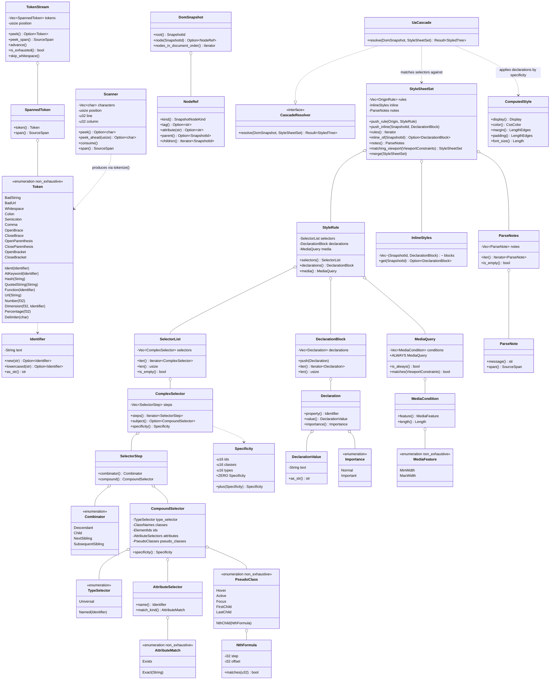

# `core/css` — CSS Syntax L3 tokenizer, selector engine and specificity (v0.5 B1)

## Requirements

Dar ao `core/css` a responsabilidade que `PRD-007:11-13` reserva ao Rust nativo: **parsear CSS**. Entram um tokenizador
CSS Syntax Level 3 escrito à mão (at-rules, blocos `{}`/`()`/`[]`, funções, `url()`, strings com escape, comentários,
números/dimensões/percentagens, `#hash`, delimitadores), um parser de regras que popula o `StyleSheetSet` que B0 já
congelou em forma (`core/css/src/domain/stylesheet_set.rs:4-7`), o motor de seletores do recorte §2.8 do relatório
(`docs/reports/IMPLEMENTACAO-DETALHADA-V0-5.md:340-345`) com especificidade de três componentes, `@media` com
`min-width`/`max-width`, e a ligação de `` e um `
`, roda
   `snapshot → collect_style_sheets → UaCascade::resolve`, e asserta que o `color` computado é o inline e a `margin` é a
   da folha — falha se qualquer elo da corrente parar de aplicar.
3. **Especificidade como desempate (`relatório §2.8:334`)**: o mesmo teste asserta `#id` > `.classe` > tipo com as três
   regras declarando a mesma propriedade na mesma folha, em ordem de documento **desfavorável** ao vencedor — de forma
   que só a especificidade possa decidir.
4. **Recorte §2.8 nos dois sentidos**: `cargo test -p css --test manifest_runner` compara manifesto ⇄ registros ⇄
   parser. Verificado à mão uma vez: apagar uma entrada de `SUPPORTED_PROPERTIES` sem tocar o `MANIFEST.md` **falha** o
   runner (e o inverso também), e a alteração é revertida.
5. **O que está fora é rejeitado, não ignorado**: o runner alimenta `:has(p)`, `p::before`, `svg|rect`,
   `@supports (display: flex) { … }`, `@font-face { … }`, `@import url(x)` e `@keyframes k { … }`, e asserta que cada um
   vira regra descartada **com `ParseNote`** — nunca uma regra aplicada nem uma folha abortada.
6. **`PRD-007:98,100` (determinismo, 100 runs)**: `run_css_conformance(&UaCascade::new(), &BlockLayout::new())` e a
   versão com mocks continuam verdes em `tests/css_conformance.rs`; a chave de ordenação
   `(precedência, especificidade, índice)` é total, então não há empate a ser desempatado por ordem de `HashMap`.
7. **`PRD-007:83-84` (sem tipo estrangeiro)**: `collect_style_sheets` recebe `&DomSnapshot`; `application/snapshot.rs`
   segue o único arquivo de `core/css` que nomeia `dom::DomTree` / `dom::NodeId` — verificável por
   `grep -rn "dom::" core/css/src`.
8. **Robustez contra entrada hostil**: `tests/parser.rs` alimenta string sem terminador, `url(` sem `)`, `\` no fim da
   fonte, `{` sem par, `}` órfão, `@media` sem bloco e aninhamento profundo; nenhum caso entra em laço infinito, estoura
   índice ou entra em pânico — o aninhamento além de `MAX_NESTING_DEPTH` devolve `CssError { stage: Parse, span }`.
9. **`ADR-0002` / `PRD-001:99`**: `just no-engine` verde — `cargo tree -p css` sem `engine`, `rhai`, `rhai-runtime`,
   `rhai-bindings`.
10. **DoD completo**: `just gate` verde (`fmt-check` + `lint` + `check` + `test` + `deny` + `coverage` + `arch` +
    `no-engine`), `just no-engine` verde, `cargo test -p css` **e** `cargo test -p css --no-default-features` verdes,
    `cargo test -p css --test manifest_runner` verde, `cargo fmt --all` + `pnpm format:md` aplicados, `pnpm lint:md`
    limpo. Dois commits: o par de canvas SPDD, depois
    `feat(css): CSS Syntax L3 tokenizer, selector engine and specificity (v0.5 B1)`, ambos com os trailers do repo. Sem
    push, sem PR, sem tocar `main`, `core/network`, `core/window`, `core/html` ou qualquer arquivo de outra fase.
