# `core/css` — box model, inline formatting context and Flexbox (v0.5 B4)

## Requirements

Trocar o `LayoutEngine` placeholder de B0 pelo **motor de layout real** que `PRD-007` §3.5 promete ("the built-in
flow-plus-Flexbox layout engine"). Entram: o box model completo (`margin` / `border-width` / `padding`, `width` /
`height`, `box-sizing`) com colapso de margem vertical nas três formas de CSS 2.1 §8.3.1 (irmãos adjacentes,
pai/primeiro-filho, pai/último-filho); um contexto de formatação inline com caixas de linha, colapso de espaço em
branco, `white-space` (`normal` / `pre` / `nowrap`), quebra suave em espaço e pós-hífen, `text-align` (`left` / `right`
/ `center` / `justify`), inlines aninhados e alinhamento por baseline, consumindo **a porta** `TextMeasurer` e nenhum
tipo de fonte; e Flexbox com `flex-direction`, `flex-wrap` (multi-linha, sem puxar a alavanca de alívio),
`justify-content`, `align-items`, `align-content`, `align-self`, `flex-grow` / `flex-shrink` / `flex-basis`. Entra
também, **antes do freeze**, o marcador de "intrinsic size pendente" que a Fase X consome. Toda geometria é
`graphics::Au` (`ADR-0016`). A fase fecha com o **freeze I3**: `css::PORT_SCHEMA_VERSION` 2 → 3 e o contract record
`docs/architecture/style-cascade-port-contract.md` cobrindo os sete itens de `ADR-0011`. Fora de B4: `float`,
`position`, `min-`/`max-` de qualquer eixo, `border-style` / `border-color`, `order`, `flex-basis: content`, grid,
`vertical-align`, UAX #14 completo, e o adaptador `.rhai` (Fase M). `core/css` continua sem `engine` e sem `rhai`.

## Entities

```mermaid
classDiagram
direction TB

class Sizing {
    <<enumeration non_exhaustive>>
    Auto
    Fixed(Length)
    +resolve(Au fontSize, Au container) Option~Au~
    +is_auto() bool
}

class BoxSizing {
    <<enumeration non_exhaustive>>
    ContentBox
    BorderBox
    +keyword() str
}

class TextAlign {
    <<enumeration non_exhaustive>>
    Left
    Right
    Center
    Justify
}

class WhiteSpace {
    <<enumeration non_exhaustive>>
    Normal
    Pre
    NoWrap
    +collapses_spaces() bool
    +allows_soft_wrap() bool
}

class FlexDirection {
    <<enumeration non_exhaustive>>
    Row
    RowReverse
    Column
    ColumnReverse
}

class FlexWrap {
    <<enumeration non_exhaustive>>
    NoWrap
    Wrap
    WrapReverse
}

class JustifyContent {
    <<enumeration non_exhaustive>>
    FlexStart
    FlexEnd
    Center
    SpaceBetween
    SpaceAround
    SpaceEvenly
}

class AlignItems {
    <<enumeration non_exhaustive>>
    FlexStart
    FlexEnd
    Center
    Stretch
    Baseline
}

class AlignContent {
    <<enumeration non_exhaustive>>
    FlexStart
    FlexEnd
    Center
    SpaceBetween
    SpaceAround
    Stretch
}

class AlignSelf {
    <<enumeration non_exhaustive>>
    Auto
    FlexStart
    FlexEnd
    Center
    Stretch
    Baseline
    +resolve(AlignItems) AlignItems
}

class FlexFactor {
    -f32 value
    +ZERO FlexFactor
    +ONE FlexFactor
    +new(f32) Option~FlexFactor~
    +value() f32
}

class FlexStyle {
    -FlexDirection direction
    -FlexWrap wrap
    -JustifyContent justify_content
    -AlignItems align_items
    -AlignContent align_content
    -AlignSelf align_self
    -FlexFactor grow
    -FlexFactor shrink
    -Sizing basis
    +initial() FlexStyle
    +with_direction(FlexDirection) FlexStyle
    +direction() FlexDirection
}

class ComputedStyle {
    -Display display
    -CssColor color
    -CssColor background_color
    -LengthEdges margin
    -LengthEdges border
    -LengthEdges padding
    -Length font_size
    -Sizing width
    -Sizing height
    -BoxSizing box_sizing
    -TextAlign text_align
    -WhiteSpace white_space
    -FlexStyle flex
    +initial() ComputedStyle
    +inheriting_from(ComputedStyle) ComputedStyle
}

class IntrinsicSize {
    <<enumeration non_exhaustive>>
    Resolved
    Pending
    +is_pending() bool
}

class StyledNode {
    -SnapshotId node
    -Option~SnapshotId~ parent
    -ChildIds children
    -ComputedStyle style
    -Option~TextRun~ text
    -IntrinsicSize intrinsic_size
    +text() Option~TextRun~
    +intrinsic_size() IntrinsicSize
}

class LayoutBox {
    -SnapshotId node
    -Rect content
    -EdgeSizes margin
    -EdgeSizes border
    -EdgeSizes padding
    -IntrinsicSize intrinsic_size
    -ChildIds children
    +border_box() Rect
    +margin_box() Rect
}

class LayoutBoxTree {
    -Vec~LayoutBox~ boxes
    -Option~SnapshotId~ root
    +box_of(SnapshotId) Option~LayoutBox~
    +boxes_in_document_order() Iterator
}

class TextMetrics {
    -Au width
    -Au height
    -Au baseline
    +new(Au, Au) TextMetrics
    +with_baseline(Au, Au, Au) TextMetrics
    +baseline() Au
}

class CollapsedMargin {
    -Au positive
    -Au negative
    +ZERO CollapsedMargin
    +from_length(Au) CollapsedMargin
    +adjoin(CollapsedMargin) CollapsedMargin
    +resolve() Au
}

class BoxMetrics {
    -EdgeSizes margin
    -EdgeSizes border
    -EdgeSizes padding
    -Option~Au~ width
    -Option~Au~ height
    +content_width_within(Au) Au
    +surround_horizontal() Au
    +surround_vertical() Au
}

class Fragment {
    -SnapshotId node
    -Rect content
    -EdgeSizes margin
    -EdgeSizes border
    -EdgeSizes padding
    -IntrinsicSize intrinsic_size
    -ChildIds children
    +translated(Au, Au) Fragment
}

class BlockResult {
    -Au height
    -CollapsedMargin top_margin
    -CollapsedMargin bottom_margin
    -MarginFlow flow
    -Vec~Fragment~ fragments
}

class MarginFlow {
    <<enumeration>>
    Separated
    CollapsesThrough
}

class ContentFlow {
    -Au height
    -Vec~Fragment~ fragments
    -CollapsedMargin leading_margin
    -CollapsedMargin trailing_margin
}

class LayoutContext {
    -StyledTree styled
    -dyn TextMeasurer measurer
    +measure(str, Au) Result~TextMetrics~
}

class LayoutEngine {
    <<interface>>
    +layout(StyledTree, ViewportConstraints) Result~LayoutBoxTree~
}

class BlockLayout {
    -Arc~dyn TextMeasurer~ measurer
    +new() BlockLayout
    +with_measurer(Arc~dyn TextMeasurer~) BlockLayout
}

class LineBox {
    -Vec~InlineItem~ items
    -Au width
    -Au ascent
    -Au descent
}

class InlineItem {
    -SnapshotId node
    -TextMetrics metrics
    -InlineKind kind
}

class FlexItem {
    -SnapshotId node
    -Au base_size
    -Au cross_size
    -FlexFactor grow
    -FlexFactor shrink
    -AlignSelf align_self
    -Vec~Fragment~ fragments
}

class FlexLine {
    -Vec~FlexItem~ items
    -Au main_size
    -Au cross_size
}

class MainAxis {
    <<enumeration>>
    Horizontal
    Vertical
    +point(Au main, Au cross) Point
    +size(Au main, Au cross) Size
}

ComputedStyle *-- FlexStyle : flex
ComputedStyle *-- Sizing : width, height
ComputedStyle *-- BoxSizing : box_sizing
ComputedStyle *-- TextAlign : text_align
ComputedStyle *-- WhiteSpace : white_space
FlexStyle *-- FlexFactor : grow, shrink
FlexStyle *-- AlignSelf : align_self
StyledNode *-- ComputedStyle : style
StyledNode *-- IntrinsicSize : intrinsic_size
LayoutBox *-- IntrinsicSize : intrinsic_size
LayoutBoxTree "1" *-- "0..*" LayoutBox : boxes
BlockLayout ..|> LayoutEngine : implements
BlockLayout --> LayoutContext : builds
LayoutContext --> BoxMetrics : resolves
BlockResult *-- MarginFlow : flow
BlockResult *-- CollapsedMargin : top_margin, bottom_margin
BlockResult "1" *-- "0..*" Fragment : fragments
ContentFlow "1" *-- "0..*" Fragment : fragments
LineBox "1" *-- "0..*" InlineItem : items
FlexLine "1" *-- "0..*" FlexItem : items
Fragment --> LayoutBox : becomes
```

## Approach

1. **Box model, primeiro e isolado** (passo 1 do spec):
    - `box_model.rs` resolve `margin` / `border` / `padding` / `width` / `height` de um nó em `BoxMetrics`, aplicando
      `box-sizing` na conversão (`border-box` desconta borda e padding da largura declarada, saturando em zero).
    - `margin_collapse.rs` isola a álgebra: `CollapsedMargin { positive, negative }`, `adjoin` = `(max, min)`, `resolve`
      = `positive + negative`. Comutativa, associativa, com identidade `ZERO` — três propriedades que o teste unitário
      afirma diretamente, antes de qualquer retângulo.
2. **Um contexto de formatação por arquivo, um resultado em comum**:
    - Todo contexto devolve `ContentFlow { height, fragments, leading_margin, trailing_margin }`, com os `Fragment`s
      posicionados **relativamente** à origem da caixa de conteúdo do contêiner. O pai translada. Isso mantém `block.rs`
      pequeno e faz o despacho ser um `match` de três braços (`Flex` → `flex.rs`; filhos inline/texto → `inline.rs`;
      resto → BFC local).
    - `block.rs` também é o `LayoutEngine`: `layout()` resolve o viewport como bloco contentor inicial e converte os
      `Fragment`s em `LayoutBox` em pré-ordem.
3. **Colapso de margem no lugar certo**: a decisão "a margem do primeiro/último filho escapa?" é do **pai**, tomada em
   `block.rs` a partir de `BoxMetrics` (borda e padding no topo/base) e de `Sizing` (`height: auto`), não do filho. O
   filho só reporta `top_margin` / `bottom_margin` / `MarginFlow`.
4. **IFC determinístico**: colapso de espaço em branco → segmentação em palavras → medição pela porta `TextMeasurer` →
   preenchimento de linha → alinhamento por linha. O `TextMeasurer` é chamado uma vez por palavra e uma vez por espaço,
   sempre com o `ComputedText` do nó dono do texto — nunca há acesso a `ttf-parser`, `graphics::FontId` ou qualquer
   `graphics::infrastructure::font`.
5. **Flexbox com abstração de eixo**: `MainAxis` converte `(main, cross)` em `Point` / `Size`, então `row` e `column`
   compartilham 100% do algoritmo; `-reverse` é uma inversão de ordem aplicada na colocação final. O algoritmo é a forma
   reduzida de CSS Flexbox §9.3-9.7: base size → coleta em linhas → resolução de flexíveis (`grow` se sobra folga,
   `shrink × base` se falta) → cross size por linha → `align-content` → `justify-content` → `align-items` /
   `align-self`.
6. **Marcador de intrinsic size**: `IntrinsicSize::Pending` nasce em `StyledTree::recompute_in_document_order` a partir
   da tag (a lista de elementos substituídos vive em `domain/computed/intrinsic.rs`), sem tocar no closure que os três
   resolvers passam; o layout copia o marcador para o `LayoutBox` e o rebaixa para `Resolved` quando a caixa tem as duas
   dimensões declaradas. A Fase X lê `LayoutBox::intrinsic_size()`.
7. **Recorte declarado**: cada propriedade nova ganha, na mesma edição, linha no `MANIFEST.md`, entrada em
   `SUPPORTED_PROPERTIES`, probe em `manifest_runner.rs` e aceitação real no parser + cascata. `width`, `border` e
   `flex-direction` saem de `REFUSED_PROPERTIES`; `border` (o atalho completo) **entra** na lista de recusados no lugar,
   porque só a largura é geometria.
8. **Freeze I3**: `PORT_SCHEMA_VERSION = 3` com o motivo no doc-comment, e
   `docs/architecture/style-cascade-port-contract.md` no molde de `runtime-engine-port-contract.md` — tabela dos sete
   itens, seção de object-safety, seção de ciclo de vida/concorrência, seção de auditoria.

## Structure

### Inheritance / trait relationships

- `BlockLayout: LayoutEngine` — o único adaptador de layout de produção; passa a segurar `Arc<dyn TextMeasurer>`, logo
  deixa de ser `Copy`, mas continua `Send + Sync` (o que a porta exige) porque `TextMeasurer: Send + Sync`.
- `MockLayoutEngine: LayoutEngine` — **intocado**. É a prova de que a troca ainda funciona.
- `MonospaceMetrics: TextMeasurer` — o measurer default de `BlockLayout::new()`; `FontBackedMeasurer` entra por
  `with_measurer`.
- Nenhuma trait nova. A porta de `PRD-007` §3.3 é a mesma assinatura, byte a byte.

### Dependencies

- `core/css` continua com exatamente três dependências: `dom`, `graphics` (só unidades, `ADR-0016`), `thiserror`.
- Nenhuma dependência nova em `Cargo.toml`; nenhuma feature nova (`builtin-adapters` continua gateando nada, e
  `--no-default-features` compila o mesmo código).
- `arch-lint.toml` não muda: `css_domain` continua proibido de nomear `css_application`, e o novo código de layout está
  todo em `infrastructure/`.

### Layered responsibilities (`ADR-0010:54-74`)

- `domain/computed/{sizing,inline_style,flex,intrinsic}.rs` — os VOs novos. Zero I/O, zero dependência de
  `application/`.
- `domain/computed/style.rs` — `ComputedStyle` ganha seis campos (`border`, `width`, `height`, `box_sizing`,
  `text_align`, `white_space`) mais o agregado `flex`.
- `domain/styled_tree.rs` — `StyledNode` ganha `text` e `intrinsic_size`, ambos preenchidos pelo construtor da árvore.
- `domain/layout_box_tree.rs` — `LayoutBox` ganha `border` e `intrinsic_size`, mais `border_box()` / `margin_box()`.
- `domain/text.rs` — `TextMetrics` ganha `baseline`.
- `application/` — **inalterada**: as três portas, a suíte de conformidade (que ganha só um check novo de determinismo
  do `LayoutBoxTree` completo) e o mapeamento de snapshot.
- `infrastructure/layout/` — os cinco arquivos do motor. `infrastructure/parser/values.rs` e
  `infrastructure/cascade/values.rs` ganham as gramáticas e a aplicação das propriedades novas.

## Operations

### 1. `domain/computed/sizing.rs`

1. `Sizing` (`#[non_exhaustive]`): `Auto` | `Fixed(Length)`; `is_auto()`,
   `resolve(font_size: Au, container: Au) -> Option<Au>` (delegando a `Length::resolve_to_au`, `None` para `Auto` e para
   magnitude não finita).
2. `BoxSizing` (`#[non_exhaustive]`): `ContentBox` (default) | `BorderBox`; `keyword()` + `Display`.

### 2. `domain/computed/inline_style.rs`

1. `TextAlign` (`#[non_exhaustive]`): `Left` (default) | `Right` | `Center` | `Justify`; `keyword()` + `Display`.
2. `WhiteSpace` (`#[non_exhaustive]`): `Normal` (default) | `Pre` | `NoWrap`; `collapses_spaces()`,
   `allows_soft_wrap()`, `preserves_newlines()`, `keyword()` + `Display`. As três consultas são o que o IFC lê — nunca
   um `match` sobre a variante espalhado pelo motor.

### 3. `domain/computed/flex.rs`

1. `FlexDirection`, `FlexWrap`, `JustifyContent`, `AlignItems`, `AlignContent`, `AlignSelf` — todos `#[non_exhaustive]`,
   todos com `keyword()` e `Display`. `AlignSelf::resolve(AlignItems) -> AlignItems` fecha o `Auto`.
2. `FlexFactor(f32)` — `new` recusa não-finito e negativo; `ZERO` / `ONE`; `value()`.
3. `FlexStyle` — os nove campos, `initial()` (row / nowrap / flex-start / stretch / stretch / auto / grow 0 / shrink 1 /
   basis auto), `with_*` no estilo copy-with, getters `#[must_use]`.

### 4. `domain/computed/intrinsic.rs`

1. `IntrinsicSize` (`#[non_exhaustive]`): `Resolved` (default) | `Pending`; `is_pending()`.
2. `pub(crate) fn for_tag(tag: Option<&str>) -> IntrinsicSize` — `Pending` para `img`, `video`, `canvas`, `iframe`,
   `object`, `embed`, `svg`; `Resolved` para o resto. Doc-comment cita a Fase X como consumidora.

### 5. `domain/computed/style.rs`

1. `ComputedStyle` ganha `border: LengthEdges`, `width: Sizing`, `height: Sizing`, `box_sizing: BoxSizing`,
   `text_align: TextAlign`, `white_space: WhiteSpace`, `flex: FlexStyle`, com `with_*` e getters.
2. `initial()` cobre os novos com o valor inicial de CSS; `inheriting_from` herda `color`, `font_size` **e** as duas
   propriedades herdadas novas (`text_align`, `white_space` — CSS Text L3 as declara herdadas).

### 6. `domain/styled_tree.rs`

1. `StyledNode` ganha `text: Option<TextRun>` e `intrinsic_size: IntrinsicSize`, com getters `#[must_use]`.
2. `recompute_in_document_order` preenche os dois a partir do `NodeRef` — **sem** mudar a assinatura do closure, para
   que `UaCascade`, `MockCascadeResolver` e qualquer adaptador externo continuem compilando sem edição.

### 7. `domain/layout_box_tree.rs`

1. `LayoutBox` ganha `border: EdgeSizes` e `intrinsic_size: IntrinsicSize`; `new` passa a receber os dois.
   `border_box()` e `margin_box()` derivam retângulos do `content` mais as arestas (aritmética saturante).
2. `LayoutBoxTreeBuilder` continua `pub(crate)`; ganha `push_all` para absorver uma lista de fragmentos em ordem.

### 8. `domain/text.rs`

1. `TextMetrics` ganha `baseline: Au`. `new(width, height)` mantém o comportamento anterior (`baseline = height`);
   `with_baseline(width, height, baseline)` é o construtor cheio. `descent()` = `height − baseline`, saturante.
2. `MonospaceMetrics` passa a reportar `baseline = font_size` (a linha é `1.2 × font_size`, o ascendente é `1 ×`);
   `FontBackedMeasurer` reporta `metrics.ascent()` do `FaceMetrics` real.

### 9. `infrastructure/parser/values.rs`

1. `parse_sizing`, `parse_box_sizing`, `parse_text_align`, `parse_white_space`, `parse_flex_direction`,
   `parse_flex_wrap`, `parse_justify_content`, `parse_align_items`, `parse_align_content`, `parse_align_self`,
   `parse_flex_factor` — cada uma um `match` sobre um `[Token::Ident]` (ou `[Token::Number]` para o fator), devolvendo
   `Option`. Um valor fora do recorte devolve `None` e a declaração é derrubada com nota, como já acontece.
2. `parse_length_edges` é reusada por `border-width` sem uma linha nova.

### 10. `infrastructure/cascade/values.rs`

1. `apply_property_value` ganha um braço por propriedade nova; os nove de flex são delegados a um
   `apply_flex_property(style, property, tokens)` privado, para que nenhuma função passe de um nível de indentação.
2. `reset_to_initial` e `copy_property` (as duas metades de `initial` / `inherit`) ganham os mesmos braços — é a única
   forma de as CSS-wide keywords continuarem valendo para **toda** propriedade listada, que é o que o `MANIFEST.md`
   promete.
3. `split_edge_property` passa a reconhecer o prefixo `border-` com sufixo `-width`.

### 11. `infrastructure/layout/box_model.rs`

1. `BoxMetrics { margin, border, padding, width: Option<Au>, height: Option<Au> }` +
   `resolve(style, font_size, container_width) -> Result<BoxMetrics, CssError>`; erro `Unsupported(Layout, …)` para
   comprimento não finito, como o placeholder já fazia.
2. `content_width_within(container)` aplica `box-sizing`: em `ContentBox` a `width` declarada **é** a largura de
   conteúdo; em `BorderBox` desconta `border.horizontal() + padding.horizontal()`, saturando em zero; com `width: auto`
   preenche `container − surround_horizontal()`.
3. `resolve_font_size(style, parent_font_size)` centraliza a resolução de `em` / `%` do `font-size`.

### 12. `infrastructure/layout/margin_collapse.rs`

1. `CollapsedMargin` com `ZERO`, `from_length(Au)`, `adjoin`, `resolve`, `is_zero`.
2. `MarginFlow { Separated, CollapsesThrough }` — nunca um `bool`.
3. `pub(crate) fn collapses_at_top(metrics) -> bool` / `collapses_at_bottom(metrics, height) -> bool`: as duas condições
   de CSS 2.1 §8.3.1 escritas uma vez, lidas por `block.rs`.

### 13. `infrastructure/layout/block.rs` (reescrito)

1. `BlockLayout { measurer: Arc<dyn TextMeasurer> }`, `new()` (→ `MonospaceMetrics`), `with_measurer`, `Default`.
2. `LayoutContext<'a> { styled: &'a StyledTree, measurer: &'a dyn TextMeasurer }` com `measure(text, font_size)`.
3. `layout()` — resolve a raiz contra `ViewportConstraints::width()`, converte `Fragment` → `LayoutBox` em pré-ordem,
   devolve `LayoutBoxTree`.
4. `layout_block(context, node, containing_width, font_size, depth) -> Result<BlockResult, CssError>` — a recursão, com
   teto `MAX_LAYOUT_DEPTH`.
5. `layout_children(context, node, content_width, …) -> Result<ContentFlow, CssError>` — o despacho de três braços (flex
   / inline / bloco) mais o empilhamento com `CollapsedMargin`.

### 14. `infrastructure/layout/inline.rs`

1. `collect_inline_items` — desce pelos inlines aninhados em ordem de documento, produzindo `InlineItem`s de texto com o
   `ComputedText` do nó **dono** do texto.
2. `segment` — colapso de espaço em branco por `WhiteSpace`, quebra forçada em `\n` sob `pre`, segmentação em palavras
   com oportunidade de quebra depois de um espaço ou de um hífen.
3. `fill_lines` — preenchimento guloso: uma palavra que não cabe abre linha nova; uma palavra sozinha maior que a linha
   transborda.
4. `align_line` — `text-align` por linha; `Justify` distribui a folga pelos intervalos e **pula a última linha**.
5. `place_lines` — `Fragment` por item, com o topo do item em `line_top + line_ascent − item_ascent` (baseline comum).

### 15. `infrastructure/layout/flex.rs`

1. `MainAxis { Horizontal, Vertical }` + `AxisOrder { Forward, Reverse }` derivados de `FlexDirection` / `FlexWrap`.
2. `collect_items` → `base_size` de cada item (`flex-basis`, senão `width`/`height` no eixo principal, senão o tamanho
   de conteúdo vindo de `layout_block`).
3. `collect_lines` → uma linha se `FlexWrap::NoWrap`, senão quebra ao estourar o tamanho principal.
4. `resolve_flexible_lengths` → `grow` proporcional se sobra folga, `shrink × base` proporcional se falta; guarda contra
   soma de fatores zero.
5. `align_lines` (`align-content`) → `justify_line` (`justify-content`) → `align_item` (`align-self` resolvido contra
   `align-items`, `Stretch` estica o tamanho cruzado, `Baseline` alinha pelo primeiro baseline do item).

### 16. `lib.rs`, `MANIFEST.md`, `manifest_runner.rs`

1. `SUPPORTED_PROPERTIES` vai de 14 para 33: `+width`, `+height`, `+box-sizing`, `+text-align`, `+white-space`,
   `+border-width` e os quatro longhands, `+flex-direction`, `+flex-wrap`, `+justify-content`, `+align-items`,
   `+align-content`, `+align-self`, `+flex-grow`, `+flex-shrink`, `+flex-basis`.
2. `PORT_SCHEMA_VERSION = 3` com o motivo no doc-comment.
3. `pub use` dos VOs novos.
4. `MANIFEST.md`: linhas novas na tabela `## Properties` (`since` = B4), a lista "declarado fora" atualizada (`border`
   atalho, `border-style`, `border-color`, `float`, `position`, `min-*`/`max-*`, `order`, `flex` atalho,
   `flex-basis: content`), e uma seção `## Layout` nova declarando as simplificações do motor.
5. `manifest_runner.rs`: um `PROPERTY_PROBES` por propriedade nova, com valor que muda o `ComputedStyle`;
   `REFUSED_PROPERTIES` perde `width`, `border`, `flex-direction` e ganha `float`, `position`, `border-style`,
   `min-width`, `max-width`, `order`.

### 17. Testes

1. `tests/box_model.rs` — asserções de retângulo: colapso entre irmãos, pai/primeiro-filho, pai/último-filho, margem
   negativa, borda/padding bloqueando o colapso, `content-box` vs `border-box`, `width`/`height` fixos.
2. `tests/inline_layout.rs` — colapso de espaço, `pre` preservando, `nowrap` sem quebra, overflow forçando quebra,
   `text-align` nas quatro formas, inlines aninhados, baseline comum.
3. `tests/flex_layout.rs` — um teste por propriedade (nove), mais `wrap` multi-linha e `-reverse`.
4. `tests/layout_determinism.rs` — 100 execuções de uma página com colapso + inline + flex, `assert_eq!` do
   `LayoutBoxTree` inteiro (molde `core/graphics/tests/text_rendering.rs:80`).
5. `tests/value_objects.rs` e `tests/pipeline.rs` — atualizados para o schema 3 e para a geometria real.

### 18. Freeze I3

1. `docs/architecture/style-cascade-port-contract.md` — tabela dos sete itens de `ADR-0011`, seção de object-safety (as
   três portas são object-safe sem companion), seção de ciclo de vida e concorrência, seção de auditoria. Molde:
   `docs/architecture/runtime-engine-port-contract.md`.
2. `docs/adr/README.md` e `docs/requirements/README.md` não mudam — nenhuma decisão nova, só o registro do freeze.

## Norms

- **Object Calisthenics, sem exceção** (`ADR-0010`): sem primitivo cru no domínio (`FlexFactor`, `Sizing`,
  `CollapsedMargin`, `IntrinsicSize` são todos VOs); coleções de primeira classe (`ChildIds` já existe; `LineBox`,
  `FlexLine` e `ParseNotes` seguem o mesmo molde — nenhum `Vec` público novo); **sem `else`** (early return, `match`,
  `if let`, `let … else`); **um nível de indentação por função**; um ponto por linha; nomes sem abreviação
  (`containing_width`, não `cw`); entidades pequenas (`< ~100` linhas) — é por isso que `FlexStyle` existe em vez de
  nove campos soltos; sem campo público mutável.
- **Clippy `pedantic` + `nursery` = deny**: nenhum `unwrap` / `expect` / `panic` / `todo` fora de `tests/` e de
  `application/conformance.rs` (que já carrega o `#![allow]` documentado). Nenhum `as` — `i32::try_from` /
  `usize::try_from` com erro tipado. Nenhuma aritmética crua — `saturating_add` / `saturating_sub` / `checked_mul` /
  `checked_div`, porque `arithmetic_side_effects` é `deny`.
- **Erros tipados**: só `CssError`, `#[non_exhaustive]`, `#[derive(thiserror::Error)]` (o `Display` à mão é carve-out
  **só** de `core/engine`, `ADR-0015`). Nenhum estágio novo em `CssStage` — `Layout` e `Measure` já existem.
- **`tracing`, nunca `log`** (`ADR-0014`) — e, na prática, nenhum log novo: layout é puro.
- **Command–Query Separation**: `LayoutBoxTreeBuilder::push` é comando e devolve `()`;
  `BoxMetrics::content_width_within` é consulta e não muta.
- **Sem parâmetro booleano**: `MarginFlow`, `AxisOrder`, `MainAxis` e `Attachment`-like enums no lugar de `bool`.
- **`#[must_use]`** em todo getter e todo construtor de valor; `const fn` sempre que o corpo permitir (`nursery` cobra).
- **Determinismo**: nenhum `HashMap`/`HashSet` iterado, nenhuma ordenação instável, nenhum `f32` na geometria final.
  `FlexFactor` guarda `f32` porque a **gramática** CSS é fracionária, mas toda distribuição de folga acontece em `Au`
  inteiro via numerador/denominador.

## Safeguards

- **A porta não muda**: `LayoutEngine::layout` continua
  `(&StyledTree, &ViewportConstraints) -> Result<LayoutBoxTree, CssError>`, byte a byte. Se essa assinatura precisar
  mudar, a fase parou e reporta — não improvisa.
- **`MockLayoutEngine` intocado**: `tests/css_conformance.rs` roda a suíte contra os mocks e contra os adaptadores
  embutidos; os dois têm de passar. É a prova mecânica de que o motor real não vazou para o contrato.
- **`manifest_runner` a cada bloco**: `cargo test -p css --test manifest_runner` roda depois de cada grupo de
  propriedades adicionadas, nunca só no fim — ele falha nos dois sentidos e é o portão contra encolhimento silencioso do
  recorte (`§2.8:350-354`).
- **Alavanca de alívio declarada, não silenciosa**: se o wrap multi-linha de Flexbox estourar o orçamento, o corte vira
  uma linha no `## Layout` do `MANIFEST.md` dizendo o que ficou fora e apontando a v0.7 — nunca um `if` escondido.
- **Nenhum tipo de fonte cruza a fronteira**: o IFC fala só `TextMeasurer` / `TextRun` / `ComputedText` / `TextMetrics`.
  `ttf-parser`, `graphics::FontId` e `graphics::infrastructure::font` não aparecem em `core/css/src` fora de
  `font_backed_measurer.rs`, que já existia.
- **Teto de recursão**: `MAX_LAYOUT_DEPTH` devolve `CssError::unsupported(CssStage::Layout, …)` — uma árvore
  patologicamente profunda é entrada hostil, não um estouro de pilha (mesma disciplina de `MAX_NESTING_DEPTH` no
  parser).
- **Determinismo provado, não assumido**: além do check da suíte de conformidade, um teste dedicado de 100 execuções
  compara o `LayoutBoxTree` inteiro de uma página com colapso + inline + flex.
- **Golden**: `core/css` não tem golden e nenhum golden de `core/graphics` consome `css`. Nenhum `*.png` é rebençoado
  nesta fase; se isso mudar, o regen vai em commit isolado só de `*.png`.
- **Um commit só**, mensagem `feat(css): box model, inline formatting context, flexbox (v0.5 B4)`; sem push; sem tocar
  `main`, `core/html`, `core/network`, `core/window` ou `alloy/`.
