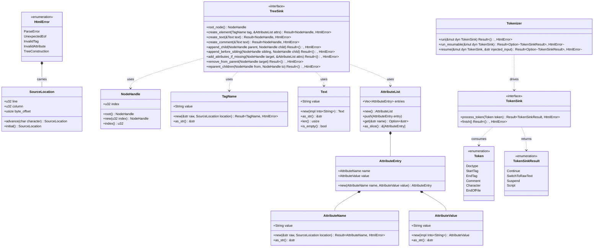

# HTML5 Tokenizer and Tree Sink Ports (v0.5 B5)

## Requirements

Implement a replaceable, streaming HTML5 tokenizer and tree construction pipeline in `core/html` that parses UTF-8 byte
streams into DOM structures through object-safe port abstractions (`TokenSink` and `TreeSink`), guarantees robust error
handling with precise source locations, supports parser suspension for inline scripts and dynamic injection, and
strictly adheres to hexagonal architecture and Object Calisthenics without leaking adapter types.

## Entities

## Approach

1. Architectural Decoupling & Port Isolation:
    - Realize the `TokenSink` and `TreeSink` ports as object-safe traits in `src/application/ports.rs`.
    - Prevent all domain leaks by using `NodeHandle` rather than `dom::NodeId` across all port methods.
    - Maintain strict inward dependency flow: `domain/` depends on nothing; `application/` depends on `domain/`;
      `infrastructure/` implements application ports and domain entities.
    - Make `core/dom` an optional feature (`default = ["dom"]`) in `core/html/Cargo.toml`.

2. Tokenizer Modularization & WHATWG §13.2.5 State Machine:
    - Decompose the tokenizer into single-responsibility sub-modules under `src/infrastructure/tokenizer/`: `cursor`,
      `state`, `entity`, `doctype`, `rawtext`, `tag_state`, and `attribute_state`.
    - Implement zero-panic, zero-allocation character navigation via `Cursor<'a>`.
    - Support accurate entity decoding for standard HTML entities and numeric references without crashing on malformed
      character encodings.
    - Implement streaming rawtext consumption for `<script>` and `<style>` elements without premature closure on
      prefixed end tags (e.g. `</scripture>`).

3. Re-entrancy, Suspension, and Dynamic Script Injection:
    - Provide `TokenSinkResult::Suspend` and `TokenSinkResult::Script(ScriptDescriptor)` flow control results.
    - Implement `run_resumable` and `resume` on `Tokenizer`, preserving cursor and pending state across invocations.
    - Support dynamic script insertion (`document.write`) by processing injected text fragments with highest priority.

4. Resilient Error Handling with Source Location:
    - Implement `SourceLocation` to track 1-indexed lines, 1-indexed columns, and 0-indexed byte offsets.
    - Ensure all `HtmlError` syntax variants carry `SourceLocation`.
    - Provide zero-dependency, hand-written `Display` and `std::error::Error` implementations for `HtmlError`.

## Structure

### Inheritance Relationships

1. `TreeSink` trait defines the DOM construction contract.
2. `TokenSink` trait defines the token processing contract.
3. `DomTreeSink` implements `TreeSink` for `dom::DomTree` (guarded by `#[cfg(feature = "dom")]`).
4. `MockTreeSink` implements `TreeSink` as an in-memory test recorder.
5. `TreeBuilder` implements `TokenSink` driving any generic `TreeSink`.
6. `HtmlError` implements `std::error::Error` and `std::fmt::Display`.

### Dependencies

1. `Tokenizer` depends on `TokenSink` and `Cursor`.
2. `TreeBuilder` depends on `TreeSink`, `TagToken`, `AttributeList`, and `TagName`.
3. `DomTreeSink` depends on `TreeSink` and `dom::DomTree`.
4. `MockTreeSink` depends on `TreeSink` and records `MockEvent`s in memory.
5. `conformance::run_html_conformance` depends on `TreeSink`.

### Layered Architecture

1. Domain Layer (`src/domain/`): `SourceLocation`, `NodeHandle`, `TagName`, `Text`, `Attribute*`, `Token`, `Tag`,
   `HtmlError`. Zero dependencies, zero I/O.
2. Application Layer (`src/application/`): `ports.rs` (`TokenSink`, `TreeSink`, `TokenSinkResult`), `conformance.rs`
   (`run_html_conformance`).
3. Infrastructure Layer (`src/infrastructure/`): `tokenizer/` module, `tree_builder.rs`, `dom_sink.rs`, `mock.rs`.
4. Facade Layer (`src/lib.rs`): Re-exports and public entrypoints `html::parse(&str)` and `html::parse_with_sink`.

## Operations

### Create Value Object - SourceLocation

1. Responsibility: Immutable tracking of source coordinates.
2. Attributes:
    - `line`: `u32` (1-indexed)
    - `column`: `u32` (1-indexed)
    - `byte_offset`: `usize` (0-indexed)
3. Methods:
    - `initial()`: Returns initial location (line 1, col 1, offset 0).
    - `advance(char)`: Returns new location incrementing offset and column/line.

### Create Port Handle - NodeHandle

1. Responsibility: Opaque reference to a tree node across the port boundary.
2. Attributes:
    - `index`: `u32`
3. Methods:
    - `root()`: Returns handle with index 0.
    - `new(u32)`: Constructs handle for specified index.
    - `index()`: Returns raw numerical index.

### Modularize Tokenizer - Tokenizer

1. Responsibility: Stream characters from source text and emit HTML5 tokens.
2. Sub-modules:
    - `cursor`: Read and reconsume characters with line/column accounting.
    - `entity`: Resolve named and numeric character references.
    - `tag_state`: Handle `<` transitions without character loss.
    - `attribute_state`: Parse attribute names and quoted/unquoted values.
    - `doctype`: Parse `<!DOCTYPE ...>` identifiers.
    - `rawtext`: Handle CDATA/rawtext blocks for `<script>` and `<style>`.
3. Methods:
    - `new(&str)`: Instantiates tokenizer.
    - `run(&mut dyn TokenSink)`: Pumps all tokens to sink.
    - `run_resumable(&mut dyn TokenSink)`: Pumps tokens until suspension or completion.
    - `resume(&mut dyn TokenSink, &str)`: Injects source and resumes tokenization.

### Implement TreeBuilder - TreeBuilder

1. Responsibility: Maintain open element stack, apply tag omission, and drive `TreeSink`.
2. Attributes:
    - `sink`: `&mut dyn TreeSink`
    - `open_elements`: `Vec<OpenElement>`
3. Methods:
    - `process_token(Token)`: Dispatches token to appropriate tree insertion mode.
    - `finish()`: Flushes unclosed elements and finalizes tree.

### Implement DomTreeSink - DomTreeSink

1. Responsibility: Map `NodeHandle` operations into mutations on `dom::DomTree`.
2. Methods:
    - `new()`: Creates a new sink wrapping a default `DomTree`.
    - `into_tree()`: Consumes the sink and returns the constructed `DomTree`.
    - Implements all `TreeSink` methods via `dom::DomTree` mutation APIs.

## Norms

1. Zero Unsafe Code: Strictly enforce `#![forbid(unsafe_code)]` across all files.
2. Object Calisthenics:
    - Single level of indentation per method.
    - No `else` keyword (use early return, `match`, `let ... else`).
    - No naked primitives (use `NodeHandle`, `TagName`, `Text`, `AttributeName`, etc.).
    - First-class collections (`AttributeList`).
    - No abbreviations (`attr`, `ch`, `pos` forbidden; use full descriptive identifiers).
    - Entity lengths strictly bounded (< 150 lines).
3. Exception Handling & Error Reporting:
    - All errors captured in `HtmlError`.
    - Every syntax error carries `SourceLocation`.
    - Hand-written `Display` and `std::error::Error` without proc-macros.
4. Conformance & Test Gates:
    - Both `DomTreeSink` and `MockTreeSink` must pass `run_html_conformance`.
    - Bidirectional consistency gate via `MANIFEST.md` and `manifest_runner.rs`.
    - Fuzz testing target `html_parse` running under libFuzzer.

## Safeguards

1. Functional Constraints:
    - Streaming tokenizer must handle standard WHATWG HTML5 data, tag, attribute, and comment states.
    - Tag omission rules for `
` and `<li>` must function deterministically.
    - Rawtext parsing must not terminate prematurely on partial name matches.
2. Performance Constraints:
    - Zero heap allocation during cursor character advancement.
    - Fast lookup for named entity resolution.
3. Security Constraints:
    - Parser must never panic on adversarial or deeply nested byte sequences.
    - Bounded entity and token sizes preventing allocation amplification attacks.
4. Integration Constraints:
    - Backward compatibility: `html::parse(&str) -> Result<dom::DomTree, HtmlError>` signature preserved.
    - Clean compilation under both `--all-features` and `--no-default-features`.
    - Crate must never link `engine`, `rhai`, or script runtimes.
