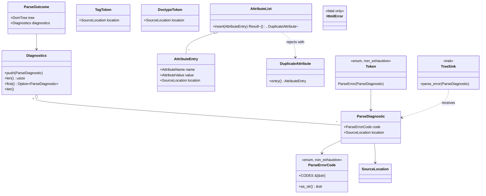

# Recoverable parse-diagnostics channel for `core/html` (issue #36)

## Requirements

Make `html` parse any input to a tree and report, instead of aborting or silently dropping, every recoverable
malformation it meets — each as a coded, located diagnostic — so a single bad tag or attribute can never fail a whole
document, and #28 can make `AttributeName` strict without regressions.

Boundaries: only conditions the current tokenizer/tree builder can reach; no strict `AttributeName`, no DOM
DocumentType, no cap, no DevTools surface. Done: nothing in `html` drops input silently, no recoverable condition aborts
`parse`, `render_golden.rs` byte-identical, gates green.

## Entities

Conservative constraints: `AttributeName`, `TagName`, `Text`, `NodeHandle`, `SourceLocation` are unchanged;
`AttributeName::new_unchecked` stays (#28 deletes it).

## Approach

1. **Channel in the port.** The tokenizer queues diagnostics as `Token::ParseError` _before_ the token that triggered
   them; `TreeBuilder` forwards them to a required, infallible `TreeSink::parse_error`. Ordering and suspension/resume
   come for free (ADR-0023).
2. **Report-and-recover in the tokenizer.** Handlers stop returning `Result`; each recoverable condition calls
   `Cursor::report(code, location)` and follows the WHATWG recovery (keep, drop, or reconsume). The `Cursor` is the one
   object every handler already receives, so it carries the pending-diagnostic buffer; `Tokenizer::pump_next_token`
   drains it into an outbox ahead of the token.
3. **Scratch state grouped.** The per-tag state currently spread across 5–7 `&mut` parameters moves into `PendingTag`
   (kind, `<` location, name, attributes, current attribute name/value/location, self-closing) which also builds the
   final token.
4. **Tree-builder conditions** read the open-elements stack: stray end tag; misnesting (an element above the matched one
   that is not spec-implied: `p`, `li`, `body`, `html`); omission closures that pop a non-implied element; repeated
   `html`/`head`/`body`; `force_quirks` doctype.
5. **Uniqueness in the collection.** `AttributeList::insert` keeps the first, hands the later back as
   `DuplicateAttribute`; the tokenizer reports it.
6. **Sinks own collection.** `DomTreeSink` holds `Diagnostics` (including its own `unsupported-attribute-name`); `parse`
   returns `ParseOutcome`. `MockTreeSink` records `MockEvent::ParseError`.
7. **Gate.** `ParseErrorCode::CODES` ↔ `SUPPORTED_PARSE_ERRORS` ↔ `MANIFEST.md ## Parse errors`, one exact-one-code
   probe per code.
8. **Consumers.** `alloy` logs one `tracing::debug!` summary and uses the tree.

## Structure

### Inheritance Relationships

1. `ParseDiagnostic` derives `thiserror::Error` (`"{code} at {location}"`); `HtmlError` stays the single fatal enum.
2. `DomTreeSink` and `MockTreeSink` implement `TreeSink` including `parse_error`; the `&mut T` blanket forwards it.
3. `TreeBuilder` implements `TokenSink`, matches `Token::ParseError` and forwards.

### Dependencies

1. `Tokenizer` → `Cursor` (reports), `PendingTag` (builds tokens) → `domain::{diagnostic, attribute, token, tag}`.
2. `TreeBuilder` → `TreeSink` port only; reads `TagToken::location`, `DoctypeToken::location`.
3. `DomTreeSink` → `dom` (feature `dom`); `ParseOutcome` lives beside it.
4. `alloy::application` → `html::parse` → `ParseOutcome`.

### Layered Architecture

1. `domain/`: `diagnostic.rs` (new), `attribute.rs`, `token.rs`, `error.rs`, `tag.rs` (`is_implied_end_tag`).
2. `application/`: `ports.rs` (`parse_error`), `conformance.rs`.
3. `infrastructure/`:
   `tokenizer/{pending_tag (new),cursor,mod,tag_state,attribute_state,doctype,entity,rawtext,state}.rs`,
   `tree_builder.rs`, `dom_sink.rs`, `mock.rs`.
4. `lib.rs`: `PORT_SCHEMA_VERSION = 2`, `parse -> Result<ParseOutcome, HtmlError>`, `SUPPORTED_PARSE_ERRORS`.

## Operations

### Create Domain Module - `domain/diagnostic.rs`

1. Responsibility: closed vocabulary of recoverable conditions plus the located diagnostic and its collection.
2. `ParseErrorCode` (macro-generated, `#[non_exhaustive]`, `Clone/Copy/Debug/PartialEq/Eq/Hash`): variants and codes —
   `UnexpectedCharacterInAttributeName` "unexpected-character-in-attribute-name",
   `UnexpectedEqualsSignBeforeAttributeName`, `DuplicateAttribute`, `MissingAttributeValue`,
   `MissingWhitespaceBetweenAttributes`, `UnexpectedSolidusInTag`, `EndTagWithAttributes`, `EofInTag`,
   `MissingEndTagName`, `EofBeforeTagName`, `InvalidFirstCharacterOfTagName`, `UnexpectedQuestionMarkInsteadOfTagName`,
   `UnknownNamedCharacterReference`, `AbsenceOfDigitsInNumericCharacterReference`, `NullCharacterReference`,
   `CharacterReferenceOutsideUnicodeRange`, `SurrogateCharacterReference`, `UnexpectedNullCharacter`,
   `ControlCharacterInInputStream`, `AbruptClosingOfEmptyComment`, `IncorrectlyOpenedComment`, `EofInComment`,
   `EofInDoctype`, `MissingDoctypeName`; and the non-WHATWG `InvalidTagName` "invalid-tag-name", `StrayEndTag`
   "stray-end-tag", `EndTagDoesNotMatchCurrentNode` "end-tag-does-not-match-current-node", `ElementClosedImplicitly`
   "element-closed-implicitly", `UnexpectedHtmlStartTag`, `UnexpectedBodyStartTag`, `UnexpectedHeadStartTag`,
   `QuirksModeDoctype` "quirks-mode-doctype", `UnsupportedAttributeName` "unsupported-attribute-name". Methods:
   `as_str(self) -> &'static str`, `const CODES: &'static [&'static str]`; `Display` prints `as_str`.
3. `ParseDiagnostic { code, location }` — `new(code, location)`, `code()`, `location()`; `thiserror`.
4. `Diagnostics` — first-class collection over a private `Vec`: `new`, `push(&mut self, ParseDiagnostic)`, `len`,
   `is_empty`, `first`, `as_slice`, `iter`, `IntoIterator for &Diagnostics`.

### Update Domain - `attribute.rs`, `token.rs`, `error.rs`, `tag.rs`

1. `AttributeEntry::new(name, value, location)`, `location()`; manual `PartialEq`/`Eq` ignoring `location`.
2. `AttributeList::insert(&mut self, entry) -> Result<(), DuplicateAttribute>`: case-insensitive on `AttributeName`;
   first wins; remove `push`. `DuplicateAttribute(AttributeEntry)` with `entry()`.
3. `TagToken::new(name, attributes, self_closing, location)`, `TagToken::parse(..., location, ...)`, `location()`;
   `DoctypeToken::new(.., location)`, `location()`; equality ignores `location`; `Token::ParseError(ParseDiagnostic)`.
4. `HtmlError`: delete `ParseError`/`UnexpectedEndOfInput` and their constructors; keep `InvalidTag`,
   `InvalidAttribute`, `TreeConstruction`.
5. `tag.rs`: `pub fn is_implied_end_tag(name: &str) -> bool` — `p`, `li`, `body`, `html`.

### Update Application - `ports.rs`, `conformance.rs`

1. `TreeSink::parse_error(&mut self, diagnostic: ParseDiagnostic)` required; forward in the `&mut T` impl.
2. Conformance: located entries via `insert`; new `check_parse_error_is_accepted`.

### Update Infrastructure Tokenizer

1. `cursor.rs`: field `diagnostics: Vec<ParseDiagnostic>`, `last_start: SourceLocation`; `next_char` records
   `last_start` before advancing (not on a reconsumed char) and reports `unexpected-null-character` /
   `control-character-in-input-stream` once per fresh char; `last_location()`; `report(code, location)`;
   `take_diagnostics() -> Vec<ParseDiagnostic>`.
2. `pending_tag.rs` (new): `TagKind { Start, End }` and `PendingTag` — `begin(kind, first_char)`,
   `mark_open`/`open_location`, `push_name_character`, `begin_attribute(char, location)`,
   `push_attribute_name_character`, `push_value_character`, `start_value`, `value_buffer`, `mark_self_closing`,
   `commit_attribute(&mut Cursor)` (duplicates → `duplicate-attribute`), `finish(&mut Cursor) -> Option<Token>` (invalid
   name → `invalid-tag-name`, end tag with attributes → `end-tag-with-attributes`), `discard()`.
3. `tag_state.rs` / `attribute_state.rs`: rewritten on `PendingTag`, no `Result`; WHATWG recoveries — EOF in any tag
   state → `eof-in-tag` + discard; `<` EOF → `eof-before-tag-name` + text `<`; `</` EOF → `eof-before-tag-name` + text
   `</`; `</>` → `missing-end-tag-name`; `<?` → `unexpected-question-mark…` + bogus comment; `<3`/`</3` →
   `invalid-first-character-of-tag-name`; `"`,`'`,`<` in name → report and keep; `=` first →
   `unexpected-equals-sign-before-attribute-name`; `a=>` → `missing-attribute-value`; quoted value followed by name →
   `missing-whitespace-between-attributes`; stray `/` → `unexpected-solidus-in-tag`. `eof_in_tag` and `emit_tag` are
   shared helpers. The `EndTagName` and `AfterEndTagName` states are removed: start and end tags share `TagName`, and
   end tags continue through the attribute states so `
` is reported as `end-tag-with-attributes` instead of its
   attributes being skipped silently.
4. `entity.rs`: when a reference does not resolve, classify (`absence-of-digits…`, `null-character-reference`,
   `character-reference-outside-unicode-range`, `surrogate-character-reference`, `unknown-named-character-reference`
   only when `;`-terminated) and report at the `&`; a terminated NUL, surrogate or out-of-range numeric reference is
   replaced by U+FFFD (§13.2.5.80) and `resolve_entity` no longer resolves `&#0;` to NUL.
5. `doctype.rs`: take the `<` location; EOF without `>` → `eof-in-doctype`; empty name → `missing-doctype-name` (name
   `None`, quirks, so the builder also reports `quirks-mode-doctype`); token carries location.
6. `mod.rs`: `outbox: VecDeque<Token>`; `pump_next_token(&mut self) -> Token` drains outbox → pending raw-text token →
   steps the machine, flushing cursor diagnostics into the outbox before each token; comment/bogus-comment/markup
   declaration codes (`abrupt-closing-of-empty-comment`, `incorrectly-opened-comment`, `eof-in-comment`).

### Update Infrastructure - `tree_builder.rs`

1. `process_token`: `Token::ParseError(d)` → `sink.parse_error(d)`; `Token::Doctype(d)` → report `quirks-mode-doctype`
   at `d.location()` when `d.force_quirks()`, with a comment that the doctype is consumed by design (no DocumentType
   node).
2. `handle_end_tag`: `head` pops only when open (else `stray-end-tag`); unmatched → `stray-end-tag`; matched with a
   non-implied element above → `end-tag-does-not-match-current-node`.
3. `apply_omission_rules`: a non-implied element popped → `element-closed-implicitly`.
4. Repeated `html`/`body` start tag → `unexpected-html/body-start-tag` + `add_attributes_if_missing` when attributes
   non-empty; repeated `head` → `unexpected-head-start-tag`.

### Update Infrastructure - `dom_sink.rs`, `mock.rs`, `lib.rs`

1. `DomTreeSink { diagnostics }`; `parse_error` pushes; a `dom`-rejected attribute → `unsupported-attribute-name` at
   `entry.location()` via `attach_attribute` (no silent `continue`); `add_attributes_if_missing` now tests presence with
   `Ok(Some(_))` — `DomTree::attribute` returns `Ok(None)` for an absent attribute, so the old `is_err()` guard never
   added anything (latent bug, first exercised by repeated `<body>`); `into_outcome() -> ParseOutcome`;
   `ParseOutcome { tree, diagnostics }` with `tree()`, `diagnostics()`, `into_tree()`, `into_parts()`.
2. `MockEvent::ParseError { code, location }`; `parse_error` records in order.
3. `lib.rs`: `PORT_SCHEMA_VERSION = 2`; `parse -> Result<ParseOutcome, HtmlError>`; `SUPPORTED_PARSE_ERRORS`;
   re-exports.

### Update Consumer - `alloy`

1. One helper `application::html_parse::parse_html(markup) -> Result<dom::DomTree, html::HtmlError>` that calls
   `html::parse`, logs one `tracing::debug!` (count + first code) when non-empty, returns `into_tree()`; used by
   `pipeline.rs`, `navigation.rs`, `session/messages.rs`. Tests use `.into_tree()`.

### Create Tests & Docs

1. `core/html/tests/diagnostics_test.rs`; extend `manifest_runner.rs` (third registry + `PARSE_ERROR_PROBES`, exact
   code/line/column per probe, every registered code probed); unit tests per module. The headline malformed-attribute
   test asserts exactly one diagnostic against `MockTreeSink`; against `DomTreeSink` the same input yields two (the
   WHATWG tokenizer code plus the adapter's `unsupported-attribute-name`) until #28 aligns the vocabularies.
2. ADR-0023 + README row; `html-tree-sink-port-contract.md` §2–§6; `PRD-008` §3.1/§3.3 + §6 migration table;
   `MANIFEST.md ## Parse errors`; `CLAUDE.md` B5 bullet.

## Norms

1. Errors: fatal = `HtmlError` via `Result`; recoverable = `ParseDiagnostic` via port data (ADR-0023); `thiserror`
   (ADR-0015); no `unwrap`/`expect` on reachable paths.
2. Domain types are newtypes/enums/first-class collections; no public `Vec`; no public mutable fields.
3. No `else`; one indentation level per function; one dot per line; no abbreviations; no boolean parameters.
4. Comments explain why and cite the WHATWG section / ADR / issue decision.
5. Logging only through `tracing` (`debug!`), never `println!`.
6. Docs: Markdown tabs/width 120 — run `pnpm format:md`.

## Safeguards

1. Functional: no recoverable condition returns `Err` from the tokenizer or builder; the only remaining `Err`s are sink
   failures and value-object constructors.
2. Ordering: a diagnostic precedes the token that triggered it; equality of tokens/entries ignores locations; an
   unfinished tag at EOF is dropped, `</` at EOF is text, a repeated `html`/`body` merges its attributes.
3. Location accuracy: line/column point at the offending character, the `<` of a tag, or the cursor at EOF.
4. Determinism: same input → same diagnostics (golden `pipeline.png` byte-identical).
5. Compatibility: `TreeSink` implementors must add `parse_error`; `html::PORT_SCHEMA_VERSION == 2`.
6. Gate: every `ParseErrorCode` has a manifest row and an exact-one-code probe.
7. Hostile input: no panics (`html_parse` fuzz target unchanged); diagnostics are linear in input (accepted, no cap).
8. Scope: `AttributeName::new_unchecked` and strict `AttributeName` untouched (#28).
