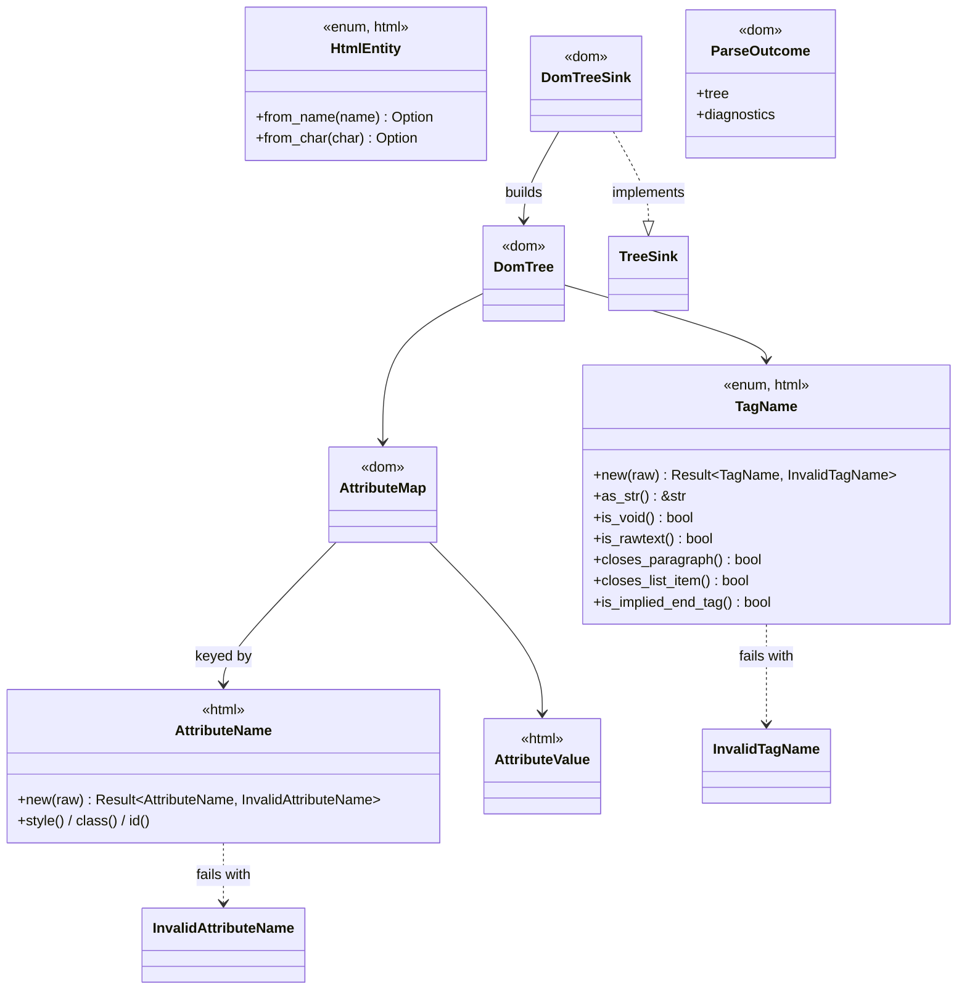

# Move the HTML vocabulary from `dom` into `html` (issues #27, #28, #29)

## Requirements

`TagName`, `AttributeName`, `AttributeValue` and `HtmlEntity` have one definition, in `html`. The dependency is
`dom → html`; `DomTreeSink` and `parse` live in `dom`. Consumers import the vocabulary from `html`. Done:
`cargo tree -p html` shows no `dom`, no `dom::TagName`-style path remains, `render_golden.rs` byte-identical, gates
green.

## Entities

## Approach

Analysis: `spdd/analysis/202610050000-[Analysis]-move-html-vocabulary-from-dom-to-html-issue-28.md`; ADR-0024.

- The tokenizer resolves named references through `HtmlEntity` (one entity table).
- An attribute name that breaks the strict rule is **dropped and reported** as `invalid-attribute-name` (replaces the
  DOM adapter's `unsupported-attribute-name`); it is neither silent nor fatal.
- Tests are split by subject: `html` tests run on `MockTreeSink`; tests of the real `DomTree` adapter live in
  `core/dom/tests/`.
- Errors: `html` keeps `HtmlError::InvalidTag { name, location }` (built by `TagToken::parse` from the location-free
  `InvalidTagName` plus its location). `HtmlError::InvalidAttribute` is removed (no construction site remains). `dom`
  converts `InvalidTagName`/`InvalidAttributeName` into `DomError` through `From`, and implements
  `From<DomError> for HtmlError`.

## Structure

`core/html` (leaf, only `thiserror`) ← `core/dom` ← `core/css`, `rhai-bindings`, `alloy`; `css`, `rhai-bindings` and
`fuzz`/`alloy` also depend on `html` or `dom::parse` as needed (`fuzz` depends on `dom` only).

## Operations

1. **`html` vocabulary** (`core/html/src/domain/`):
    - `tag.rs`: `TagName::new(&str)`; add `canvas`/`iframe`/`object`/`embed`/`svg` constructors; `closes_paragraph`
      holds the block list directly; new method `is_implied_end_tag`; delete the `&str` free functions, `is_block` and
      `is_replaced`.
    - `attribute.rs`: strict `AttributeName::new(&str)`, add `style`/`class`/`id`, delete `new_unchecked`.
    - `error.rs`: add `InvalidTagName`, `InvalidAttributeName`; remove `HtmlError::InvalidAttribute` and
      `From<dom::DomError>`.
    - `entity.rs`: `HtmlEntity` moved from `dom`, with its lookup tests.
    - `diagnostic.rs`: add `InvalidAttributeName => "invalid-attribute-name"`, remove `UnsupportedAttributeName`.
    - Tokenizer: `commit_attribute` reports `InvalidAttributeName` and drops; `resolve_entity` uses
      `HtmlEntity::from_name`.
2. **Inversion**: `html` loses the `dom` feature, `dom_sink.rs`, `parse`; `core/dom` gains `infrastructure/html_sink.rs`
   (`DomTreeSink`, `ParseOutcome`, `parse`, `From<DomError> for HtmlError`) and drops `tag_name.rs`/`entity.rs`;
   `AttributeMap` keys on `html::AttributeName`.
3. **Mock sink**: `MockEvent::CreateElement` carries `attributes: AttributeList` (was a count).
   `MockEvent::AddAttributes` keeps `attribute_count`.
4. **Consumers**: `css`, `rhai-bindings` import `html::{TagName, AttributeName, AttributeValue}`; `css` drops
   `pub use dom::TagName`; `rhai-bindings`' `dom_error` takes `&impl Display`; `alloy` calls `dom::parse`; `fuzz` calls
   `dom::parse` and depends on `dom` instead of `html`.
5. **Tests**: `html/tests/{manifest_runner,diagnostics_test,conformance_test}.rs` on `MockTreeSink`;
   `dom/tests/{html_parse_corpus,html_parse_diagnostics,html_sink_conformance}.rs` (fixture moved to
   `dom/tests/data/fixtures/`).
6. **Docs/lint**: `arch-lint.toml` (`html` must not depend on or import `dom`), PRD-008 §6 v3 row, port contract,
   `CLAUDE.md`.

## Norms

Object Calisthenics and Clean Code per `CLAUDE.md`; `thiserror` errors; no `println!`; location-free value-object
constructors, the caller attaches the `SourceLocation`.

## Safeguards

`arch-lint`: `html` must not depend on or import `dom`. `html::PORT_SCHEMA_VERSION` 2 → 3. `html` dependencies stay
`thiserror` only (ADR-0024). The CI `cargo test -p html --no-default-features` step is now equivalent to the default
build (no features remain); left in place.
